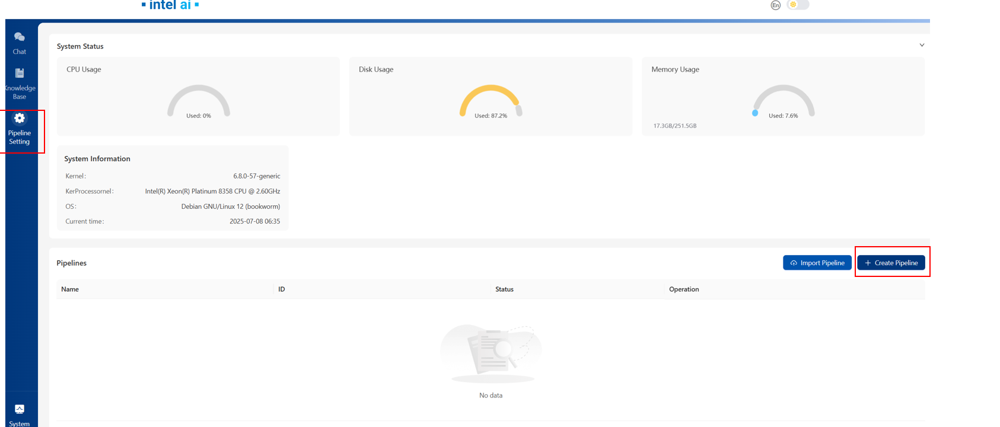

# Edge Craft Retrieval-Augmented Generation

Edge Craft RAG (EC-RAG) is a customizable, tunable and production-ready
Retrieval-Augmented Generation system for edge solutions. It is designed to
curate the RAG pipeline to meet hardware requirements at edge with guaranteed
quality and performance.

## What's New in this release?

- Support image/url data retrieval and display in EC-RAG
- Support display of document source used by LLM in UI
- Support pipeline remove operation in RESTful API and UI
- Support RAG pipeline performance benchmark and display in UI
- Fixed known issues in EC-RAG UI and server

## Quick Start Guide

### (Optional) Build Docker Images for Mega Service, Server and UI by your own

If you want to build the images by your own, please follow the steps:

```bash
cd GenAIExamples/EdgeCraftRAG

docker build --build-arg http_proxy=$http_proxy --build-arg https_proxy=$https_proxy --build-arg no_proxy=$no_proxy -t opea/edgecraftrag:latest -f Dockerfile .
docker build --build-arg http_proxy=$http_proxy --build-arg https_proxy=$https_proxy --build-arg no_proxy=$no_proxy -t opea/edgecraftrag-server:latest -f Dockerfile.server .
docker build --build-arg http_proxy=$http_proxy --build-arg https_proxy=$https_proxy --build-arg no_proxy=$no_proxy -t opea/edgecraftrag-ui:latest -f ui/docker/Dockerfile.ui .
```

### Using Intel Arc GPU

#### Local inference with OpenVINO for Intel Arc GPU

You can select "local" type in generation field which is the default approach to enable Intel Arc GPU for LLM. You don't need to build images for "local" type.

#### vLLM with OpenVINO for Intel Arc GPU

You can also select "vLLM" as generation type, to enable this type, you'll need to build the vLLM image for Intel Arc GPU before service bootstrap.
Please follow this link [vLLM with OpenVINO](https://github.com/opea-project/GenAIComps/tree/main/comps/llms/text-generation/vllm/langchain#build-docker-image) to build the vLLM image.

### Start Edge Craft RAG Services with Docker Compose

```bash
cd GenAIExamples/EdgeCraftRAG/docker_compose/intel/gpu/arc

export MODEL_PATH="your model path for all your models"
export DOC_PATH="your doc path for uploading a dir of files"
export GRADIO_PATH="your gradio cache path for transferring files"
# If you have a specific prompt template, please uncomment the following line
# export PROMPT_PATH="your prompt path for prompt templates"

# Make sure all 3 folders have 1000:1000 permission, otherwise
# chown 1000:1000 ${MODEL_PATH} ${DOC_PATH} ${GRADIO_PATH}
# In addition, also make sure the .cache folder has 1000:1000 permission, otherwise
# chown 1000:1000 $HOME/.cache

# Use `ip a` to check your active ip
export HOST_IP="your host ip"

# Check group id of video and render
export VIDEOGROUPID=$(getent group video | cut -d: -f3)
export RENDERGROUPID=$(getent group render | cut -d: -f3)

# If you have a proxy configured, uncomment below line
# export no_proxy=${no_proxy},${HOST_IP},edgecraftrag,edgecraftrag-server
# export NO_PROXY=${NO_PROXY},${HOST_IP},edgecraftrag,edgecraftrag-server
# If you have a HF mirror configured, it will be imported to the container
# export HF_ENDPOINT="your HF mirror endpoint"

# By default, the ports of the containers are set, uncomment if you want to change
# export MEGA_SERVICE_PORT=16011
# export PIPELINE_SERVICE_PORT=16011
# export UI_SERVICE_PORT="8082"

# Prepare models for embedding, reranking and generation, you can also choose other OpenVINO optimized models
# Here is the example:
pip install --upgrade --upgrade-strategy eager "optimum[openvino]"

optimum-cli export openvino -m BAAI/bge-small-en-v1.5 ${MODEL_PATH}/BAAI/bge-small-en-v1.5 --task sentence-similarity
optimum-cli export openvino -m BAAI/bge-reranker-large ${MODEL_PATH}/BAAI/bge-reranker-large --task text-classification
optimum-cli export openvino -m Qwen/Qwen2-7B-Instruct ${MODEL_PATH}/Qwen/Qwen2-7B-Instruct/INT4_compressed_weights --weight-format int4

```

#### Launch services with local inference

```bash
docker compose -f compose.yaml up -d
```

#### Launch services with vLLM + OpenVINO inference service

Set up Additional Environment Variables and start with compose_vllm.yaml

```bash
export LLM_MODEL=#your model id
export VLLM_SERVICE_PORT=8008
export vLLM_ENDPOINT="http://${HOST_IP}:${VLLM_SERVICE_PORT}"
export HUGGINGFACEHUB_API_TOKEN=#your HF token

docker compose -f compose_vllm.yaml up -d
```

### ChatQnA with LLM Example (Command Line)

```bash
cd GenAIExamples/EdgeCraftRAG

# Activate pipeline test_pipeline_local_llm
curl -X POST http://${HOST_IP}:16010/v1/settings/pipelines -H "Content-Type: application/json" -d @tests/test_pipeline_local_llm.json | jq '.'

# Will need to wait for several minutes
# Expected output:
# {
#   "idx": "3214cf25-8dff-46e6-b7d1-1811f237cf8c",
#   "name": "rag_test",
#   "comp_type": "pipeline",
#   "node_parser": {
#     "idx": "ababed12-c192-4cbb-b27e-e49c76a751ca",
#     "parser_type": "simple",
#     "chunk_size": 400,
#     "chunk_overlap": 48
#   },
#   "indexer": {
#     "idx": "46969b63-8a32-4142-874d-d5c86ee9e228",
#     "indexer_type": "faiss_vector",
#     "model": {
#       "idx": "7aae57c0-13a4-4a15-aecb-46c2ec8fe738",
#       "type": "embedding",
#       "model_id": "BAAI/bge-small-en-v1.5",
#       "model_path": "/home/user/models/bge_ov_embedding",
#       "device": "auto"
#     }
#   },
#   "retriever": {
#     "idx": "3747fa59-ff9b-49b6-a8e8-03cdf8c979a4",
#     "retriever_type": "vectorsimilarity",
#     "retrieve_topk": 30
#   },
#   "postprocessor": [
#     {
#       "idx": "d46a6cae-ba7a-412e-85b7-d334f175efaa",
#       "postprocessor_type": "reranker",
#       "model": {
#         "idx": "374e7471-bd7d-41d0-b69d-a749a052b4b0",
#         "type": "reranker",
#         "model_id": "BAAI/bge-reranker-large",
#         "model_path": "/home/user/models/bge_ov_reranker",
#         "device": "auto"
#       },
#       "top_n": 2
#     }
#   ],
#   "generator": {
#     "idx": "52d8f112-6290-4dd3-bc28-f9bd5deeb7c8",
#     "generator_type": "local",
#     "model": {
#       "idx": "fa0c11e1-46d1-4df8-a6d8-48cf6b99eff3",
#       "type": "llm",
#       "model_id": "qwen2-7b-instruct",
#       "model_path": "/home/user/models/qwen2-7b-instruct/INT4_compressed_weights",
#       "device": "auto"
#     }
#   },
#   "status": {
#     "active": true
#   }
# }

# Prepare data from local directory
curl -X POST http://${HOST_IP}:16010/v1/data -H "Content-Type: application/json" -d '{"local_path":"docs/#REPLACE WITH YOUR DIR WITHIN MOUNTED DOC PATH#"}' | jq '.'

# Validate Mega Service
curl -X POST http://${HOST_IP}:16011/v1/chatqna -H "Content-Type: application/json" -d '{"messages":"#REPLACE WITH YOUR QUESTION HERE#", "top_n":5, "max_tokens":512}' | jq '.'
```

### ChatQnA with LLM Example (UI)

Open your browser, access http://${HOST_IP}:8082

> Your browser should be running on the same host of your console, otherwise you will need to access UI with your host domain name instead of ${HOST_IP}.

To create a default pipeline, you need to click the `Create Pipeline` button on the `RAG Settings` page. You can also create multiple pipelines or update existing pipelines through the `Pipeline Configuration`, but please note that active pipelines cannot be updated.


After the pipeline creation, you can upload your data in the `Chatbot` page.


Then, you can submit messages in the chat box.


## Advanced User Guide

### Pipeline Management

#### Create a pipeline

```bash
curl -X POST http://${HOST_IP}:16010/v1/settings/pipelines -H "Content-Type: application/json" -d @tests/test_pipeline_local_llm.json | jq '.'
```

#### Update a pipeline

```bash
curl -X PATCH http://${HOST_IP}:16010/v1/settings/pipelines/rag_test_local_llm  -H "Content-Type: application/json" -d @tests/test_pipeline_local_llm.json | jq '.'
```

#### Check all pipelines

```bash
curl -X GET http://${HOST_IP}:16010/v1/settings/pipelines -H "Content-Type: application/json" | jq '.'
```

#### Activate a pipeline

```bash
curl -X PATCH http://${HOST_IP}:16010/v1/settings/pipelines/rag_test_local_llm -H "Content-Type: application/json" -d '{"active": "true"}' | jq '.'
```

#### Remove a pipeline

```bash
# Firstly, deactivate the pipeline if the pipeline status is active
curl -X PATCH http://${HOST_IP}:16010/v1/settings/pipelines/rag_test_local_llm -H "Content-Type: application/json" -d '{"active": "false"}' | jq '.'
# Then delete the pipeline
curl -X DELETE http://${HOST_IP}:16010/v1/settings/pipelines/rag_test_local_llm -H "Content-Type: application/json" | jq '.'
```

#### Enable and check benchmark for pipelines

```bash
# Set ENABLE_BENCHMARK as true before launch services
export ENABLE_BENCHMARK="true"

# check the benchmark data for pipeline {pipeline_name}
curl -X GET http://${HOST_IP}:16010/v1/settings/pipelines/{pipeline_name}/benchmark -H "Content-Type: application/json" | jq '.'
```

### Model Management

#### Load a model

```bash
curl -X POST http://${HOST_IP}:16010/v1/settings/models -H "Content-Type: application/json" -d '{"model_type": "reranker", "model_id": "BAAI/bge-reranker-large", "model_path": "./models/bge_ov_reranker", "device": "cpu", "weight": "INT4"}' | jq '.'
```

It will take some time to load the model.

#### Check all models

```bash
curl -X GET http://${HOST_IP}:16010/v1/settings/models -H "Content-Type: application/json" | jq '.'
```

#### Update a model

```bash
curl -X PATCH http://${HOST_IP}:16010/v1/settings/models/BAAI/bge-reranker-large -H "Content-Type: application/json" -d '{"model_type": "reranker", "model_id": "BAAI/bge-reranker-large", "model_path": "./models/bge_ov_reranker", "device": "gpu", "weight": "INT4"}' | jq '.'
```

#### Check a certain model

```bash
curl -X GET http://${HOST_IP}:16010/v1/settings/models/BAAI/bge-reranker-large -H "Content-Type: application/json" | jq '.'
```

#### Delete a model

```bash
curl -X DELETE http://${HOST_IP}:16010/v1/settings/models/BAAI/bge-reranker-large -H "Content-Type: application/json" | jq '.'
```

### File Management

#### Add a text

```bash
curl -X POST http://${HOST_IP}:16010/v1/data -H "Content-Type: application/json" -d '{"text":"#REPLACE WITH YOUR TEXT"}' | jq '.'
```

#### Add files from existed file path

```bash
curl -X POST http://${HOST_IP}:16010/v1/data -H "Content-Type: application/json" -d '{"local_path":"docs/#REPLACE WITH YOUR DIR WITHIN MOUNTED DOC PATH#"}' | jq '.'
curl -X POST http://${HOST_IP}:16010/v1/data -H "Content-Type: application/json" -d '{"local_path":"docs/#REPLACE WITH YOUR FILE WITHIN MOUNTED DOC PATH#"}' | jq '.'
```

#### Check all files

```bash
curl -X GET http://${HOST_IP}:16010/v1/data/files -H "Content-Type: application/json" | jq '.'
```

#### Check one file

```bash
curl -X GET http://${HOST_IP}:16010/v1/data/files/test2.docx -H "Content-Type: application/json" | jq '.'
```

#### Delete a file

```bash
curl -X DELETE http://${HOST_IP}:16010/v1/data/files/test2.docx -H "Content-Type: application/json" | jq '.'
```

#### Update a file

```bash
curl -X PATCH http://${HOST_IP}:16010/v1/data/files/test.pdf -H "Content-Type: application/json" -d '{"local_path":"docs/#REPLACE WITH YOUR FILE WITHIN MOUNTED DOC PATH#"}' | jq '.'
```
