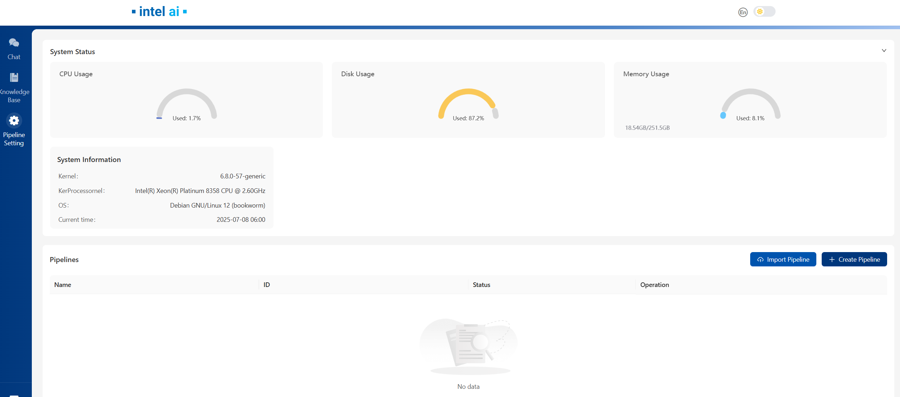

# Example Edge Craft Retrieval-Augmented Generation Deployment on Intel® Arc® Platform

This document outlines the deployment process for Edge Craft Retrieval-Augmented Generation service on Intel Arc server. This example includes the following sections:

- [EdgeCraftRAG Quick Start Deployment](#edgecraftrag-quick-start-deployment): Demonstrates how to quickly deploy a Edge Craft Retrieval-Augmented Generation service/pipeline on Intel® Arc® platform.
- [EdgeCraftRAG Docker Compose Files](#edgecraftrag-docker-compose-files): Describes some example deployments and their docker compose files.
- [EdgeCraftRAG Service Configuration](#edgecraftrag-service-configuration): Describes the service and possible configuration changes.

## EdgeCraftRAG Quick Start Deployment

This section describes how to quickly deploy and test the EdgeCraftRAG service manually on Intel® Arc® platform. The basic steps are:

1. [Prerequisites](#1-prerequisites)
2. [Access the Code](#2-access-the-code)
3. [Prepare models](#3-prepare-models)
4. [Prepare env variables and configurations](#4-prepare-env-variables-and-configurations)
5. [Deploy the Service on Arc GPU Using Docker Compose](#5-deploy-the-service-on-intel-gpu-using-docker-compose)
6. [Access UI](#6-access-ui)
7. [Cleanup the Deployment](#7-cleanup-the-deployment)

### 1. Prerequisites

EC-RAG supports vLLM deployment(default method) and local OpenVINO deployment for Intel Arc GPU. Prerequisites are shown as below:  
Hardware: Intel Arc A770  
OS: Ubuntu Server 22.04.1 or newer (at least 6.2 LTS kernel)  
Driver & libraries: please to [Installing GPUs Drivers](https://dgpu-docs.intel.com/driver/installation-rolling.html#installing-gpu-drivers) for detailed driver & libraries setup

Hardware: Intel Arc B60  
please to [Install Native Environment](https://github.com/intel/llm-scaler/tree/main/vllm#11-install-native-environment) for detailed setup

Below steps are based on **vLLM** as inference engine, if you want to choose **OpenVINO**, please refer to [OpenVINO Local Inference](../../../../docs/Advanced_Setup.md#openvino-local-inference)

### 2. Access the Code

Clone the GenAIExample repository and access the EdgeCraftRAG Intel® Arc® platform Docker Compose files and supporting scripts:

```
git clone https://github.com/opea-project/GenAIExamples.git
cd GenAIExamples/EdgeCraftRAG
```

Checkout a released version, such as v1.5:

```
git checkout v1.5
```

### 3. Prepare models

```bash
# Prepare models for embedding, reranking:
export MODEL_PATH="${PWD}/models" # Your model path for embedding, reranking and LLM models
mkdir -p $MODEL_PATH
pip install --upgrade --upgrade-strategy eager "optimum[openvino]"
optimum-cli export openvino -m BAAI/bge-small-en-v1.5 ${MODEL_PATH}/BAAI/bge-small-en-v1.5 --task sentence-similarity
optimum-cli export openvino -m BAAI/bge-reranker-large ${MODEL_PATH}/BAAI/bge-reranker-large --task text-classification

# Prepare LLM model
export LLM_MODEL="Qwen/Qwen3-8B" # Your model id
pip install modelscope
modelscope download --model $LLM_MODEL --local_dir "${MODEL_PATH}/${LLM_MODEL}"
# Optionally, you can also download models with huggingface:
# pip install -U huggingface_hub
# huggingface-cli download $LLM_MODEL --local-dir "${MODEL_PATH}/${LLM_MODEL}"
```

### 4. Prepare env variables and configurations

#### Prepare env variables for vLLM deployment

```bash
ip_address=$(hostname -I | awk '{print $1}')
# Use `ip a` to check your active ip
export HOST_IP=$ip_address # Your host ip

# Check group id of video and render
export VIDEOGROUPID=$(getent group video | cut -d: -f3)
export RENDERGROUPID=$(getent group render | cut -d: -f3)

# If you have a proxy configured, execute below line
export no_proxy=${no_proxy},${HOST_IP},edgecraftrag,edgecraftrag-server
export NO_PROXY=${NO_PROXY},${HOST_IP},edgecraftrag,edgecraftrag-server
# If you have a HF mirror configured, it will be imported to the container
# export HF_ENDPOINT=https://hf-mirror.com # your HF mirror endpoint"

# Make sure all 3 folders have 1000:1000 permission, otherwise
export DOC_PATH=${PWD}/tests
export TMPFILE_PATH=${PWD}/tests
chown 1000:1000 ${MODEL_PATH} ${DOC_PATH} ${TMPFILE_PATH}
# In addition, also make sure the .cache folder has 1000:1000 permission, otherwise
chown 1000:1000 -R $HOME/.cache
```

For more advanced env variables and configurations, please refer to [Prepare env variables for vLLM deployment](../../../../docs/Advanced_Setup.md#prepare-env-variables-for-vllm-deployment)

### 5. Deploy the Service on Intel GPU Using Docker Compose

set Milvus DB and chat history round for inference:

```bash
# EC-RAG support Milvus as persistent database, by default milvus is disabled, you can choose to set MILVUS_ENABLED=1 to enable it
export MILVUS_ENABLED=0
# If you enable Milvus, the default storage path is PWD, uncomment if you want to change:
# export DOCKER_VOLUME_DIRECTORY= # change to your preference

# EC-RAG support chat history round setting, by default chat history is disabled, you can set CHAT_HISTORY_ROUND to control it
# export CHAT_HISTORY_ROUND= # change to your preference
```

#### option a. Deploy the Service on Arc A770 Using Docker Compose

```bash
export VLLM_SERVICE_PORT_A770=8086 # You can set your own port for vllm service

# Launch EC-RAG service with compose
docker compose --profile a770 -f docker_compose/intel/gpu/arc/compose.yaml up -d
```

#### option b. Deploy the Service on Arc B60 Using Docker Compose

```bash
# Besides MILVUS_ENABLED and CHAT_HISTORY_ROUND, below environments are exposed for vLLM config, you can change them to your preference:
# export VLLM_SERVICE_PORT_B60=8086
# export DTYPE=float16
# export TP=1 # for multi GPU, you can change TP value
# export DP=1
# export ZE_AFFINITY_MASK=0 # for multi GPU, you can export ZE_AFFINITY_MASK=0,1,2...
# export ENFORCE_EAGER=1
# export TRUST_REMOTE_CODE=1
# export DISABLE_SLIDING_WINDOW=1
# export GPU_MEMORY_UTIL=0.8
# export NO_ENABLE_PREFIX_CACHING=1
# export MAX_NUM_BATCHED_TOKENS=8192
# export DISABLE_LOG_REQUESTS=1
# export MAX_MODEL_LEN=49152
# export BLOCK_SIZE=64
# export QUANTIZATION=fp8
docker compose --profile b60 -f docker_compose/intel/gpu/arc/compose.yaml up -d
```

### 6. Access UI

Open your browser, access http://${HOST_IP}:8082

> Your browser should be running on the same host of your console, otherwise you will need to access UI with your host domain name instead of ${HOST_IP}.

Below is the UI front page, for detailed operations on UI and EC-RAG settings, please refer to [Explore_Edge_Craft_RAG](../../../../docs/Explore_Edge_Craft_RAG.md)


### 7. Cleanup the Deployment

To stop the containers associated with the deployment, execute the following command:

```
docker compose -f docker_compose/intel/gpu/arc/compose.yaml down
```

All the EdgeCraftRAG containers will be stopped and then removed on completion of the "down" command.

## EdgeCraftRAG Docker Compose Files

The compose.yaml is default compose file using tgi as serving framework

| Service Name        | Image Name                               |
| ------------------- | ---------------------------------------- |
| etcd                | quay.io/coreos/etcd:v3.5.5               |
| minio               | minio/minio:RELEASE.2023-03-20T20-16-18Z |
| milvus-standalone   | milvusdb/milvus:v2.4.6                   |
| edgecraftrag-server | opea/edgecraftrag-server:latest          |
| edgecraftrag-ui     | opea/edgecraftrag-ui:latest              |
| ecrag               | opea/edgecraftrag:latest                 |

## EdgeCraftRAG Service Configuration

The table provides a comprehensive overview of the EdgeCraftRAG service utilized across various deployments as illustrated in the example Docker Compose files. Each row in the table represents a distinct service, detailing its possible images used to enable it and a concise description of its function within the deployment architecture.

| Service Name        | Possible Image Names                     | Optional | Description                                                                                      |
| ------------------- | ---------------------------------------- | -------- | ------------------------------------------------------------------------------------------------ |
| etcd                | quay.io/coreos/etcd:v3.5.5               | No       | Provides distributed key-value storage for service discovery and configuration management.       |
| minio               | minio/minio:RELEASE.2023-03-20T20-16-18Z | No       | Provides object storage services for storing documents and model files.                          |
| milvus-standalone   | milvusdb/milvus:v2.4.6                   | No       | Provides vector database capabilities for managing embeddings and similarity search.             |
| edgecraftrag-server | opea/edgecraftrag-server:latest          | No       | Serves as the backend for the EdgeCraftRAG service, with variations depending on the deployment. |
| edgecraftrag-ui     | opea/edgecraftrag-ui:latest              | No       | Provides the user interface for the EdgeCraftRAG service.                                        |
| ecrag               | opea/edgecraftrag:latest                 | No       | Acts as a reverse proxy, managing traffic between the UI and backend services.                   |
