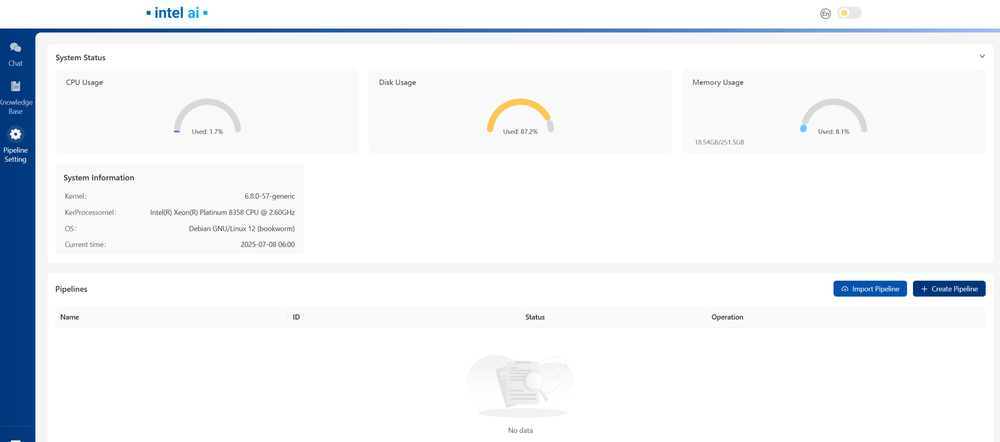

# 在 Intel® Arc® 平台上部署 Edge Craft 检索增强生成（EC-RAG）示例

[English](README.md)

本文档介绍了在 Intel® Arc® 平台上部署 Edge Craft 检索增强生成服务的流程。该示例包含以下部分：

- [EdgeCraftRAG 快速开始部署](#edgecraftrag-快速开始部署)：演示如何在 Intel® Arc® 平台上快速部署 Edge Craft 检索增强生成服务/流水线。
- [EdgeCraftRAG Docker Compose 文件](#edgecraftrag-docker-compose-文件)：说明一些示例部署及其 docker compose 文件。
- [EdgeCraftRAG 服务配置](#edgecraftrag-服务配置)：说明服务以及可进行的配置变更。

## EdgeCraftRAG 快速开始部署

本节介绍如何在 Intel® Arc® 平台上手动快速部署并测试 EdgeCraftRAG 服务。基本步骤如下：

1. [前置条件](#1-前置条件)
2. [获取代码](#2-获取代码)
3. [运行 quick_start.sh](#3-运行-quick_startsh)
4. [访问 UI](#4-访问-ui)
5. [清理部署](#5-清理部署)

### 1. 前置条件

EC-RAG 支持 vLLM 部署（默认方式）以及面向 Intel Arc GPU 和 Core Ultra 平台的本地 OpenVINO 部署。前置条件如下：

#### Core Ultra
**操作系统**：Ubuntu 24.04 或更高版本  
**驱动与库**：请参考 [Installing Client GPUs on Ubuntu Desktop](https://dgpu-docs.intel.com/driver/client/overview.html#installing-client-gpus-on-ubuntu-desktop)  
**可用推理框架**：openVINO

#### Intel Arc B60
**操作系统**：Ubuntu 25.04 Desktop（适用于 Core Ultra 和 Xeon-W），Ubuntu 25.04 Server（适用于 Xeon-SP）。  
**驱动与库**：详细安装请参考 [Install Bare Metal Environment](https://github.com/intel/llm-scaler/tree/main/vllm#11-install-bare-metal-environment)  
**可用推理框架**：openVINO、vLLM

#### Intel Arc A770
**操作系统**：Ubuntu Server 22.04.1 或更高版本（至少 6.2 LTS 内核）  
**驱动与库**：详细驱动与库安装请参考 [Installing GPUs Drivers](https://dgpu-docs.intel.com/driver/installation-rolling.html#installing-gpu-drivers)  
**可用推理框架**：openVINO、vLLM

### 2. 获取代码

克隆 GenAIExample 仓库，并进入 EdgeCraftRAG 在 Intel® Arc® 平台上的 Docker Compose 文件与配套脚本目录：

```
git clone https://github.com/opea-project/GenAIExamples.git
cd GenAIExamples/EdgeCraftRAG
```

> **注意**：如果你想切换到某个发布版本，例如 v1.5：
>
>```
>git checkout v1.5
>```

### 3. 运行 quick_start.sh

在 `EdgeCraftRAG` 根目录下运行快速启动脚本：

```bash
./tools/quick_start.sh
```

在不配置任何环境变量时，脚本默认启动本地 OpenVINO 部署。

如果你希望使用手动方式（模型准备、环境变量配置、Docker Compose 启动），请参考 [Advanced Setup 中的手动部署说明](../../../../docs/Advanced_Setup_zh.md#arc-平台手动部署详细说明)。

### 4. 访问 UI

打开浏览器访问 http://${HOST_IP}:8082

启动完成后，`quick_start.sh` 会输出：

```text
Service launched successfully.
UI access URL: http://${HOST_IP}:8082
If you are accessing from another machine, replace ${HOST_IP} with your server's reachable IP or hostname.
```

> 浏览器应运行在与控制台相同的主机上；否则你需要使用主机域名而不是 ${HOST_IP} 来访问 UI。

下图为 UI 首页。有关 UI 操作和 EC-RAG 设置的详细说明，请参考 [Explore_Edge_Craft_RAG](../../../../docs/Explore_Edge_Craft_RAG_zh.md)


### 5. 清理部署

若要停止与本次部署关联的容器，请执行脚本命令：

```bash
./tools/quick_start.sh cleanup
```

执行完成后，所有 EdgeCraftRAG 容器都会停止并被移除。

如果你希望使用手动 docker compose 清理命令，请参考 [Advanced Setup 中的手动清理说明](../../../../docs/Advanced_Setup_zh.md#6-清理部署手动)。

## EdgeCraftRAG Docker Compose 文件

`compose.yaml` 是默认的 compose 文件，使用 tgi 作为服务框架。

| 服务名称            | 镜像名称                                 |
| ------------------- | ---------------------------------------- |
| etcd                | quay.io/coreos/etcd:v3.5.5               |
| minio               | minio/minio:RELEASE.2023-03-20T20-16-18Z |
| milvus-standalone   | milvusdb/milvus:v2.4.6                   |
| edgecraftrag-server | opea/edgecraftrag-server:latest          |
| edgecraftrag-ui     | opea/edgecraftrag-ui:latest              |
| ecrag               | opea/edgecraftrag:latest                 |

## EdgeCraftRAG 服务配置

下表全面概述了示例 Docker Compose 文件中各类部署所使用的 EdgeCraftRAG 服务。表中每一行代表一个独立服务，详细说明了可用镜像及其在部署架构中的功能描述。

| 服务名称            | 可选镜像名称                             | 可选 | 描述                                                                                             |
| ------------------- | ---------------------------------------- | ---- | ------------------------------------------------------------------------------------------------ |
| etcd                | quay.io/coreos/etcd:v3.5.5               | 否   | 提供分布式键值存储，用于服务发现和配置管理。                                                     |
| minio               | minio/minio:RELEASE.2023-03-20T20-16-18Z | 否   | 提供对象存储服务，用于存储文档和模型文件。                                                       |
| milvus-standalone   | milvusdb/milvus:v2.4.6                   | 否   | 提供向量数据库能力，用于管理 embedding 和相似度检索。                                            |
| edgecraftrag-server | opea/edgecraftrag-server:latest          | 否   | 作为 EdgeCraftRAG 服务后端，具体形态随部署方式不同而变化。                                       |
| edgecraftrag-ui     | opea/edgecraftrag-ui:latest              | 否   | 提供 EdgeCraftRAG 服务的用户界面。                                                               |
| ecrag               | opea/edgecraftrag:latest                 | 否   | 作为反向代理，管理 UI 与后端服务之间的流量。                                                     |
