# EC-RAG Agent Guide

This guide explains how to enable, configure, and use Agent capabilities within EdgeCraftRAG (EC-RAG). It covers the creation and management of different agent types to enhance retrieval and generation workflows.(Currently, EC-RAG Agent is an experimental option.)

## Overview

EC-RAG introduces autonomous agents that can perform complex reasoning, planning to answer queries more effectively than standard RAG pipelines.

EC-RAG currently supports two types of agents:

- **Simple Agent**: A lightweight agent designed for straightforward tasks and direct query answering.
- **Deep Search Agent**: An advanced agent capable of multi-step planning, deep research, and reasoning.

## Creating an Agent

### Prerequisites

To use agents in EC-RAG, please ensure the following prerequisites are met:

1. Ensure the standard EC-RAG services are running and the UI is accessible.
2. Agents require vLLM serving, please ensure pipelines utilizing vLLM serving are available.

### Creating a Simple Agent

To create a Simple Agent, you need to switch to `Agents` tab in the `Settings` page and click `Create Agent` button.
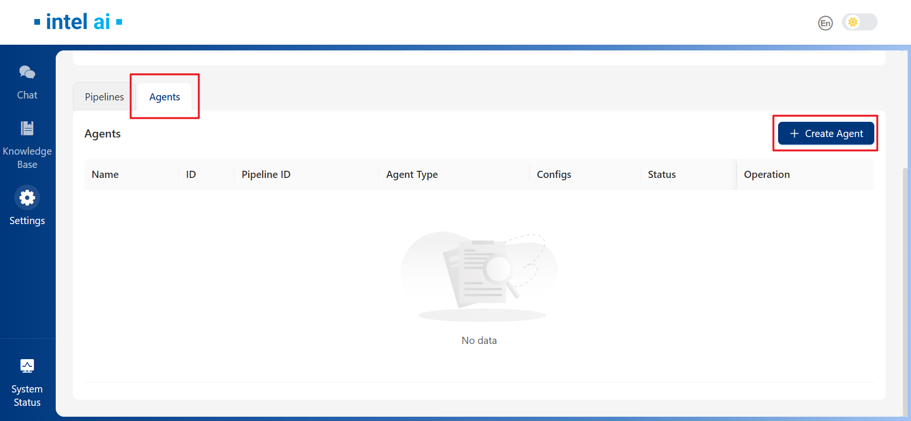

Then in the `Create Agent` window, set `Agent Type` as `Simple`.

After selecting `Simple`, pipeline selection and Agent configuration will be available. Please select the pipeline with vLLM serving (generator type `FreeChat`). For `Agent Configs`, you may specify `Max Retrievals` as needed.
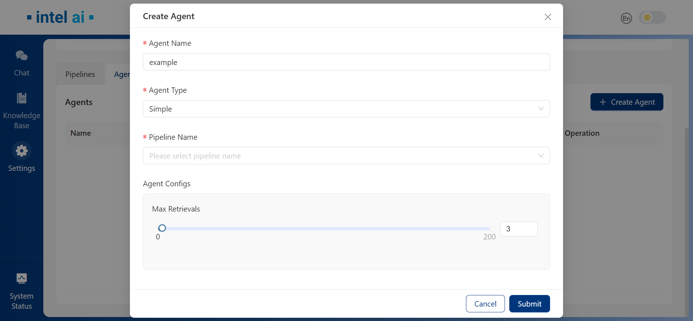

### Creating a Deep Search Agent

To create a Deep Search Agent, switch to `Agents` tab and click `Create Agent` button. In `Create Agent` window, set `Agent Type` as `Deep Search`.
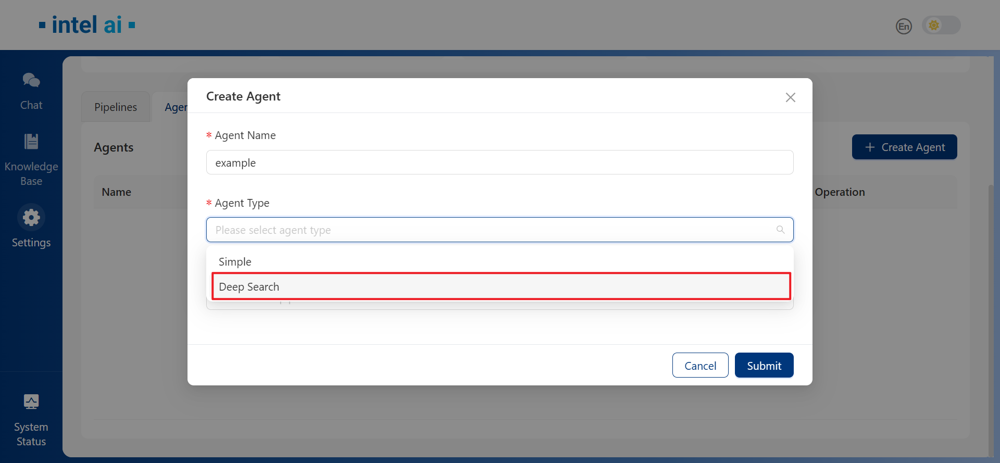

Similarly, please select the pipeline with vLLM serving (generator type `FreeChat`) in `Pipeline Name`. In `Agent Configs` session, 5 parameters could be customized: `Retrieve Top K`, `Rerank Top K`, `Mece Retrieval`, `Max Retrievals` and `Max Plan Steps`. If `Mece Retrieval` is enabled, agent will not retrieve chunks already retrieved in each step.
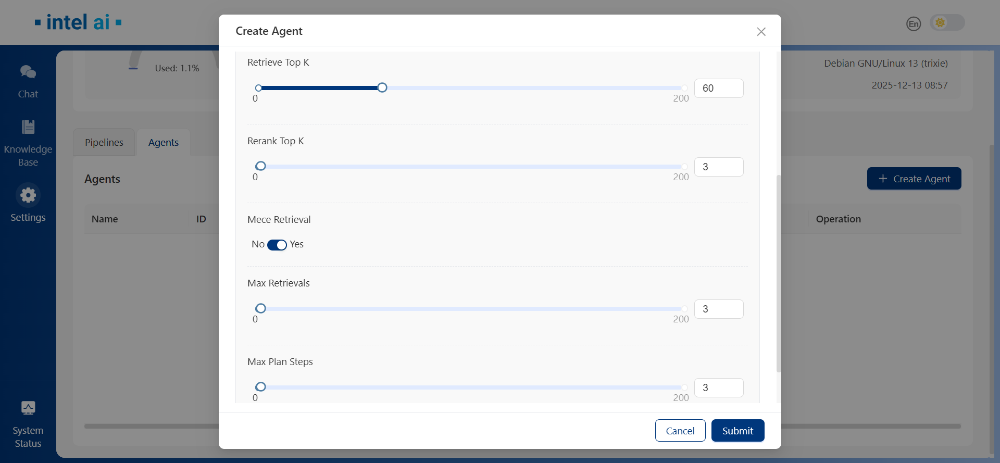

## Using Agents in RAG Pipelines

When agents were created successfully, they will be listed under `Agents` tab.
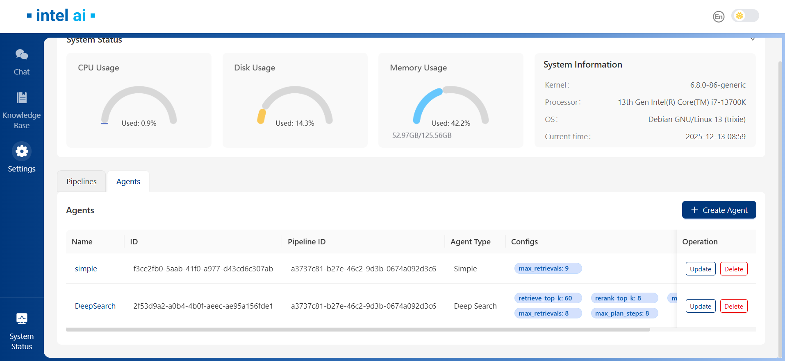

Then we can switch to `Chat` page to use the agents we created. They will be listed under `Agents` section of `Chat` page.
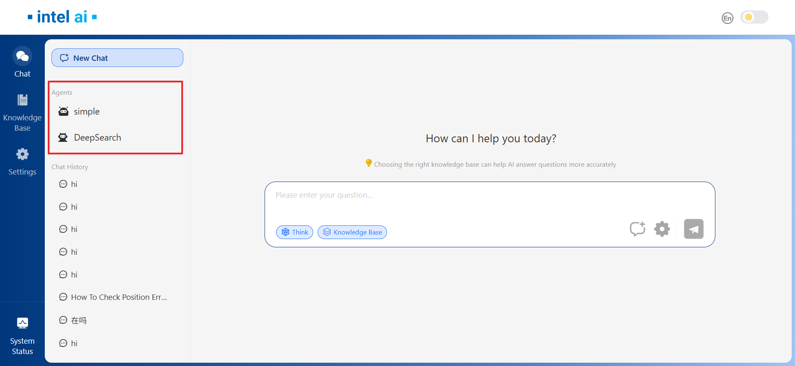

### Simple Agent

Select the Simple agent we created, `Think` function will be locked in dialog window as `Think` is mandatory for agents. While Simple agent is working, it will decide if more information is needed, and generate new query if so.
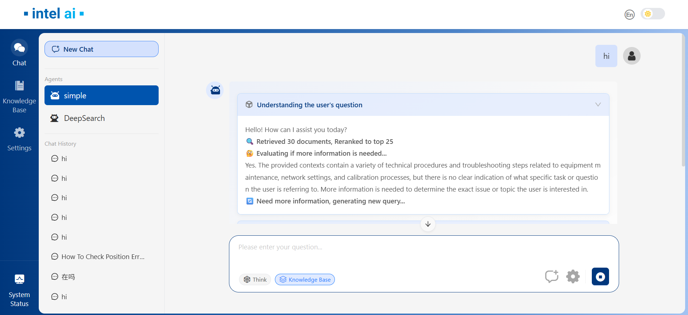

### DeepSearch Agent

Select DeepSearch agent from the `Agents` section. If we're going to switch between different agents, previous will be close.
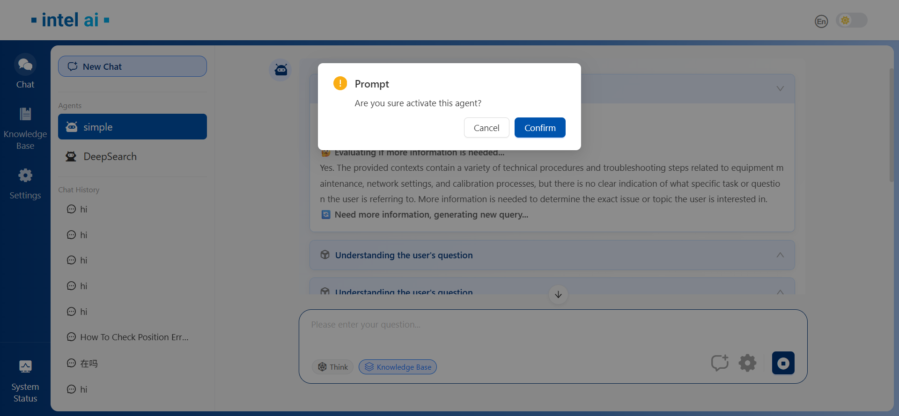

Agent could also be deactivated by single-click on the activated agent.
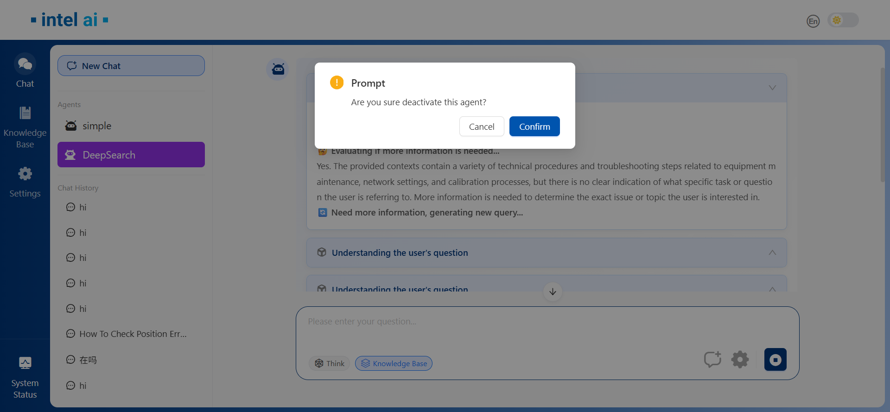

While DeepSearch agent is working, it will make plans on its own and execute the plan step by step.
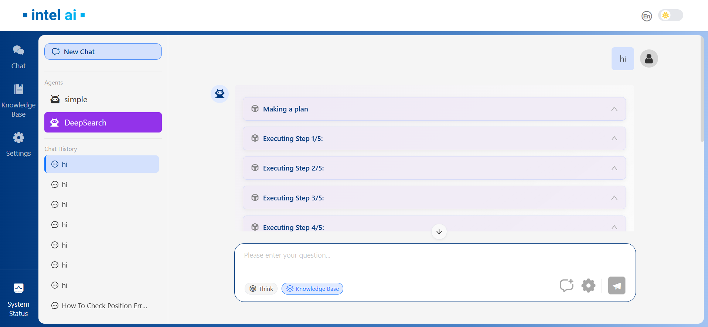

When all planned steps completed, DeepSearch agent will generate the final answer.
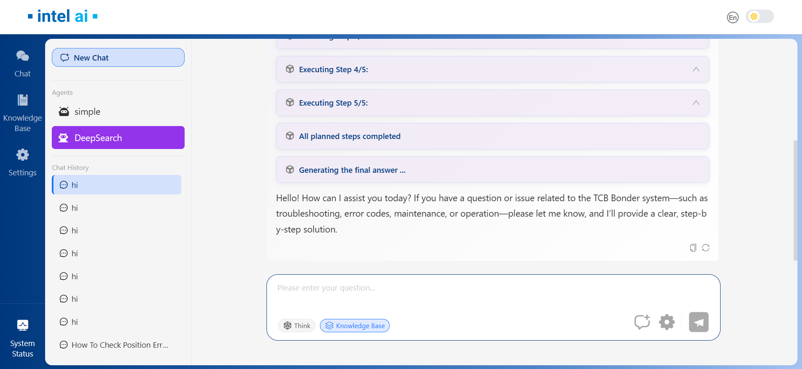
