# EC-RAG智能体指南

目前，EC-RAG智能体将作为试用版功能开放体验。
本指南将为您介绍如何在 EdgeCraftRAG (EC-RAG) 中启用、配置和使用智能体（Agent）功能，涵盖不同类型智能体的创建和管理。

## 概述

EC-RAG现已支持创建智能体，这些智能体能够执行复杂的推理、规划，从而能够比未使用智能体的RAG更准确地为您提供回答。
EC-RAG目前支持两种类型的智能体：

- **Simple Agent**: 不包含规划、research的简单轻量级Agent；
- **Deep Search Agent**: 能够进行多步规划、deep research和深度推理的更高级版本Agent。

## Retrieval

### 前提条件

要在EC-RAG中使用智能体，您需要确保满足以下前提条件：

1. 确保EC-RAG完整服务正在运行，并且UI可以访问；
2. Agent需要vLLM的大模型作为后端服务，请确保EC-RAG中以vLLM作为后端的pipeline处于可用状态。

### 创建Simple Agent智能体

当您需要创建Simple Agent时，需要在`配置`页面切换到`智能体`选项卡，点击`创建智能体`按钮。
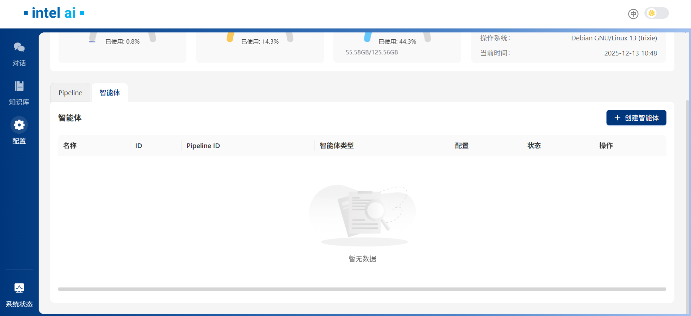

然后在`创建智能体`窗口中，将`智能体类型`设置为`simple`。
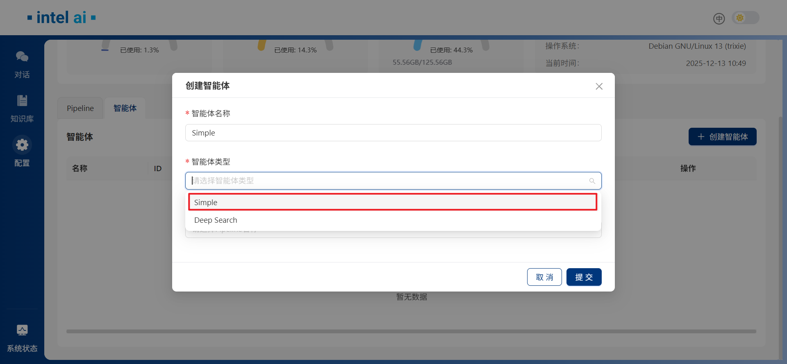

选择`simple`后，窗口内将出现`pipeline名称`和`智能体配置`两个可选项。请您选择带有 vLLM 服务且生成器类型为`FreeChat`的pipeline，并在`智能体配置`中，根据您的需要指定`Max Retrievals`。
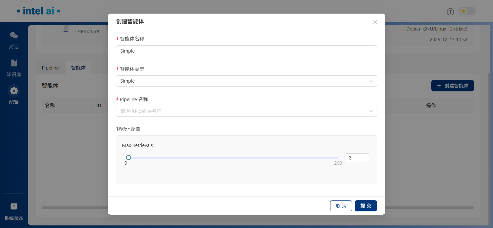

### 创建Deep Search Agent智能体

当您需要创建深度搜索代理时，同样，请切换到`智能体`选项卡，并点击`创建智能体`按钮。在`创建智能体`窗口中，将`智能体类型`设置为`Deep Search`。
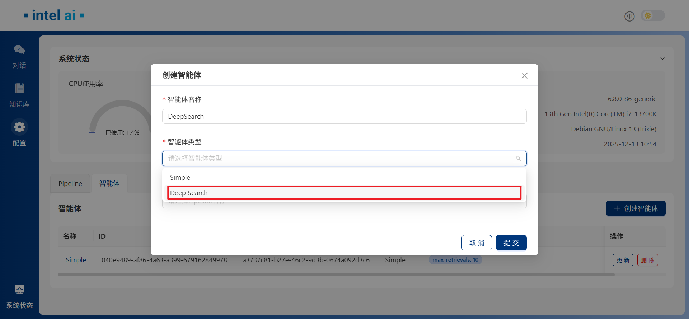

在`pipeline名称`和`智能体配置`两个可选项出现后，请选择带有 vLLM 服务且生成器类型为`FreeChat`的pipeline。对于Deep Search智能体，在`智能体配置`部分，可以自定义 5 个参数：`Retrieve Top K`、`Rerank Top K`、`Mece Retrieval`、`Max Retrievals`和`Max Plan Steps`。如果您启用了`Mece Retrieval`，智能体在每次行进retrieve时，将不会重复拿取之前的chunck。
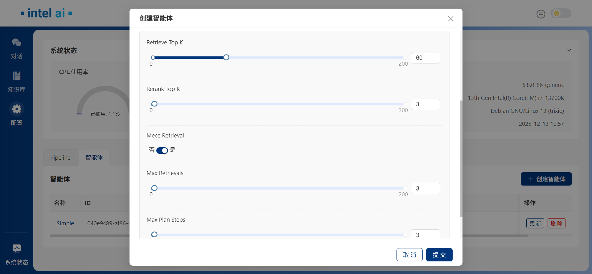

## 在RAG中使用智能体

当您成功创建智能体后，它们将在`智能体`选项卡下列出。
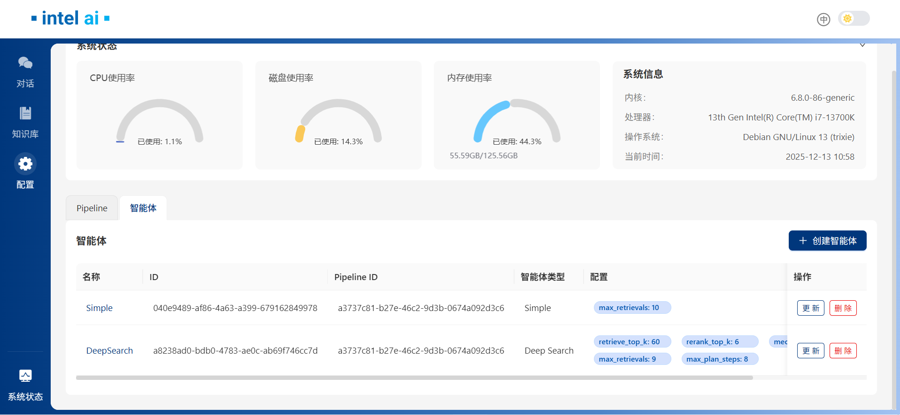

此时，您可以切换到`对话`页面，来使用刚才创建的智能体。它们将在`对话`页面的`智能体`部分列出。

### 使用Simple Agent智能体

`思考`功能对于智能体来说是必须的，所以您会注意到，当您选择创建的Simple Agent后，对话框中的`思考`选项会被锁定。当Simple Agent正常工作时，它会判断回答是否足够、是否需要更多信息。
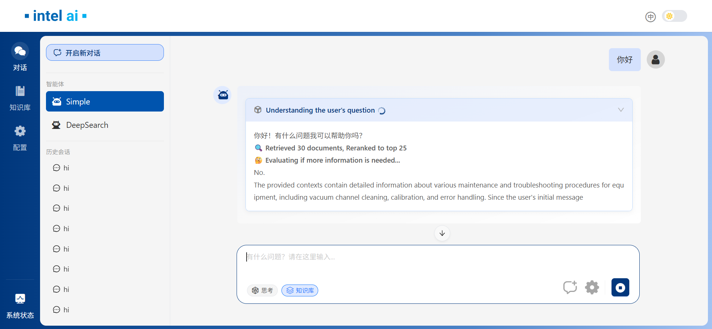

### 使用Deep Research智能体

从`智能体`部分选择您创建的DeepResearch智能体。您会注意到，如果您在不同智能体之间切换，之前的智能体将自动变为未激活状态。
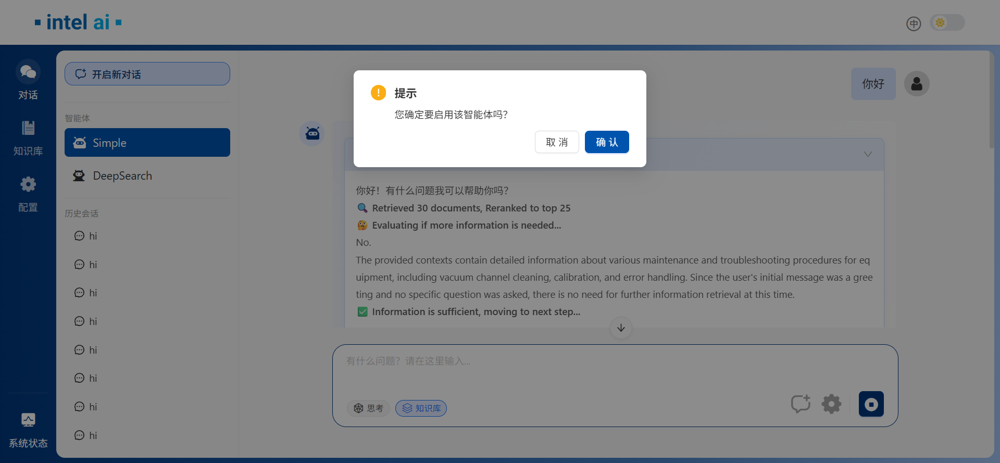

您也可以通过单击已激活的智能体来停用它。
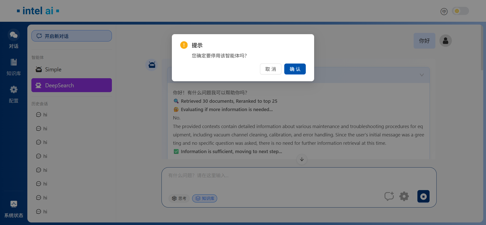

当Deep Research智能体正常工作时，它会自主进行回答规划并按需求逐步执行，并最终生成答案。
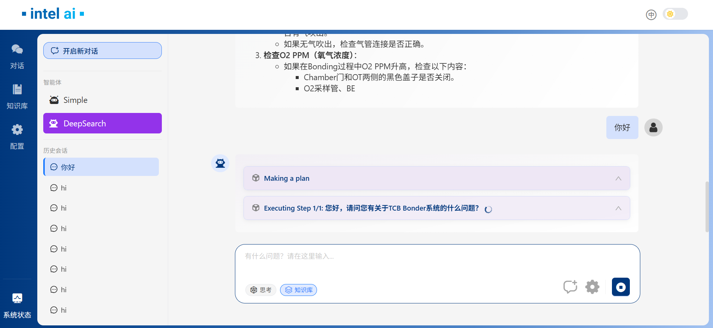
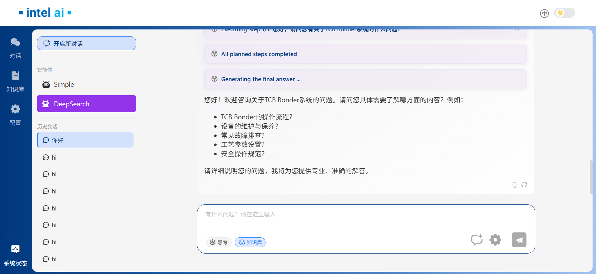
