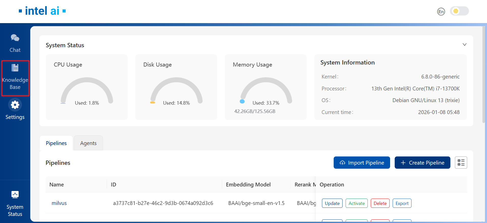
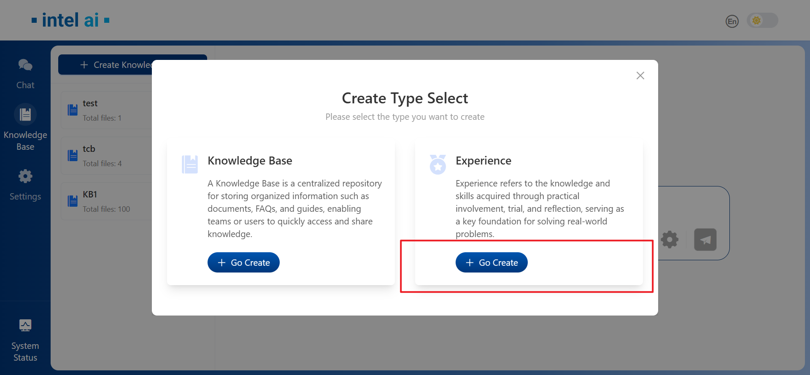
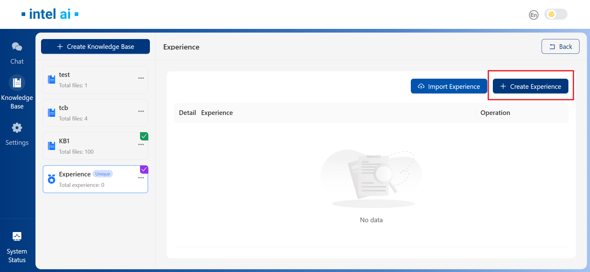
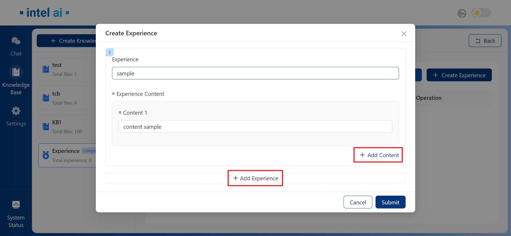
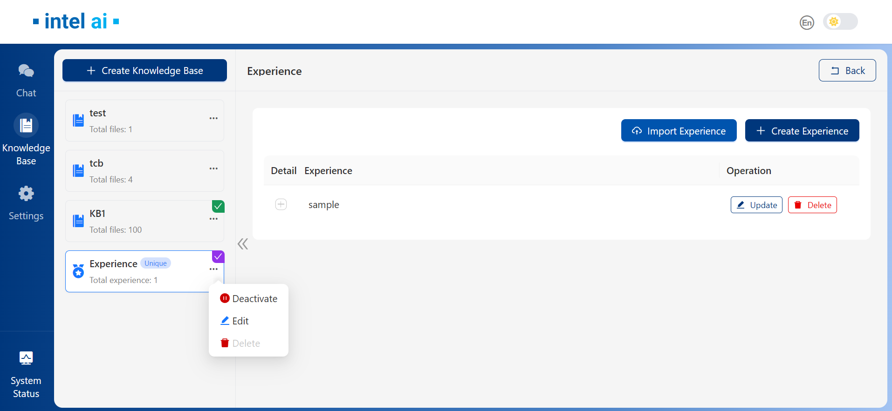
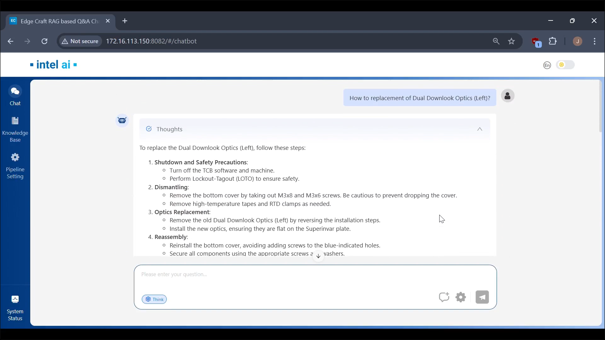
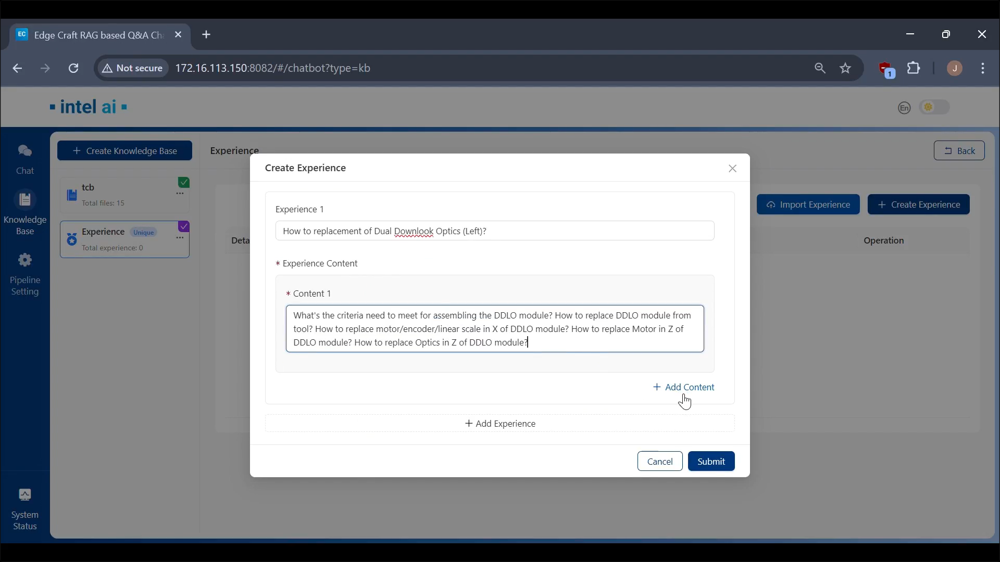
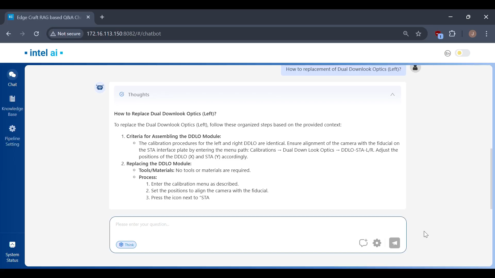

# EC-RAG Experience Guide

This guide explains how to enable, configure, and use Experience capabilities within EdgeCraftRAG (EC-RAG). It covers the creation and management of experience to enhance the answer quality

## Overview

Experience refers to the knowledge and skills acquired through practical involvement, trial, and reflection, serving as a key foundation for solving real-world problems. In EC-RAG we now provide abilities to add such experience for the reference of your Chat.

Before use Experience, please make sure Milvus VectorDB is enabled and below env is set:

```bash
export METADATA_DATABASE_URL="http://${HOST_IP}:19530"
```

## Creating An Experience

Upon successful deployment of EC-RAG, we may navigate to `Knowledge Base` tab from the left panel:


Then in the `Create Type Select` windows, choose `Go Create Experience`:


In the next windws, we can set Experience to `Activated` or `Inactive`, this could also be changed after creation of Experience:


## Managing Experiences

### Add Experiences

After successfully created `Experience`, Experience tab would be available with `Unique` tag:


To add new experience, select `Create Experience` from the right panel:


In the `Create Experience` window, we could add experience and its corresponding content as needed, multi experience creation is supported:


### View and Edit Experiences

After experience added, they will be shown in list under `Experience` tab. We could toggle the `+` sign to show experience content details. Use the three dots next to `Experience` to activate or deactivate a Experience Base:


## Examples

Here's a comparison with experience activated and not activated:

Without experience:


Activated experience:


RAG Answer:

