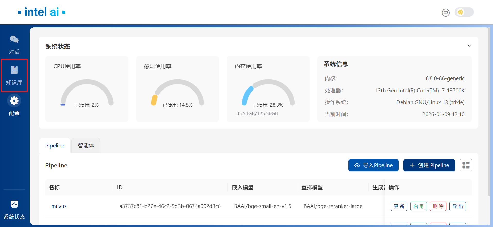
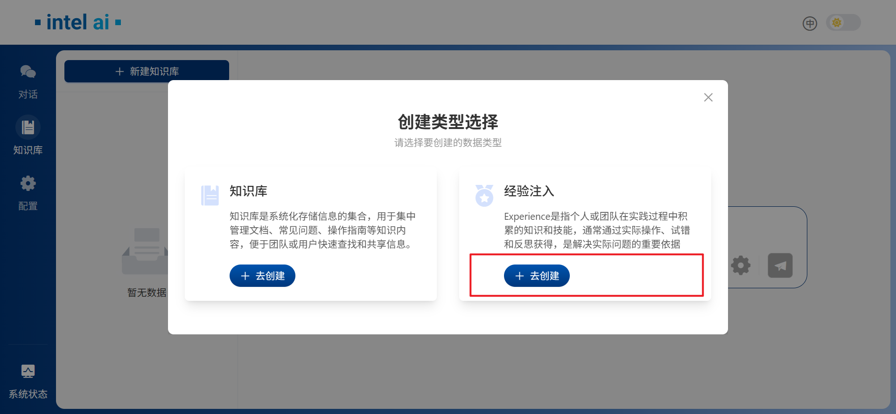
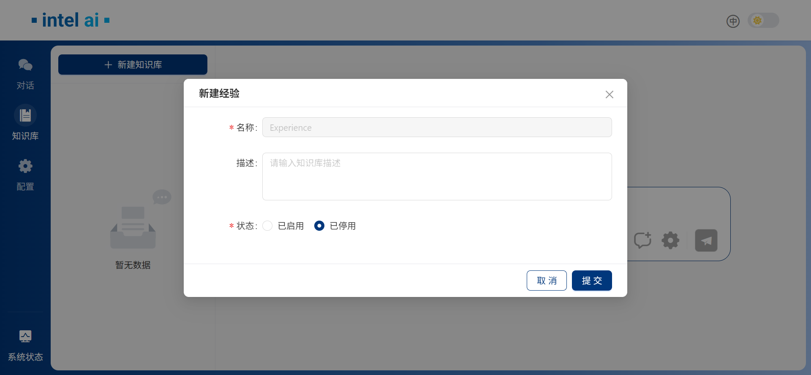
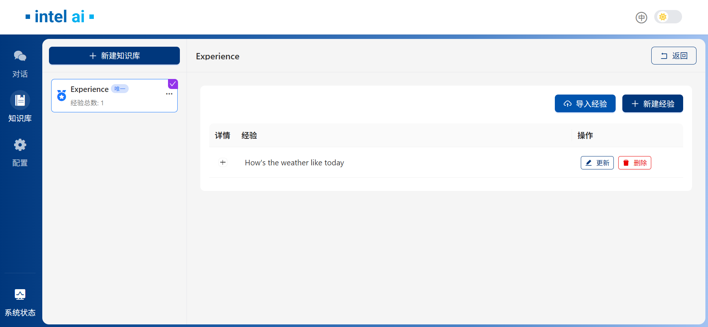
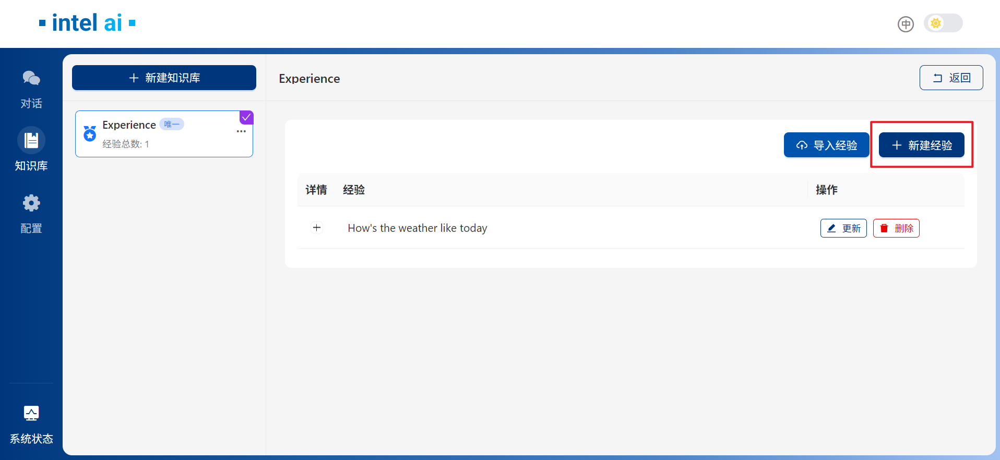
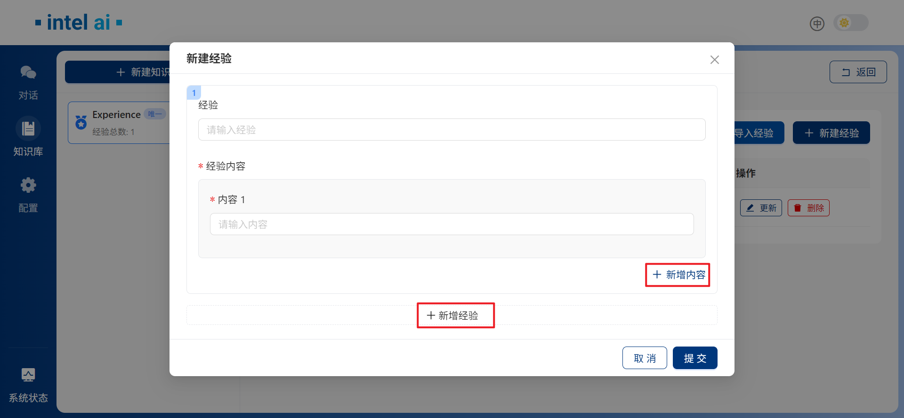

# EC-RAG 经验注入指南

本指南将为您介绍如何在 EdgeCraftRAG (EC-RAG) 中启用、配置和使用经验注入（Experience）功能，涵盖 Experience 的创建和管理，旨在提升您使用EC-RAG时的回答质量。

## 概述

Experience（经验）是指个人或团队在实践过程中积累的知识和技能，通常通过实际操作、试错和反思获得，是解决实际问题的重要依据。EC-RAG 现已支持添加此类Experience，为您的对话提供更多参考。
使用Experience之前，请确保Mivlus服务已经启动，并且请指定如下的环境变量:

```bash
export METADATA_DATABASE_URL="http://${HOST_IP}:19530"
```

## 创建 Experience

当 EC-RAG 被正确部署后，您可以通过左侧面板的`知识库`（Knowledge Base）选项卡切换到Experience创建页面：


然后在`创建类型选择`窗口中，选择`去创建经验注入`：


在接下来的窗口中，您可以将 Experience 设置为`已启用`或`已停用`状态。请注意，这也可以在创建 Experience 后进行更改：


## 管理 Experience

成功创建`Experience`后，左侧面板会出现`Experience`选项卡，同时带有`唯一`标签：


### 添加 Experience

当您需要添加新 Experience 时，请从右侧面板选择`新建经验`：


在`新建经验`窗口中，您可以根据需要添加经验及其对应的内容，EC-RAG 支持创建多个经验条目：


### 查看与修改

添加经验后，它们将以列表形式显示在`经验`选项卡下。您可以点击`+`号展开查看 Experience 内容的详细信息。使用左侧面板里`Experience`旁边的三个点可以激活或停用某个 Experience 库：


## 使用示例

以下是激活和未激活Experience库的对比：

未激活Experience：


激活Experience：


RAG回答：

