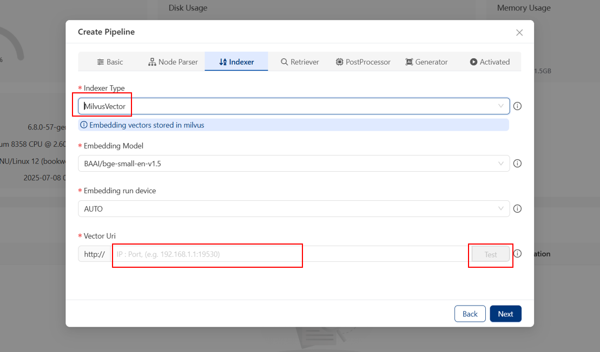
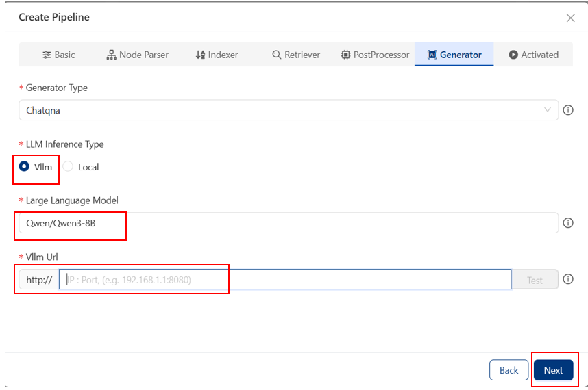
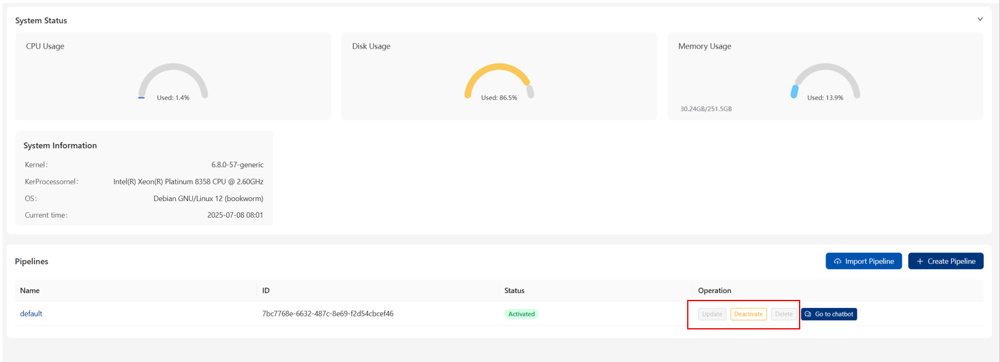
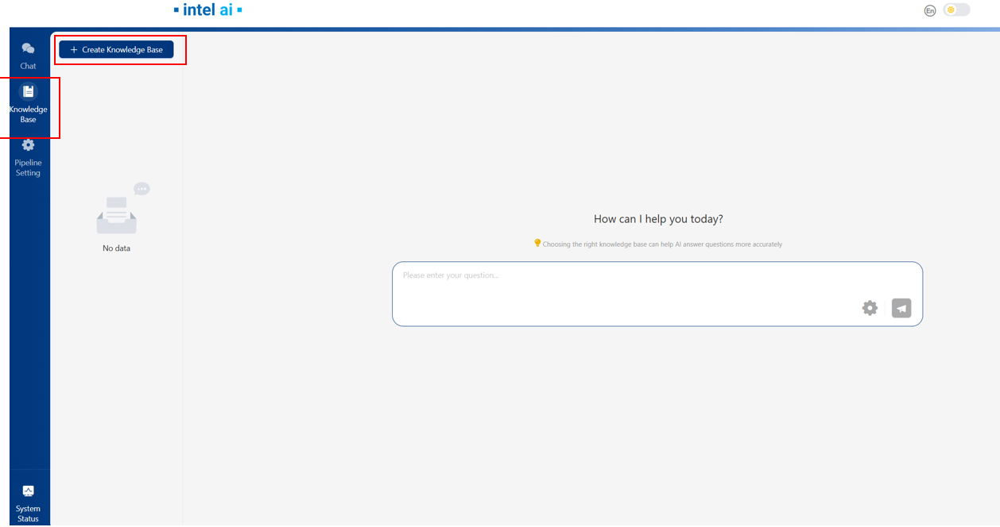
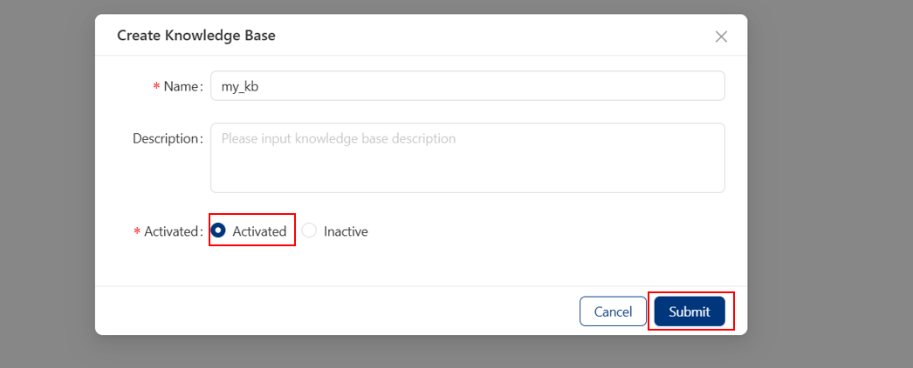
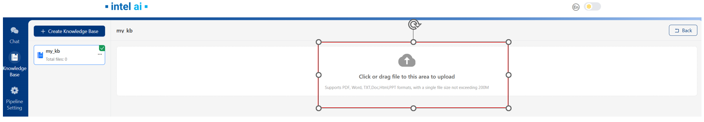
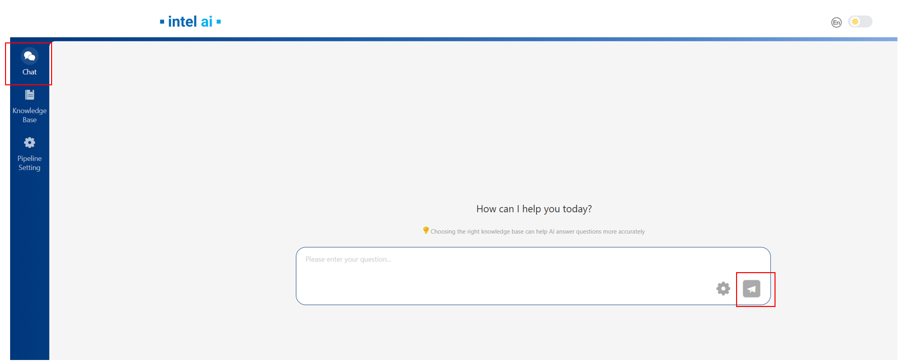
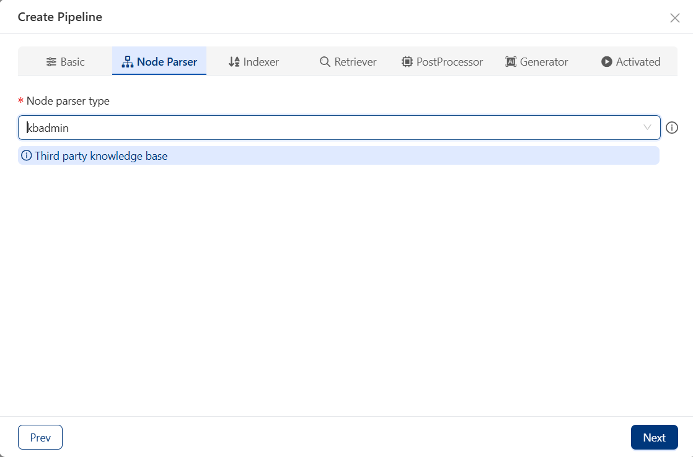
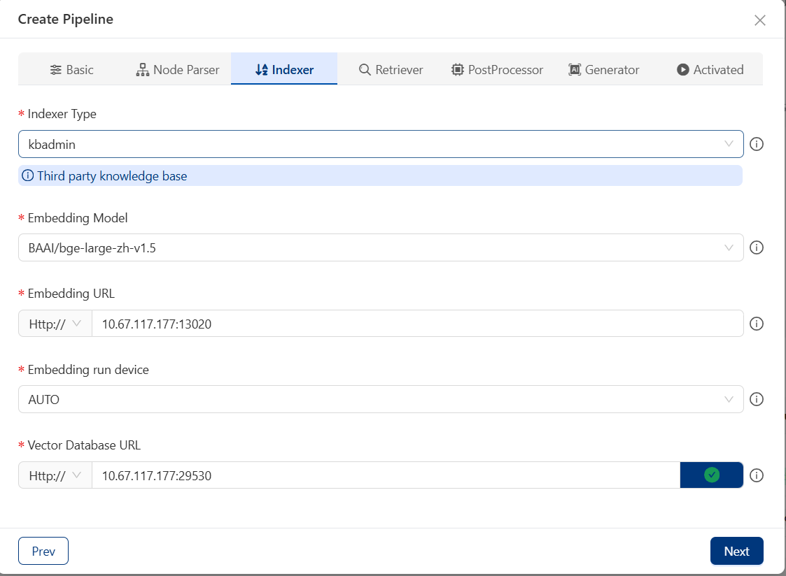
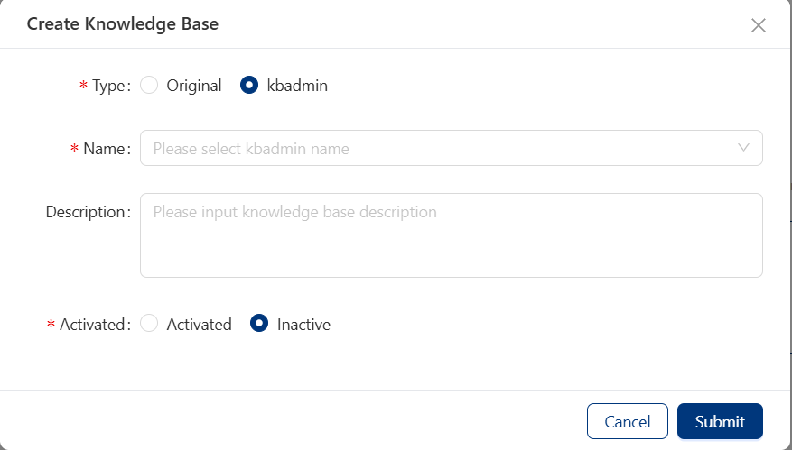

# Explore Edge Craft RAG

## ChatQnA with LLM Example in UI

### Create Pipeline

To create a default pipeline, you need to click the `Create Pipeline` button in the `Pipeline Setting` page.

Then follow the pipeline create guide in UI to set your pipeline, please note that in `Indexer Type` you can set MilvusVector as indexer(Please make sure Milvus is enabled before set MilvusVector as indexer, you can refer to [Enable Milvus](../docker_compose/intel/gpu/arc/README.md#deploy-the-service-using-docker-compose)).  
if choosing MilvusVector, you need to verify vector uri first, please input 'Your_IP:milvus_port' then click `Test` button. Note that milvus_port is 19530

Then, In ` Generator` config page, choose LLM Inference Type to `Vllm`.  
In `Large Language Model` field, input your LLM_MODEL name, e.g. 'Qwen/Qwen3-8B'.  
In `Vllm Url` field, you need to input 'IP:vllm_port' then click `Test` button. Note that defaultly vllm_port is '8086'  
(Note if the test fails, it might be because vLLM service not ready yet, you can wait for 30s and try again)

You can also create multiple pipelines or update/remove existing pipelines through the `Operation` field, but please note that active pipelines cannot be updated.

### Upload files & ChatQnA

After the pipeline creation, you can go to `Knowledge Base` page and click `Create Knowledge Base` button to create your knowledge base.

When creating Knowledge base, please choose `Activated` option, since only the files in activated Knowledge base can be retrieved in ChatQnA

After knowledge base creation, you can upload the documents for retrieval.

Then, you can submit messages in the chat box in `Chat` page.

## ChatQnA with Kbadmin in UI

### Kbadmin Pipeline

In the `Node Parser` page, select 'kbadmin' as node parser.

In the `Indexer` page, input embedding and vector DB information, please note the embedding service port is 13020; the vector DB port is 29530.

### Upload files & ChatQnA

After the pipeline creation, you can go to `Knowledge Base` page and click `Create Knowledge Base` button to create your knowledge base.  
Please select 'kbadmin' in `Type`and select kb name from the kbs you created in kbadmin UI page.

Then, you can submit messages in the chat box in `Chat` page.

