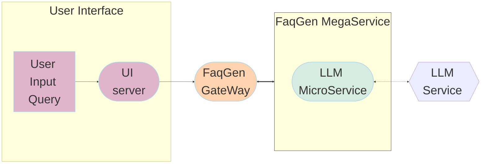

# FAQ Generation Application

In today's data-driven world, organizations across various industries face the challenge of managing and understanding vast amounts of information. Legal documents, contracts, regulations, and customer inquiries often contain critical insights buried within dense text. Extracting and presenting these insights in a concise and accessible format is crucial for decision-making, compliance, and customer satisfaction.

Our FAQ Generation Application leverages the power of large language models (LLMs) to revolutionize the way you interact with and comprehend complex textual data. By harnessing cutting-edge natural language processing techniques, our application can automatically generate comprehensive and natural-sounding frequently asked questions (FAQs) from your documents, legal texts, customer queries, and other sources. In this example use case, we utilize LangChain to implement FAQ Generation and facilitate LLM inference using Text Generation Inference on Intel Xeon and Gaudi2 processors.

The FaqGen example is implemented using the component-level microservices defined in [GenAIComps](https://github.com/opea-project/GenAIComps). The flow chart below shows the information flow between different microservices for this example.

## Deploy FAQ Generation Service

The FAQ Generation service can be deployed on either Intel Gaudi2 or Intel Xeon Scalable Processors.

### Deploy FAQ Generation on Gaudi

Refer to the [Gaudi Guide](./docker_compose/intel/hpu/gaudi/README.md) for instructions on deploying FAQ Generation on Gaudi.

### Deploy FAQ Generation on Xeon

Refer to the [Xeon Guide](./docker_compose/intel/cpu/xeon/README.md) for instructions on deploying FAQ Generation on Xeon.

### Deploy FaqGen on Kubernetes using Helm Chart

Refer to the [FaqGen helm chart](./kubernetes/helm/README.md) for instructions on deploying FaqGen on Kubernetes.
