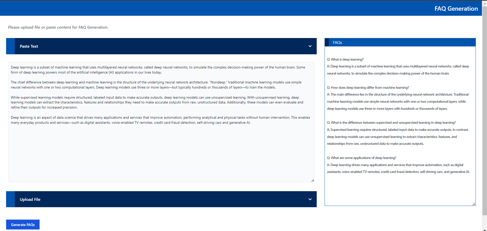
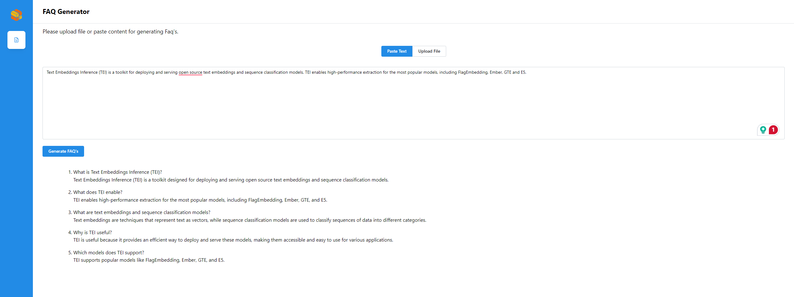

# Build MegaService of FAQ Generation on Gaudi

This document outlines the deployment process for a FAQ Generation application utilizing the [GenAIComps](https://github.com/opea-project/GenAIComps.git) microservice pipeline on Intel Gaudi server. The steps include Docker image creation, container deployment via Docker Compose, and service execution to integrate microservices such as llm. We will publish the Docker images to Docker Hub, which will simplify the deployment process for this service.

## 🚀 Build Docker Images

First of all, you need to build Docker Images locally. This step can be ignored once the Docker images are published to Docker hub.

```bash
git clone https://github.com/opea-project/GenAIComps.git
cd GenAIComps
```

### 1. Pull TGI Gaudi Image

As TGI Gaudi has been officially published as a Docker image, we simply need to pull it:

```bash
docker pull ghcr.io/huggingface/tgi-gaudi:1.2.1
```

### 2. Build LLM Image

```bash
docker build -t opea/llm-faqgen-tgi:latest --build-arg https_proxy=$https_proxy --build-arg http_proxy=$http_proxy -f comps/llms/faq-generation/tgi/Dockerfile .
```

### 3. Build MegaService Docker Image

To construct the Mega Service, we utilize the [GenAIComps](https://github.com/opea-project/GenAIComps.git) microservice pipeline within the `faqgen.py` Python script. Build the MegaService Docker image using the command below:

```bash
git clone https://github.com/opea-project/GenAIExamples
cd GenAIExamples/FaqGen/docker/
docker build --no-cache -t opea/faqgen:latest --build-arg https_proxy=$https_proxy --build-arg http_proxy=$http_proxy -f Dockerfile .
```

### 4. Build UI Docker Image

Construct the frontend Docker image using the command below:

```bash
cd GenAIExamples/FaqGen/docker/ui/
docker build -t opea/faqgen-ui:latest --build-arg https_proxy=$https_proxy --build-arg http_proxy=$http_proxy -f ./docker/Dockerfile .
```

### 5. Build react UI Docker Image (Optional)

Build the frontend Docker image based on react framework via below command:

```bash
cd GenAIExamples/FaqGen/docker/ui
export BACKEND_SERVICE_ENDPOINT="http://${host_ip}:8888/v1/faqgen"
docker build -t opea/faqgen-react-ui:latest --build-arg https_proxy=$https_proxy --build-arg http_proxy=$http_proxy --build-arg BACKEND_SERVICE_ENDPOINT=$BACKEND_SERVICE_ENDPOINT -f ./docker/Dockerfile.react .
```

Then run the command `docker images`, you will have the following Docker Images:

1. `ghcr.io/huggingface/tgi-gaudi:1.2.1`
2. `opea/llm-faqgen-tgi:latest`
3. `opea/faqgen:latest`
4. `opea/faqgen-ui:latest`
5. `opea/faqgen-react-ui:latest`

## 🚀 Start Microservices and MegaService

### Setup Environment Variables

Since the `compose.yaml` will consume some environment variables, you need to setup them in advance as below.

```bash
export no_proxy=${your_no_proxy}
export http_proxy=${your_http_proxy}
export https_proxy=${your_http_proxy}
export LLM_MODEL_ID="Intel/neural-chat-7b-v3-3"
export TGI_LLM_ENDPOINT="http://${your_ip}:8008"
export HUGGINGFACEHUB_API_TOKEN=${your_hf_api_token}
export MEGA_SERVICE_HOST_IP=${host_ip}
export LLM_SERVICE_HOST_IP=${host_ip}
export BACKEND_SERVICE_ENDPOINT="http://${host_ip}:8888/v1/faqgen"
```

Note: Please replace with `host_ip` with your external IP address, do not use localhost.

### Start Microservice Docker Containers

```bash
cd GenAIExamples/FaqGen/docker/gaudi
docker compose up -d
```

### Validate Microservices

1. TGI Service

```bash
curl http://${your_ip}:8008/generate \
  -X POST \
  -d '{"inputs":"What is Deep Learning?","parameters":{"max_new_tokens":64, "do_sample": true}}' \
  -H 'Content-Type: application/json'
```

2. LLM Microservice

```bash
curl http://${host_ip}:9000/v1/faqgen \
  -X POST \
  -d '{"query":"Text Embeddings Inference (TEI) is a toolkit for deploying and serving open source text embeddings and sequence classification models. TEI enables high-performance extraction for the most popular models, including FlagEmbedding, Ember, GTE and E5."}' \
  -H 'Content-Type: application/json'
```

3. MegaService

```bash
curl http://${host_ip}:8888/v1/faqgen -H "Content-Type: application/json" -d '{
     "messages": "Text Embeddings Inference (TEI) is a toolkit for deploying and serving open source text embeddings and sequence classification models. TEI enables high-performance extraction for the most popular models, including FlagEmbedding, Ember, GTE and E5."
     }'
```

## Enable LangSmith to Monitor an Application (Optional)

LangSmith offers a suite of tools to debug, evaluate, and monitor language models and intelligent agents. It can be used to assess benchmark data for each microservice. Before launching your services with `docker compose -f compose.yaml up -d`, you need to enable LangSmith tracing by setting the `LANGCHAIN_TRACING_V2` environment variable to true and configuring your LangChain API key.

Here's how you can do it:

1. Install the latest version of LangSmith:

```bash
pip install -U langsmith
```

2. Set the necessary environment variables:

```bash
export LANGCHAIN_TRACING_V2=true
export LANGCHAIN_API_KEY=ls_...
```

## 🚀 Launch the UI

Open this URL `http://{host_ip}:5173` in your browser to access the frontend.



## 🚀 Launch the React UI (Optional)

To access the FAQGen (react based) frontend, modify the UI service in the `compose.yaml` file. Replace `faqgen-xeon-ui-server` service with the `faqgen-xeon-react-ui-server` service as per the config below:

```bash
  faqgen-xeon-react-ui-server:
    image: opea/faqgen-react-ui:latest
    container_name: faqgen-xeon-react-ui-server
    environment:
      - no_proxy=${no_proxy}
      - https_proxy=${https_proxy}
      - http_proxy=${http_proxy}
    ports:
      - 5174:80
    depends_on:
      - faqgen-xeon-backend-server
    ipc: host
    restart: always
```

Open this URL `http://{host_ip}:5174` in your browser to access the react based frontend.

- Create FAQs from Text input
  

- Create FAQs from Text Files
  
