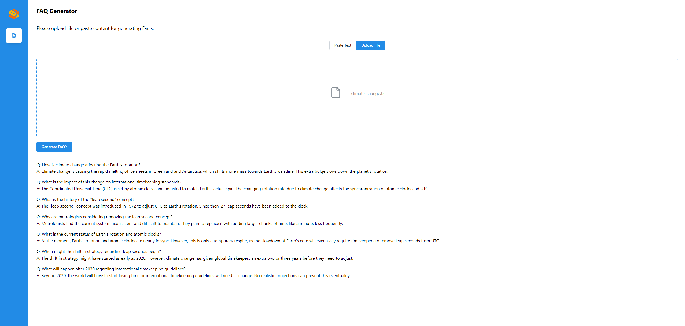

<h1 align="center" id="title">Doc Summary React</h1>

### 📸 Project Screenshots




<h2>🧐 Features</h2>

Here're some of the project's features:

- Generate FAQs from Text via Pasting: Paste the text to into the text box, then click 'Generate FAQ' to produce a condensed FAQ of the content, which will be displayed in the 'FAQ' box below.

- Generate FAQs from Text via txt file Upload: Upload the file in the Upload bar, then click 'Generate FAQ' to produce a condensed FAQ of the content, which will be displayed in the 'FAQ' box below.

<h2>🛠️ Get it Running:</h2>

1. Clone the repo.

2. cd command to the current folder.

3. Modify the required .env variables.
   ```
   VITE_DOC_SUM_URL = ''
   ```
4. Execute `npm install` to install the corresponding dependencies.

5. Execute `npm run dev` in both environments
