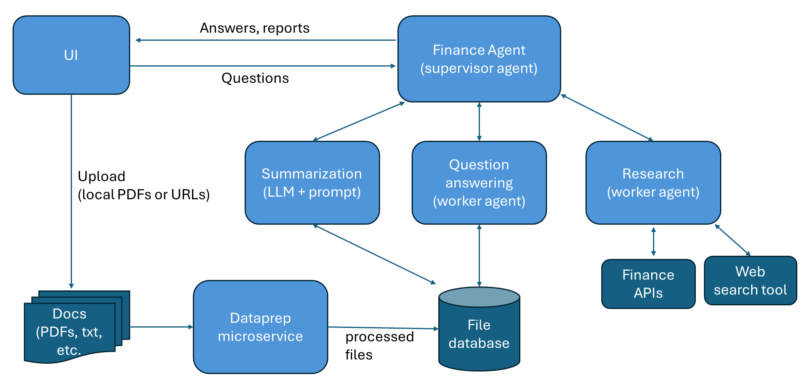
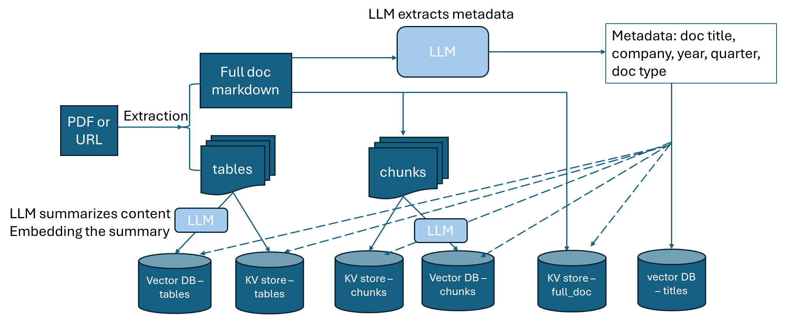
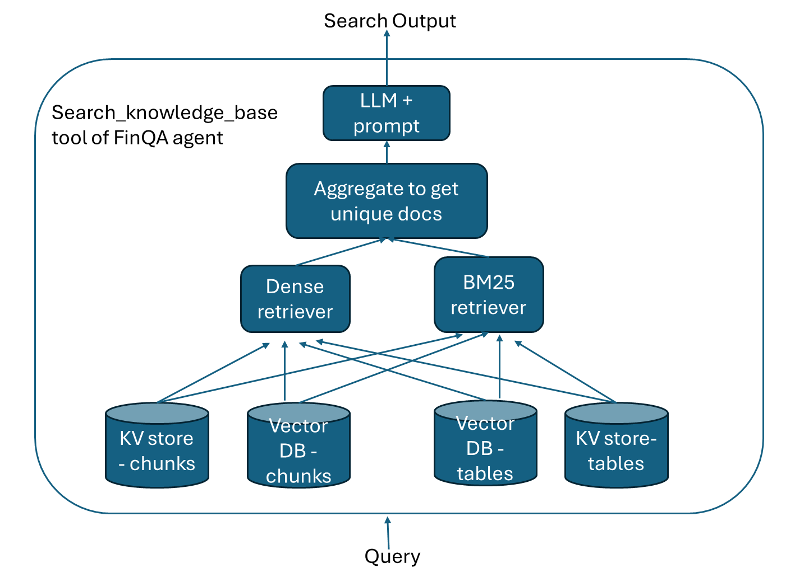
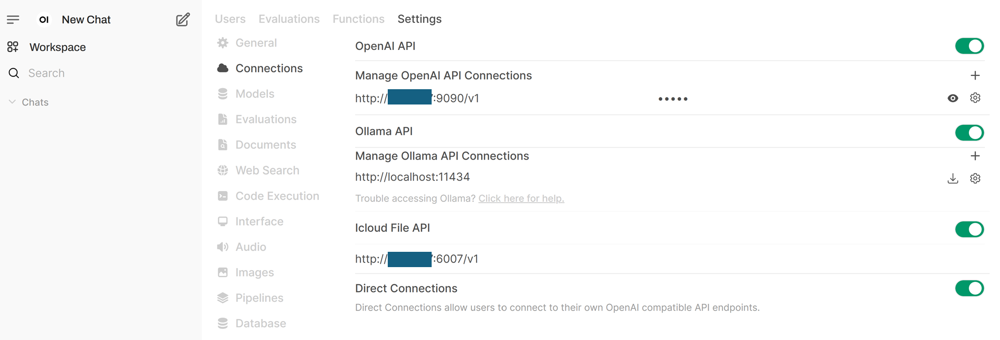
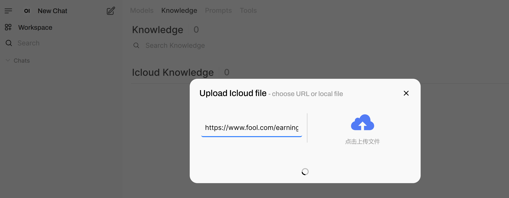
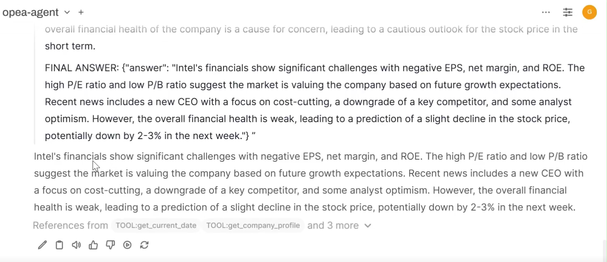

# Finance Agent

## 1. Overview

The architecture of this Finance Agent example is shown in the figure below. The agent is a hierarchical multi-agent system and has 3 main functions:

1. Summarize long financial documents and provide key points (using OPEA DocSum).
2. Answer questions over financial documents, such as SEC filings (using a worker agent).
3. Conduct research of a public company and provide an investment report of the company (using a worker agent).

The user interacts with the supervisor agent through the graphical UI. The supervisor agent gets the requests from the user and dispatches tasks to worker agents or to the summarization microservice. The user can also uploads documents through the UI.



The architectural diagram of the `dataprep` microservice is shown below. We use [docling](https://github.com/docling-project/docling) to extract text from PDFs and URLs into markdown format. Both the full document content and tables are extracted. We then use an LLM to extract metadata from the document, including the company name, year, quarter, document type, and document title. The full document markdown then gets chunked, and LLM is used to summarize each chunk, and the summaries are embedded and saved to a vector database. Each table is also summarized by LLM and the summaries are embedded and saved to the vector database. The chunks and tables are also saved into a KV store. The pipeline is designed as such to improve retrieval accuracy of the `search_knowledge_base` tool used by the Question Answering worker agent.



The `dataprep` microservice can ingest financial documents in two formats:

1. PDF documents stored locally, such as SEC filings saved in local directory.
2. URLs, such as earnings call transcripts ([example](https://www.fool.com/earnings/call-transcripts/2025/03/06/costco-wholesale-cost-q2-2025-earnings-call-transc/)) and online SEC filings ([example](https://investors.3m.com/financials/sec-filings/content/0000066740-25-000006/0000066740-25-000006.pdf)).

Please note:

1. Each financial document should be about one company.
2. URLs ending in `.htm` are not supported.

The Question Answering worker agent uses `search_knowledge_base` tool to get relevant information. The tool uses a dense retriever and a BM25 retriever to get many pieces of information including financial statement tables. Then an LLM is used to extract useful information related to the query from the retrieved documents. Refer to the diagram below. We found that using this method significantly improves agent performance.



## 2. Getting started

### 2.1 Download repos

```bash
mkdir /path/to/your/workspace/
export WORKDIR=/path/to/your/workspace/
cd $WORKDIR
git clone https://github.com/opea-project/GenAIExamples.git
```

### 2.2 Set up env vars

```bash
export ip_address="External_Public_IP"
export no_proxy=${your_no_proxy},${ip_address}
export HF_CACHE_DIR=/path/to/your/model/cache/
export HF_TOKEN=<you-hf-token>
export FINNHUB_API_KEY=<your-finnhub-api-key> # go to https://finnhub.io/ to get your free api key
export FINANCIAL_DATASETS_API_KEY=<your-api-key> # go to https://docs.financialdatasets.ai/ to get your free api key
```

### 2.3 [Optional] Build docker images

Only needed when docker pull failed.

```bash
cd $WORKDIR/GenAIExamples/FinanceAgent/docker_image_build
# get GenAIComps repo
git clone https://github.com/opea-project/GenAIComps.git
# build the images
docker compose -f build.yaml build --no-cache
```

If deploy on Gaudi, also need to build vllm image.

```bash
cd $WORKDIR
git clone https://github.com/HabanaAI/vllm-fork.git
# get the latest release tag of vllm gaudi
cd vllm-fork
VLLM_VER=$(git describe --tags "$(git rev-list --tags --max-count=1)")
echo "Check out vLLM tag ${VLLM_VER}"
git checkout ${VLLM_VER}
docker build --no-cache -f Dockerfile.hpu -t opea/vllm-gaudi:latest --shm-size=128g . --build-arg https_proxy=$https_proxy --build-arg http_proxy=$http_proxy
```

## 3. Deploy with docker compose

### 3.1 Launch vllm endpoint

Below is the command to launch a vllm endpoint on Gaudi that serves `meta-llama/Llama-3.3-70B-Instruct` model on 4 Gaudi cards.

```bash
cd $WORKDIR/GenAIExamples/FinanceAgent/docker_compose/intel/hpu/gaudi
bash launch_vllm.sh
```

### 3.2 Prepare knowledge base

The commands below will upload some example files into the knowledge base. You can also upload files through UI.

First, launch the redis databases and the dataprep microservice.

```bash
# inside $WORKDIR/GenAIExamples/FinanceAgent/docker_compose/intel/hpu/gaudi/
bash launch_dataprep.sh
```

Validate datat ingest data and retrieval from database:

```bash
python $WORKDIR/GenAIExamples/FinanceAgent/tests/test_redis_finance.py --port 6007 --test_option ingest
python $WORKDIR/GenAIExamples/FinanceAgent/tests/test_redis_finance.py --port 6007 --test_option get
```

### 3.3 Launch the multi-agent system

The command below will launch 3 agent microservices, 1 docsum microservice, 1 UI microservice.

```bash
# inside $WORKDIR/GenAIExamples/FinanceAgent/docker_compose/intel/hpu/gaudi/
bash launch_agents.sh
```

### 3.4 Validate agents

FinQA Agent:

```bash
export agent_port="9095"
prompt="What is Gap's revenue in 2024?"
python3 $WORKDIR/GenAIExamples/FinanceAgent/tests/test.py --prompt "$prompt" --agent_role "worker" --ext_port $agent_port
```

Research Agent:

```bash
export agent_port="9096"
prompt="generate NVDA financial research report"
python3 $WORKDIR/GenAIExamples/FinanceAgent/tests/test.py --prompt "$prompt" --agent_role "worker" --ext_port $agent_port --tool_choice "get_current_date" --tool_choice "get_share_performance"
```

Supervisor Agent single turns:

```bash
export agent_port="9090"
python3 $WORKDIR/GenAIExamples/FinanceAgent/tests/test.py --agent_role "supervisor" --ext_port $agent_port --stream
```

Supervisor Agent multi turn:

```bash
python3 $WORKDIR/GenAIExamples/FinanceAgent/tests/test.py --agent_role "supervisor" --ext_port $agent_port --multi-turn --stream

```

## How to interact with the agent system with UI

The UI microservice is launched in the previous step with the other microservices.
To see the UI, open a web browser to `http://${ip_address}:5175` to access the UI. Note the `ip_address` here is the host IP of the UI microservice.

1. Create Admin Account with a random value

2. Enter the endpoints in the `Connections` settings

   First, click on the user icon in the upper right corner to open `Settings`. Click on `Admin Settings`. Click on `Connections`.

   Then, enter the supervisor agent endpoint in the `OpenAI API` section: `http://${ip_address}:9090/v1`. Enter the API key as "empty". Add an arbitrary model id in `Model IDs`, for example, "opea_agent". The `ip_address` here should be the host ip of the agent microservice.

   Then, enter the dataprep endpoint in the `Icloud File API` section. You first need to enable `Icloud File API` by clicking on the button on the right to turn it into green and then enter the endpoint url, for example, `http://${ip_address}:6007/v1`. The `ip_address` here should be the host ip of the dataprep microservice.

   You should see screen like the screenshot below when the settings are done.



3. Upload documents with UI

   Click on the `Workplace` icon in the top left corner. Click `Knowledge`. Click on the "+" sign to the right of `Icloud Knowledge`. You can paste an url in the left hand side of the pop-up window, or upload a local file by click on the cloud icon on the right hand side of the pop-up window. Then click on the `Upload Confirm` button. Wait till the processing is done and the pop-up window will be closed on its own when the data ingestion is done. See the screenshot below.

   Note: the data ingestion may take a few minutes depending on the length of the document. Please wait patiently and do not close the pop-up window.



4. Test agent with UI

   After the settings are done and documents are ingested, you can start to ask questions to the agent. Click on the `New Chat` icon in the top left corner, and type in your questions in the text box in the middle of the UI.

   The UI will stream the agent's response tokens. You need to expand the `Thinking` tab to see the agent's reasoning process. After the agent made tool calls, you would also see the tool output after the tool returns output to the agent. Note: it may take a while to get the tool output back if the tool execution takes time.


