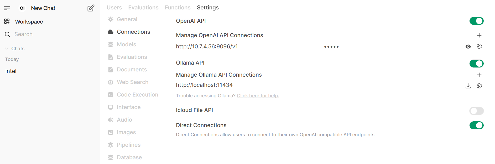

# Finance Agent

## 1. Overview

The architecture of this Finance Agent example is shown in the figure below. The agent has 3 main functions:

1. Summarize long financial documents and provide key points.
2. Answer questions over financial documents, such as SEC filings.
3. Conduct research of a public company and provide an investment report of the company.


The `dataprep` microservice can ingest financial documents in two formats:

1. PDF documents stored locally, such as SEC filings saved in local directory.
2. URLs, such as earnings call transcripts ([example](https://www.fool.com/earnings/call-transcripts/2025/03/06/costco-wholesale-cost-q2-2025-earnings-call-transc/)) and online SEC filings ([example](https://investors.3m.com/financials/sec-filings/content/0000066740-25-000006/0000066740-25-000006.pdf)).

Please note:

1. Each financial document should be about one company.
2. URLs ending in `.htm` are not supported.

## 2. Getting started

### 2.1 Download repos

```bash
mkdir /path/to/your/workspace/
export WORKDIR=/path/to/your/workspace/
genaicomps
genaiexamples
```

### 2.2 Set up env vars

```bash
export HF_CACHE_DIR=/path/to/your/model/cache/
export HF_TOKEN=<you-hf-token>

```

### 2.3 Build docker images

Build docker images for dataprep, agent, agent-ui.

```bash
cd GenAIExamples/FinanceAgent/docker_image_build
docker compose -f build.yaml build --no-cache
```

If deploy on Gaudi, also need to build vllm image.

```bash
cd $WORKDIR
git clone https://github.com/HabanaAI/vllm-fork.git
# get the latest release tag of vllm gaudi
cd vllm-fork
VLLM_VER=$(git describe --tags "$(git rev-list --tags --max-count=1)")
echo "Check out vLLM tag ${VLLM_VER}"
git checkout ${VLLM_VER}
docker build --no-cache -f Dockerfile.hpu -t opea/vllm-gaudi:latest --shm-size=128g . --build-arg https_proxy=$https_proxy --build-arg http_proxy=$http_proxy
```

## 3. Deploy with docker compose

### 3.1 Launch vllm endpoint

Below is the command to launch a vllm endpoint on Gaudi that serves `meta-llama/Llama-3.3-70B-Instruct` model on 4 Gaudi cards.

```bash
cd $WORKDIR/GenAIExamples/FinanceAgent/docker_compose/intel/hpu/gaudi
bash launch_vllm.sh
```

### 3.2 Prepare knowledge base

The commands below will upload some example files into the knowledge base. You can also upload files through UI.

First, launch the redis databases and the dataprep microservice.

```bash
# inside $WORKDIR/GenAIExamples/FinanceAgent/docker_compose/intel/hpu/gaudi/
bash launch_dataprep.sh
```

Validate datat ingest data and retrieval from database:

```bash
python $WORKPATH/tests/test_redis_finance.py --port 6007 --test_option ingest
python $WORKPATH/tests/test_redis_finance.py --port 6007 --test_option get
```

### 3.3 Launch the multi-agent system

```bash
# inside $WORKDIR/GenAIExamples/FinanceAgent/docker_compose/intel/hpu/gaudi/
bash launch_agents.sh
```

### 3.4 Validate agents

FinQA Agent:

```bash
export agent_port="9095"
prompt="What is Gap's revenue in 2024?"
python3 $WORKDIR/GenAIExamples/FinanceAgent/tests/test.py --prompt "$prompt" --agent_role "worker" --ext_port $agent_port
```

Research Agent:

```bash
export agent_port="9096"
prompt="generate NVDA financial research report"
python3 $WORKDIR/GenAIExamples/FinanceAgent/tests/test.py --prompt "$prompt" --agent_role "worker" --ext_port $agent_port --tool_choice "get_current_date" --tool_choice "get_share_performance"
```

Supervisor ReAct Agent:

```bash
export agent_port="9090"
python3 $WORKDIR/GenAIExamples/FinanceAgent/tests/test.py --agent_role "supervisor" --ext_port $agent_port --stream
```

Supervisor ReAct Agent Multi turn:

```bash
python3 $WORKDIR/GenAIExamples/FinanceAgent/tests/test.py --agent_role "supervisor" --ext_port $agent_port --multi-turn --stream

```

## How to interact with the agent system with UI

The UI microservice is launched in the previous step with the other microservices.
To see the UI, open a web browser to `http://${ip_address}:5175` to access the UI. Note the `ip_address` here is the host IP of the UI microservice.

1. `create Admin Account` with a random value

2. use an opea agent endpoint, for example, the `Research Agent` endpoint `http://$ip_address:9096/v1`, which is a openai compatible api



3. test opea agent with ui


