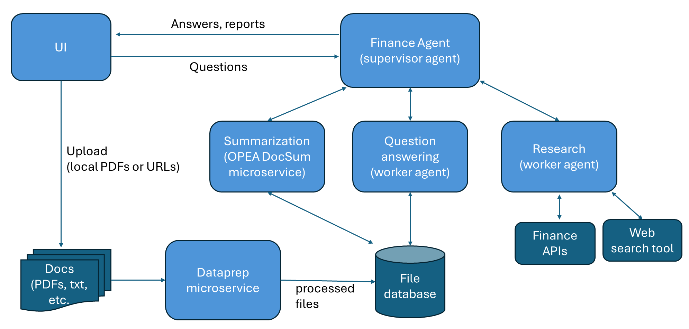

# Finance Agent Example

## Table of Contents

- [Overview](#overview)
- [Architecture](#architecture)
  - [High-Level Diagram](#high-level-diagram)
  - [OPEA Microservices Diagram for Data Handling](#opea-microservices-diagram-for-data-handling)
- [Deployment Options](#deployment-options)
- [Contribution](#contribution)

## Overview

The Finance Agent exemplifies a hierarchical multi-agent system designed to streamline financial document processing and analysis for users. It offers three core functionalities: summarizing lengthy financial documents, answering queries related to these documents, and conducting research to generate investment reports on public companies.

Navigating and analyzing extensive financial documents can be both challenging and time-consuming. Users often need concise summaries, answers to specific queries, or comprehensive investment reports. The Finance Agent effectively addresses these needs by automating document summarization, query answering, and research tasks, thereby enhancing productivity and decision-making efficiency.

Users interact with the system through a graphical user interface (UI), where a supervisor agent manages requests by delegating tasks to worker agents or the summarization microservice. The system also supports document uploads via the UI for processing.

## Architecture

### High-Level Diagram

The architecture of this Finance Agent example is shown in the figure below. The agent is a hierarchical multi-agent system and has 3 main functions:

1. Summarize long financial documents and provide key points (using OPEA DocSum).
2. Answer questions over financial documents, such as SEC filings (using a worker agent).
3. Conduct research of a public company and provide an investment report of the company (using a worker agent).

The user interacts with the supervisor agent through the graphical UI. The supervisor agent gets the requests from the user and dispatches tasks to worker agents or to the summarization microservice. The user can also uploads documents through the UI.

### OPEA Microservices Diagram for Data Handling

The architectural diagram of the `dataprep` microservice is shown below. We use [docling](https://github.com/docling-project/docling) to extract text from PDFs and URLs into markdown format. Both the full document content and tables are extracted. We then use an LLM to extract metadata from the document, including the company name, year, quarter, document type, and document title. The full document markdown then gets chunked, and LLM is used to summarize each chunk, and the summaries are embedded and saved to a vector database. Each table is also summarized by LLM and the summaries are embedded and saved to the vector database. The chunks and tables are also saved into a KV store. The pipeline is designed as such to improve retrieval accuracy of the `search_knowledge_base` tool used by the Question Answering worker agent.

The `dataprep` microservice can ingest financial documents in two formats:

1. PDF documents stored locally, such as SEC filings saved in local directory.
2. URLs, such as earnings call transcripts ([example](https://www.fool.com/earnings/call-transcripts/2025/03/06/costco-wholesale-cost-q2-2025-earnings-call-transc/)) and online SEC filings ([example](https://investors.3m.com/financials/sec-filings/content/0000066740-25-000006/0000066740-25-000006.pdf)).

Please note:

1. Each financial document should be about one company.
2. URLs ending in `.htm` are not supported.

The Question Answering worker agent uses `search_knowledge_base` tool to get relevant information. The tool uses a dense retriever and a BM25 retriever to get many pieces of information including financial statement tables. Then an LLM is used to extract useful information related to the query from the retrieved documents. Refer to the diagram below. We found that using this method significantly improves agent performance.

## Deployment Options

This Finance Agent example can be deployed manually on Docker Compose.

| Hardware                           | Deployment Mode      | Guide Link                                                               |
| :--------------------------------- | :------------------- | :----------------------------------------------------------------------- |
| Intel® Gaudi® AI Accelerator     | Single Node (Docker) | [Gaudi Docker Compose Guide](./docker_compose/intel/hpu/gaudi/README.md) |
| Intel® Xeon® Scalable processors | Single Node (Docker) | [Xeon Docker Compose Guide](./docker_compose/intel/cpu/xeon/README.md)   |

_Note: Building custom microservice images can be done using the resources in [GenAIComps](https://github.com/opea-project/GenAIComps)._

## Contribution

We welcome contributions to the OPEA project. Please refer to the [contribution guidelines](https://github.com/opea-project/docs/blob/main/community/CONTRIBUTING.md) for more information.

## Validated Configurations

| **Deploy Method** | **LLM Engine** | **LLM Model**                     | **Hardware** |
| ----------------- | -------------- | --------------------------------- | ------------ |
| Docker Compose    | vLLM           | meta-llama/Llama-3.3-70B-Instruct | Intel Gaudi  |
