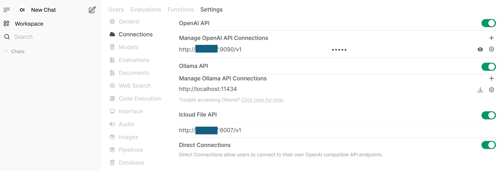
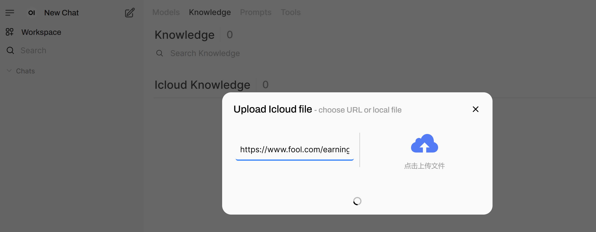

# Deploy Finance Agent on Intel® Gaudi® AI Accelerator with Docker Compose

This README provides instructions for deploying the Finance Agent application using Docker Compose on systems equipped with Intel® Gaudi® AI Accelerators. It leverages containers optimized for Gaudi for the LLM serving component, along with CPU-based containers for other microservices like embedding, retrieval, data preparation and the UI.

## Table of Contents

- [Prerequisites](#prerequisites)
- [Finance Agent Quick Start Deployment](#finance-agent-quick-start-deployment)
- [Validate Services](#validate-services)
- [Accessing the User Interface (UI)](#accessing-the-user-interface-ui)

## Prerequisites

- Docker and Docker Compose installed.
- Intel® Gaudi® AI Accelerator(s) with the necessary drivers and software stack installed on the host system. (Refer to Intel Gaudi Documentation).
- Git installed (for cloning repository).
- Hugging Face Hub API Token (for downloading models).
- Access to the internet (or a private model cache).
- Finnhub API Key. Go to https://finnhub.io/ to get your free api key.
- Financial Datasets API Key. Go to https://docs.financialdatasets.ai/ to get your free api key.

Clone the GenAIExamples repository:

```shell
mkdir /path/to/your/workspace/
export WORKDIR=/path/to/your/workspace/
cd $WORKDIR
git clone https://github.com/opea-project/GenAIExamples.git
cd GenAIExamples/FinanceAgent/docker_compose/intel/hpu/gaudi
```

## Finance Agent Quick Start Deployment

This uses the default vLLM-based deployment profile (vllm-gaudi-server).

### Configure Environment

Set required environment variables in your shell:

```shell
# Path to your model cache
export HF_CACHE_DIR="./data"
# Some models from Hugging Face require approval beforehand. Ensure you have the necessary permissions to access them.
export HF_TOKEN="your_huggingface_token"
export FINNHUB_API_KEY="your-finnhub-api-key"
export FINANCIAL_DATASETS_API_KEY="your-financial-datasets-api-key"

# Configure HOST_IP
# Replace with your host's external IP address (do not use localhost or 127.0.0.1).
export HOST_IP=$(hostname -I | awk '{print $1}')

# Optional: Configure proxy if needed
# export HTTP_PROXY="${http_proxy}"
# export HTTPS_PROXY="${https_proxy}"
# export NO_PROXY="${NO_PROXY},${HOST_IP}"

source set_env.sh
```

Note: The compose file might read additional variables from `set_env.sh`. Ensure all required variables like ports (LLM_SERVICE_PORT, TEI_EMBEDDER_PORT, etc.) are set if not using defaults from the compose file. For instance, edit the `set_env.sh` or overwrite LLM_MODEL_ID to change the LLM model.

### Start Services

#### Deploy with Docker Compose

Below is the command to launch services

- tei-embedding-serving
- redis-vector-db
- redis-kv-store
- dataprep-redis-server-finance
- finqa-agent-endpoint
- research-agent-endpoint
- docsum-vllm-gaudi
- supervisor-agent-endpoint
- agent-ui

```shell
docker compose -f compose.yaml up -d
```

#### [Optional] Build docker images

This is only needed if the Docker image is unavailable or the pull operation fails.

```bash
cd $WORKDIR/GenAIExamples/FinanceAgent/docker_image_build
# get GenAIComps repo
git clone https://github.com/opea-project/GenAIComps.git
# build the images
docker compose -f build.yaml build --no-cache
```

If deploy on Gaudi, also need to build vllm image.

```bash
cd $WORKDIR
git clone https://github.com/HabanaAI/vllm-fork.git
# get the latest release tag of vllm gaudi
cd vllm-fork
VLLM_VER=v0.10.0
echo "Check out vLLM tag ${VLLM_VER}"
git checkout ${VLLM_VER}
docker build --no-cache -f Dockerfile.hpu -t opea/vllm-gaudi:latest --shm-size=128g . --build-arg https_proxy=$https_proxy --build-arg http_proxy=$http_proxy
```

## Validate Services

Wait several minutes for models to download and services to initialize (Gaudi initialization can take time). Check container logs (docker compose logs -f <service_name>, especially vllm-gaudi-server).

```bash
docker logs --tail 2000 -f vllm-gaudi-server
```

> Below is the expected output of the `vllm-gaudi-server` service.

```
   INFO:     Started server process [1]
   INFO:     Waiting for application startup.
   INFO:     Application startup complete.
   INFO:     Uvicorn running on http://0.0.0.0:8000 (Press CTRL+C to quit)
   INFO:     <IP>:<Port Number> - "GET /health HTTP/1.1" 200 OK

```

### Validate Data Services

Ingest data and retrieval from database

```bash
python $WORKDIR/GenAIExamples/FinanceAgent/tests/test_redis_finance.py --port 6007 --test_option ingest
python $WORKDIR/GenAIExamples/FinanceAgent/tests/test_redis_finance.py --port 6007 --test_option get
```

### Validate Agents

FinQA Agent:

```bash
export agent_port="9095"
prompt="What is Gap's revenue in 2024?"
python3 $WORKDIR/GenAIExamples/FinanceAgent/tests/test.py --prompt "$prompt" --agent_role "worker" --ext_port $agent_port
```

Research Agent:

```bash
export agent_port="9096"
prompt="generate NVDA financial research report"
python3 $WORKDIR/GenAIExamples/FinanceAgent/tests/test.py --prompt "$prompt" --agent_role "worker" --ext_port $agent_port --tool_choice "get_current_date" --tool_choice "get_share_performance"
```

Supervisor Agent single turns:

```bash
export agent_port="9090"
python3 $WORKDIR/GenAIExamples/FinanceAgent/tests/test.py --agent_role "supervisor" --ext_port $agent_port --stream
```

Supervisor Agent multi turn:

```bash
export agent_port="9090"
python3 $WORKDIR/GenAIExamples/FinanceAgent/tests/test.py --agent_role "supervisor" --ext_port $agent_port --multi-turn --stream
```

## Accessing the User Interface (UI)

The UI microservice is launched in the previous step with the other microservices.
To see the UI, open a web browser to `http://${HOST_IP}:5175` to access the UI. Note the `HOST_IP` here is the host IP of the UI microservice.

1. Create Admin Account with a random value

2. Enter the endpoints in the `Connections` settings

   First, click on the user icon in the upper right corner to open `Settings`. Click on `Admin Settings`. Click on `Connections`.

   Then, enter the supervisor agent endpoint in the `OpenAI API` section: `http://${HOST_IP}:9090/v1`. Enter the API key as "empty". Add an arbitrary model id in `Model IDs`, for example, "opea_agent". The `HOST_IP` here should be the host ip of the agent microservice.

   Then, enter the dataprep endpoint in the `Icloud File API` section. You first need to enable `Icloud File API` by clicking on the button on the right to turn it into green and then enter the endpoint url, for example, `http://${HOST_IP}:6007/v1`. The `HOST_IP` here should be the host ip of the dataprep microservice.

   You should see screen like the screenshot below when the settings are done.



3. Upload documents with UI

   Click on the `Workplace` icon in the top left corner. Click `Knowledge`. Click on the "+" sign to the right of `iCloud Knowledge`. You can paste an url in the left hand side of the pop-up window, or upload a local file by click on the cloud icon on the right hand side of the pop-up window. Then click on the `Upload Confirm` button. Wait till the processing is done and the pop-up window will be closed on its own when the data ingestion is done. See the screenshot below.
   Then, enter the dataprep endpoint in the `iCloud File API` section. You first need to enable `iCloud File API` by clicking on the button on the right to turn it into green and then enter the endpoint url, for example, `http://${HOST_IP}:6007/v1`. The `HOST_IP` here should be the host ip of the dataprep microservice.
   Note: the data ingestion may take a few minutes depending on the length of the document. Please wait patiently and do not close the pop-up window.



4. Test agent with UI

   After the settings are done and documents are ingested, you can start to ask questions to the agent. Click on the `New Chat` icon in the top left corner, and type in your questions in the text box in the middle of the UI.

   The UI will stream the agent's response tokens. You need to expand the `Thinking` tab to see the agent's reasoning process. After the agent made tool calls, you would also see the tool output after the tool returns output to the agent. Note: it may take a while to get the tool output back if the tool execution takes time.


