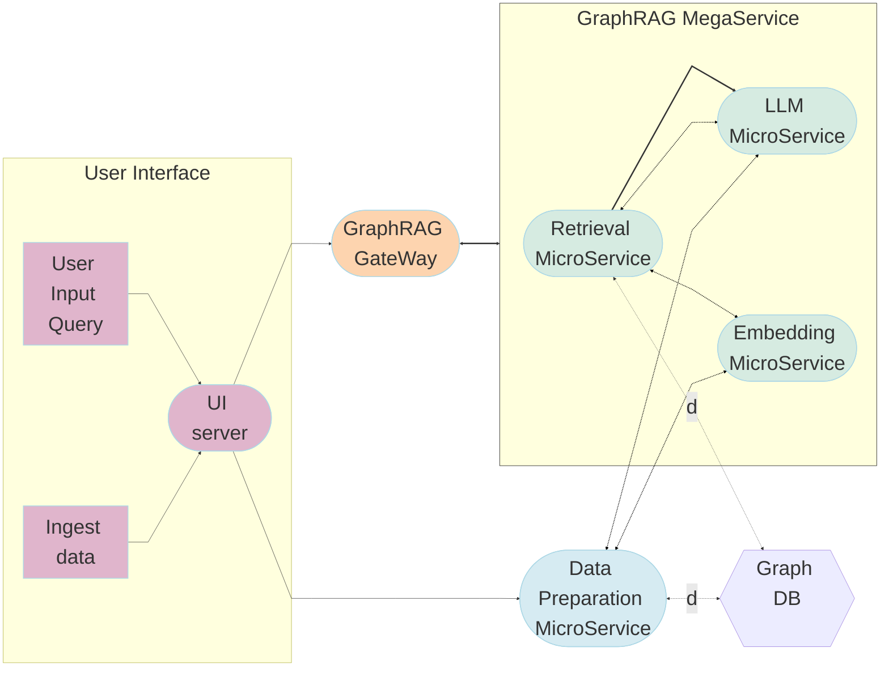

# GraphRAG Application

While naive RAG works well in fetching precise information it fails on global questions directed at an entire text corpus, such as "What are the main themes in the dataset?".
GraphRAG was introduced by Microsoft paper "From Local to Global: A Graph RAG Approach to Query-Focused Summarization". The key elements are:

- Uses LLM to derive an entity knowledge graph from the source documents
- Uses hierarchical leiden algorithm to identify communities of closely-related entities and summaries are extracted for each community
- For an input query the relevant communities are identified and partial answers are generated from each of the community summaries (query-focused summarization (QFS))
- There is a final generation stage that responds to the query based on the intermediate community answers.

## Table of contents

1. [Architecture](#architecture)
2. [Deployment Options](#deployment-options)

## Architecture and Deploy details

The GraphRAG example is implemented using the component-level microservices defined in [GenAIComps](https://github.com/opea-project/GenAIComps). The flow chart below shows the information flow between different microservices for this example.

> **Note**: The Dataprep and Retriever microservices use the LLM Microservice and Embedding Microservice in their implementation. For example, Dataprep uses LLM to extract entities and relationships from text to build graph and Retriever uses LLM to summarize communities (these are clusters of similar entities and their properties). Those endpoint interactions with the corresponding prompt templates are buried in the microservice implementation thus not managed by the megaservice orchestrator scheduler and not exposed in the megaservice. Shown as thin black lines in diagram.

## Deployment Options

The table below lists the available deployment options and implementation details.

| Platform     | Deployment Method | Link                                                              |
| ------------ | ----------------- | ----------------------------------------------------------------- |
| Intel Gaudi2 | Docker compose    | [Deployment on Gaudi](./docker_compose/intel/hpu/gaudi/README.md) |

## Validated Configurations

| **Deploy Method** | **LLM Engine** | **LLM Model**                         | **Hardware** |
| ----------------- | -------------- | ------------------------------------- | ------------ |
| Docker Compose    | TGI            | meta-llama/Meta-Llama-3.1-8B-Instruct | Intel Gaudi  |
