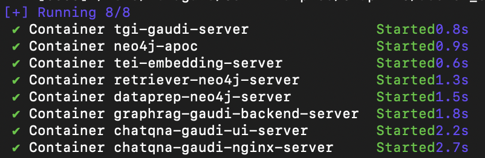

# GraphRAG Application

While naive RAG works well in fetching precise information it fails on global questions directed at an entire text corpus, such as "What are the main themes in the dataset?".
GraphRAG was introduced by Microsoft paper "From Local to Global: A Graph RAG Approach to Query-Focused Summarization". The key elements are:

- Uses LLM to derive an entity knowledge graph from the source documents
- Uses hierarchical leiden algorithm to identify communities of closely-related entities and summaries are extracted for each community
- For an input query the relevant communities are identified and partial answers are generated from each of the community summaries (query-focused summarization (QFS))
- There is a final generation stage that responds to the query based on the intermediate community answers.

## Deploy GraphRAG Service

The GraphRAG service can be effortlessly deployed on Intel Gaudi2, Intel Xeon Scalable Processors.

Quick Start Deployment Steps:

1. Set up the environment variables.
2. Run Docker Compose.
3. Consume the GraphRAG Service.

Note: If you do not have docker installed you can run this script to install docker : `bash docker_compose/install_docker.sh`

### Quick Start: 1.Setup Environment Variable

To set up environment variables for deploying GraphRAG services, follow these steps:

1. Set the required private environment variables:

   ```bash
   export host_ip=${your_hostname IP} #local IP, i.e "192.168.1.1"
   export NEO4J_URI=${your_neo4j_url}
   export NEO4J_USERNAME=${your_neo4j_username}
   export NEO4J_PASSWORD=${your_neo4j_password}
   export PYTHONPATH=${path_to_comps}
   export OPENAI_KEY=${your_openai_api_key} #optional, when not provided will use smaller models TGI/TEI
   export HUGGINGFACEHUB_API_TOKEN=${your_hf_token} #needed for TGI/TEI models
   ```

2. If you are in a proxy environment, also set the proxy-related environment variables:

   ```bash
   export http_proxy="Your_HTTP_Proxy"
   export https_proxy="Your_HTTPs_Proxy"
   export no_proxy=$no_proxy,${host_ip} #important to add {host_ip} for containers communication
   ```

3. Set up other environment variables:

   ```bash
   # on Gaudi
   source ./docker_compose/intel/hpu/gaudi/set_env.sh
   ```

### Quick Start: 2.Run Docker Compose

If the microservice images are available in Docker Hub they will be pulled, otherwise you will need to build the container images manually. Please refer to the 'Build Docker Images' in [Guide](../ChatQnA/docker_compose/intel/cpu/xeon/README.md). [test_compose_on_gaudi.sh](tests/test_compose_on_gaudi.sh) can be a good resource as it shows how to do image build, starting services, validated each microservices and megaservices. This is what is used in CI/CD.

Docker compose will start 8 services: 

```bash
cd GraphRAG/docker_compose/intel/hpu/gaudi
docker compose -f compose.yaml up -d
```

### QuickStart: 3.Upload RAG Files and Consume the GraphRAG Service

To chat with retrieved information, you need to upload a file using `Dataprep` service.

Here is an example of `Nike 2023` pdf.

```bash
# download pdf file
wget https://raw.githubusercontent.com/opea-project/GenAIComps/v1.1/comps/retrievers/redis/data/nke-10k-2023.pdf
# upload pdf file with dataprep
curl -X POST "http://${host_ip}:11103/v1/dataprep/ingest" \
    -H "Content-Type: multipart/form-data" \
    -F "files=@./nke-10k-2023.pdf"
```

```bash
curl http://${host_ip}:8888/v1/graphrag \
    -H "Content-Type: application/json"  \
    -d '{"messages": [{"role": "user","content": "where do Nike subsidiaries operate?
    "}]}'
```

## Architecture and Deploy details

The GraphRAG example is implemented using the component-level microservices defined in [GenAIComps](https://github.com/opea-project/GenAIComps). The flow chart below shows the information flow between different microservices for this example.


> **Note**: The Dataprep and Retriever microservices use the LLM Microservice and Embedding Microservice in their implementation. For example, Dataprep uses LLM to extract entities and relationships from text to build graph and Retriever uses LLM to summarize communities (these are clusters of similar entities and their properties). Those endpoint interactions with the corresponding prompt templates are buried in the microservice implementation thus not managed by the megaservice orchestrator scheduler and not exposed in the megaservice. Shown as thin black lines in diagram.

This GraphRAG use case performs RAG using Llama-index, Neo4J Graph Property Store and Text Generation Inference on [Intel Gaudi2](https://www.intel.com/content/www/us/en/products/details/processors/ai-accelerators/gaudi-overview.html) or [Intel Xeon Scalable Processors](https://www.intel.com/content/www/us/en/products/details/processors/xeon.html).
In the below, we provide a table that describes for each microservice component in the GraphRAG architecture, the default configuration of the open source project, hardware, port, and endpoint.

Gaudi default compose.yaml
| MicroService | Open Source Project | HW | Port | Endpoint |
| ------------ | ------------------- | ----- | ---- | -------------------- |
| Embedding | Llama-index | Xeon | 6006 | /v1/embaddings |
| Retriever | Llama-index, Neo4j | Xeon | 6009 | /v1/retrieval |
| LLM | Llama-index, TGI | Gaudi | 6005 | /v1/chat/completions |
| Dataprep | Neo4j, LlamaIndex | Xeon | 6004 | /v1/dataprep/ingest |

### Models Selection

GraphRAG quality dependents heavily on the ability to extract a high quality graph. We highly recommend using the best model available to you. Table below shows default models specified in the codebase when OPENAI_API_KEY is available and for local inference w TEI/TGI. The local models are small since those will be used in CI/CD but users should improve upon these by changing the `xxx_MODEL_ID` in `docker_compose/xxx/set_env.sh`.

Working on a table comparison of various model sizes vs. naive RAG with a dataset that reflects well the benefits of GraphRAG. Stay tuned!

| Service   | Model                                 |
| --------- | ------------------------------------- |
| Embedding | BAAI/bge-base-en-v1.5                 |
| Embedding | "text-embedding-3-small"              |
| LLM       | gpt-4o                                |
| LLM       | "meta-llama/Meta-Llama-3-8B-Instruct" |

## Consume GraphRAG Service with RAG

### Check Service Status

Before consuming GraphRAG Service, make sure each microservice is ready by checking the docker logs of each microservice. [test_compose_on_gaudi.sh](tests/test_compose_on_gaudi.sh) can be a good resource as it shows how CI/CD validated each microservices based on returned HTTP status and response body.

```bash
docker logs container_name
```

### Upload RAG Files

To chat with retrieved information, you need to upload a file using `Dataprep` service.

Here is an example of `Nike 2023` pdf.

```bash
# download pdf file
wget https://raw.githubusercontent.com/opea-project/GenAIComps/v1.1/comps/retrievers/redis/data/nke-10k-2023.pdf
# upload pdf file with dataprep
curl -X POST "http://${host_ip}:6007/v1/dataprep/ingest" \
    -H "Content-Type: multipart/form-data" \
    -F "files=@./nke-10k-2023.pdf"
```

### Consume GraphRAG Service

Two ways of consuming GraphRAG Service:

1. Use cURL command on terminal

```bash
curl http://${host_ip}:8888/v1/graphrag \
    -H "Content-Type: application/json"  \
    -d '{
        "model": "gpt-4o-mini","messages": [{"role": "user","content": "Who is John Brady and has he had any confrontations?
    "}]}'
```

2. Access via frontend

   To access the frontend, open the following URL in your browser: `http://{host_ip}:5173`

   By default, the UI runs on port 5173 internally.

   If you choose conversational UI, use this URL: `http://{host_ip}:5174`

## Troubleshooting

1. If you get errors like "Access Denied", [validate micro service](https://github.com/opea-project/GenAIExamples/blob/main/ChatQnA/docker_compose/intel/cpu/xeon/README.md#validate-microservices) first. A simple example:

   ```bash
   http_proxy="" curl ${host_ip}:6006/embed -X POST  -d '{"inputs":"What is Deep Learning?"}' -H 'Content-Type: application/json'
   ```

2. (Docker only) If all microservices work well, check the port ${host_ip}:8888, the port may be allocated by other users, you can modify the `compose.yaml`.

3. (Docker only) If you get errors like "The container name is in use", change container name in `compose.yaml`.

## Monitoring OPEA Service with Prometheus and Grafana dashboard

OPEA microservice deployment can easily be monitored through Grafana dashboards in conjunction with Prometheus data collection. Follow the [README](https://github.com/opea-project/GenAIEval/blob/main/evals/benchmark/grafana/README.md) to setup Prometheus and Grafana servers and import dashboards to monitor the OPEA service.


