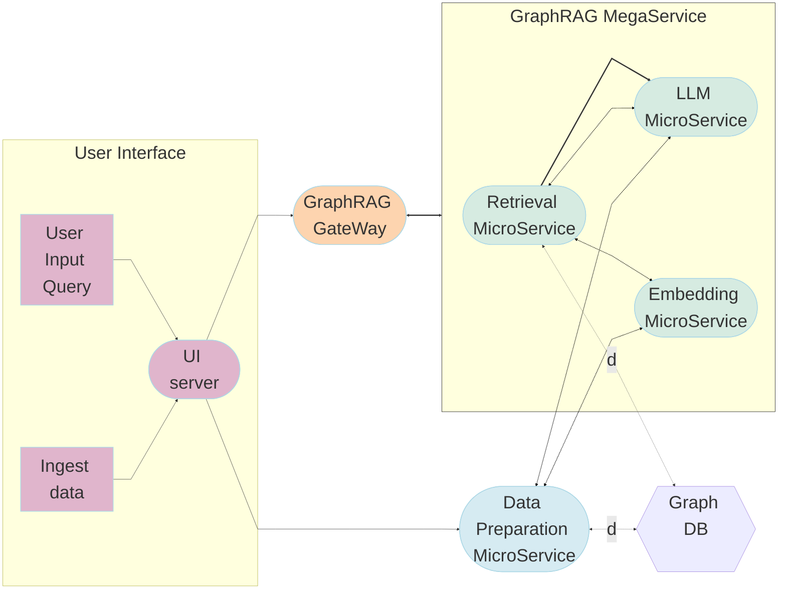

# GraphRAG Application

While naive RAG works well in fetching precise information it fails on global questions directed at an entire text corpus, such as "What are the main themes in the dataset?".
GraphRAG was introduced by Microsoft paper "From Local to Global: A Graph RAG Approach to Query-Focused Summarization". The key elements are:

- Uses LLM to derive an entity knowledge graph from the source documents
- Uses hierarchical leiden algorithm to identify communities of closely-related entities and summaries are extracted for each community
- For an input query the relevant communities are identified and partial answers are generated from each of the community summaries with a retrieval LLM (query-focused summarization (QFS))
- There is a final generation stage (last LLM) that responds to the query based on the intermediate community answers (QFS). See [GraphRAG Model Notes](GraphRAG_LLM_notes.md)
- In this app three LLM models are used: dataprep (knowledge graph), retriever (query-focused summaries), and final generation. CPU (Xeon) is used for the final generation LLM, and embedding, and dataprep and retriever LLMs are used by endpoints.

## Deploy GraphRAG Service

Quick Start Deployment Steps:

1. Set up the environment variables.
2. Run Docker Compose.
3. Consume the GraphRAG Service.

Note: If you do not have docker installed you can run this script to install docker : `bash docker_compose/install_docker.sh`

## Pre-requisites

Build images:

```bash
cd ~/
git clone https://github.com/opea-project/GenAIExamples.git
git clone https://github.com/vllm-project/vllm.git
git clone https://github.com/opea-project/GenAIComps.git

# vllm-service
cd vllm/
VLLM_VER=v0.10.0
git checkout "${VLLM_VER}"
docker build --no-cache -f docker/Dockerfile.cpu -t opea/vllm-cpu:"${TAG:-latest}" --shm-size=128g .

# opea/dataprep
cd ~/GenAIComps
docker build -t opea/dataprep:latest \
    --build-arg "no_proxy=${no_proxy}" \
    --build-arg "https_proxy=${https_proxy}" \
    --build-arg "http_proxy=${http_proxy}" \
    -f comps/dataprep/src/Dockerfile .

# opea/retrievers
cd ~/GenAIComps
docker build -t opea/retriever:latest \
    --build-arg "no_proxy=${no_proxy}" \
    --build-arg "https_proxy=${https_proxy}" \
    --build-arg "http_proxy=${http_proxy}" \
    -f comps/retrievers/src/Dockerfile .

# opea/graphrag-ui
cd ~/GenAIExamples/GraphRAG/ui
docker build -t opea/graphrag-ui:latest \
    --build-arg "no_proxy=${no_proxy}" \
    --build-arg "https_proxy=${https_proxy}" \
    --build-arg "http_proxy=${http_proxy}" \
    -f docker/Dockerfile .

# opea/graphrag
cd ~/GenAIExamples/GraphRAG
docker build -t opea/graphrag:latest .

# Note: it is important to be in the correct path before builds so that docker has the correct context to COPY relevant code to containers.
```

### Quick Start: 1.Setup Environment Variable

To set up environment variables for deploying GraphRAG services, follow these steps:

1. Set the required private environment variables:

   ```bash
    # For simplicity Openrouter.ai is used as an endpoint for both dataprep and retriever components.
    # These endpoints could be configured to any openAI-like endpoint.
    export OPENROUTER_KEY="mykey"
    export HUGGINGFACEHUB_API_TOKEN="mytoken"

    source set_env.sh

    # Below will override some of these defaults in set_env.sh
    export host_ip=$(hostname -I | awk '{print $1}')

    export NEO4J_PORT1=11631
    export NEO4J_PORT2=11632
    export NEO4J_URI="bolt://${host_ip}:${NEO4J_PORT2}"
    export NEO4J_URL="bolt://${host_ip}:${NEO4J_PORT2}"

    export NEO4J_USERNAME="neo4j"
    export NEO4J_PASSWORD="neo4jtest"

    export DATAPREP_SERVICE_ENDPOINT="http://${host_ip}:5000/v1/dataprep/ingest"

    # Must explicitly override default to not use OpenAI.
    export OPENAI_LLM_MODEL=""
    export OPENAI_EMBEDDING_MODEL=""

    # Embedder endpoint
    export TEI_EMBEDDER_PORT=6006
    export TEI_EMBEDDING_ENDPOINT="http://${host_ip}:${TEI_EMBEDDER_PORT}"

    # LLM for dataprep is used to extract knowledge graph
    export DATAPREP_LLM_ENDPOINT="https://openrouter.ai/api"
    export DATAPREP_LLM_MODEL_ID="anthropic/claude-3-haiku"
    export DATAPREP_LLM_ENDPOINT_KEY=${OPENROUTER_KEY}

    # LLM for retriever performs community summaries at retrieval time
    export RETRIEVER_LLM_ENDPOINT="https://openrouter.ai/api"
    export RETRIEVER_LLM_MODEL_ID="anthropic/claude-3-haiku"
    export RETRIEVER_LLM_ENDPOINT_KEY=${OPENROUTER_KEY}

    # Final LLM to formulates response based on relevant community summaries.
    export FINAL_LLM_MODEL_ID="Qwen/Qwen2.5-0.5B-Instruct"

    export LOGFLAG=True
    export MAX_INPUT_TOKENS=4096
    export MAX_TOTAL_TOKENS=8192
    export DATAPREP_PORT=11103
    export RETRIEVER_PORT=11635
    export MEGA_SERVICE_PORT=8888
   ```

2. If you are in a proxy environment, also set the proxy-related environment variables:

   ```bash
   export http_proxy="Your_HTTP_Proxy"
   export https_proxy="Your_HTTPs_Proxy"
   export no_proxy=$no_proxy,${host_ip} #important to add {host_ip} for containers communication
   ```

### Quick Start: 2.Run Docker Compose

If the microservice images are available in Docker Hub they will be pulled, otherwise you will need to build the container images manually. Please refer to the 'Build Docker Images' in [Guide](../../../../../ChatQnA/docker_compose/intel/cpu/xeon/README.md). [test_compose_on_xeon.sh](../../../../../ChatQnA/tests/test_compose_on_xeon.sh) can be a good resource as it shows how to do image build, starting services, validated each microservices and megaservices. This is what is used in CI/CD.

```bash
cd GraphRAG/docker_compose/intel/cpu/xeon
NGINX_PORT=8080 docker compose -f compose.yaml up -d
```

Here NGINX_PORT=8080 because typically port 80 is used for internet browsing.

#### Check the Deployment Status

After running docker compose, check if all the containers launched via docker compose have started:

```bash
docker ps -a
```

The following containers should have started:

```bash
CONTAINER ID   IMAGE                                                   COMMAND                  CREATED       STATUS                 PORTS                                                                                                    NAMES
740d0061fce2   opea/nginx:latest                                       "/docker-entrypoint.…"   3 hours ago   Up 3 hours             0.0.0.0:8080->80/tcp, [::]:8080->80/tcp                                                                  graphrag-xeon-nginx-server
3010243786cd   opea/graphrag-ui:latest                                 "docker-entrypoint.s…"   3 hours ago   Up 3 hours             0.0.0.0:5173->5173/tcp, :::5173->5173/tcp                                                                graphrag-ui-server
f63d10453e22   opea/graphrag:latest                                    "python graphrag.py"     3 hours ago   Up 3 hours             0.0.0.0:8888->8888/tcp, :::8888->8888/tcp                                                                graphrag-xeon-backend-server
a48d0fba13e6   opea/dataprep:latest                                    "sh -c 'python $( [ …"   3 hours ago   Up 3 hours             0.0.0.0:6004->5000/tcp, [::]:6004->5000/tcp                                                              dataprep-neo4j-server
9301a833f220   opea/retriever:latest                                   "python opea_retriev…"   3 hours ago   Up 3 hours             0.0.0.0:7000->7000/tcp, :::7000->7000/tcp                                                                retriever-neo4j-server
eda369268406   ghcr.io/huggingface/text-embeddings-inference:cpu-1.7   "text-embeddings-rou…"   3 hours ago   Up 3 hours             0.0.0.0:6006->80/tcp, [::]:6006->80/tcp                                                                  tei-embedding-server
f21e82efa1fa   opea/vllm-cpu:latest                                    "python3 -m vllm.ent…"   3 hours ago   Up 3 hours (healthy)   0.0.0.0:9009->80/tcp, [::]:9009->80/tcp                                                                  vllm-service
3b541ceeaf9f   neo4j:latest                                            "tini -g -- /startup…"   3 hours ago   Up 3 hours             7473/tcp, 0.0.0.0:11631->7474/tcp, [::]:11631->7474/tcp, 0.0.0.0:11632->7687/tcp, [::]:11632->7687/tcp   neo4j-apoc
```

##### Test Final vLLM

```
curl http://localhost:9009/v1/chat/completions \
  -H "Content-Type: application/json" \
  -d '{"model":"'${FINAL_LLM_MODEL_ID}'","messages":[{"role":"user","content":"Tell me a joke?"}]}'
```

### QuickStart: 3.Upload RAG Files and Consume the GraphRAG Service

To chat with retrieved information, you need to upload a file using `Dataprep` service.

Here is an example of uploading sample graph data (which can also be uploaded via the UI):

```bash
cd ~/GenAIExamples/GraphRAG/example_data

# First file
curl -X POST "http://${host_ip}:6004/v1/dataprep/ingest" \
    -H "Content-Type: multipart/form-data" \
    -F "files=@./programming_languages.txt"

# Second file
curl -X POST "http://${host_ip}:6004/v1/dataprep/ingest" \
    -H "Content-Type: multipart/form-data" \
    -F "files=@./programming_languages2.txt"
```

To login into the Neo4j UI you may browse to http://localhost:{NEO4J_PORT1}/browser, and login with your NEO4J login and password defined in the environment variables section.
The backend graphrag service can be queried via curl:

```bash
curl http://${host_ip}:8888/v1/graphrag \
    -H "Content-Type: application/json"  \
    -d '{"messages": [{"role": "user","content": "what are the main themes of the programming dataset?"}]}'
```

## Architecture and Deploy details

The GraphRAG example is implemented using the component-level microservices defined in [GenAIComps](https://github.com/opea-project/GenAIComps). The flow chart below shows the information flow between different microservices for this example.



Xeon default configuration:
| MicroService | Open Source Project | HW | Default Port | Endpoint |
| ------------ | ------------------- | --- | ------------ | -------- |
| Dataprep | Neo4j, LlamaIndex | OpenAI-like Endpoint | 6004 | /v1/dataprep/ingest |
| Embedding | Llama-index, TEI | Xeon or CPU | 6006 | /v1/embeddings |  
| Retriever | Llama-index, Neo4j | OpenAI-like Endpoint | 7000 | /v1/retrieval |
| Final LLM | vLLM | Xeon or CPU | 9009 | /v1/chat/completions |

### Models Selection

[GraphRAG Model Notes](GraphRAG_LLM_notes.md)

## Consume GraphRAG Service with RAG

### 1. Check Service Status

Before consuming GraphRAG Service, make sure each microservice is ready by checking the docker logs of each microservice.

```bash
docker logs container_name
```

### 2. Access via frontend

To access the frontend, open the following URL in your browser: `http://{host_ip}:NGINX_PORT`

In the above example, the UI runs on port 8080 internally.

## Monitoring OPEA Service with Prometheus and Grafana dashboard

OPEA microservice deployment can easily be monitored through Grafana dashboards in conjunction with Prometheus data collection. Follow the [README](https://github.com/opea-project/GenAIEval/blob/main/evals/benchmark/grafana/README.md) to setup Prometheus and Grafana servers and import dashboards to monitor the OPEA service.
