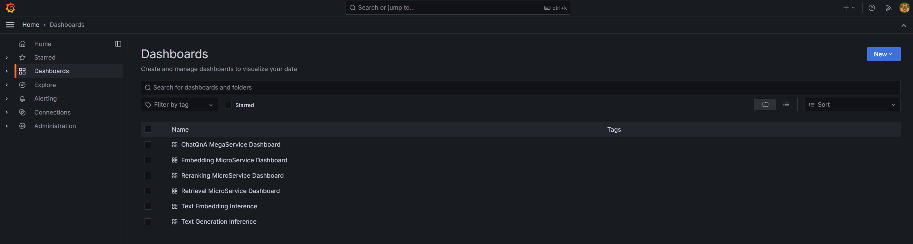

# Example GraphRAG Deployment on Intel® Gaudi® Platform

This document outlines the deployment process for a Graphrag service utilizing the [GenAIComps](https://github.com/opea-project/GenAIComps.git) microservice pipeline on Intel Gaudi server. This example includes the following sections:

- [GraphRAG Quick Start Deployment](#graphrag-quick-start-deployment): Demonstrates how to quickly deploy a GraphRAG service/pipeline on Intel® Gaudi® platform.
- [GraphRAG Docker Compose Files](#graphrag-docker-compose-files): Describes some example deployments and their docker compose files.
- [GraphRAG Service Configuration](#graphrag-service-configuration): Describes the service and possible configuration changes.

## GraphRAG Quick Start Deployment

This section describes how to quickly deploy and test the GraphRAG service manually on Intel® Gaudi® platform. The basic steps are:

1. [Access the Code](#access-the-code)
2. [Generate a HuggingFace Access Token](#generate-a-huggingface-access-token)
3. [Configure the Deployment Environment](#configure-the-deployment-environment)
4. [Deploy the Service Using Docker Compose](#deploy-the-service-using-docker-compose)
5. [Check the Deployment Status](#check-the-deployment-status)
6. [Test the Pipeline](#test-the-pipeline)
7. [Troubleshooting](#troubleshooting)
8. [Monitoring OPEA Service with Prometheus and Grafana dashboard](#monitoring-opea-service-with-prometheus-and-grafana-dashboard)
9. [Cleanup the Deployment](#cleanup-the-deployment)

### Access the Code

Clone the GenAIExample repository and access the GraphRAG Intel® Gaudi® platform Docker Compose files and supporting scripts:

```
git clone https://github.com/opea-project/GenAIExamples.git
cd GenAIExamples/GraphRAG/docker_compose/intel/hpu/gaudi/
```

Checkout a released version, such as v1.3:

```
git checkout v1.3
```

### Generate a HuggingFace Access Token

Some HuggingFace resources, such as some models, are only accessible if you have an access token. If you do not already have a HuggingFace access token, you can create one by first creating an account by following the steps provided at [HuggingFace](https://huggingface.co/) and then generating a [user access token](https://huggingface.co/docs/transformers.js/en/guides/private#step-1-generating-a-user-access-token).

### Configure the Deployment Environment

To set up environment variables for deploying GraphRAG service, source the _set_env.sh_ script in this directory:

```
source set_env.sh
```

The set_env.sh script will prompt for required and optional environment variables used to configure the GraphRAG service. If a value is not entered, the script will use a default value for the same. It will also generate a env file defining the desired configuration. Consult the section on [GraphRAG Service configuration](#graphrag-service-configuration) for information on how service specific configuration parameters affect deployments.

### Deploy the Service Using Docker Compose

To deploy the GraphRAG service, execute the `docker compose up` command with the appropriate arguments. For a default deployment, execute:

```bash
docker compose up -d
```

The GraphRAG docker images should automatically be downloaded from the `OPEA registry` and deployed on the Intel® Gaudi® Platform.

Note: If you do not have Docker installed you can [install Docker](https://docs.docker.com/engine/install/) first

### Check the Deployment Status

After running docker compose, check if all the containers launched via docker compose have started:

```
docker ps -a
```

### Test the Pipeline

Once the GraphRAG service are running, test the pipeline using the following command:

```bash
curl http://${host_ip}:8888/v1/graphrag \
    -H "Content-Type: application/json"  \
    -d '{"model": "gpt-4o-mini", "messages": [{"role": "user", "content": "Who is John Brady and has he had any confrontations?"}]}'
```

**Note** The value of _host_ip_ was set using the _set_env.sh_ script and can be found in the _.env_ file.

### Troubleshooting

1. If you get errors like "Access Denied", [validate micro service](https://github.com/opea-project/GenAIExamples/blob/main/ChatQnA/docker_compose/intel/cpu/xeon/README.md#validate-microservices) first. A simple example:

```bash
http_proxy="" curl ${host_ip}:6006/embed -X POST  -d '{"inputs":"What is Deep Learning?"}' -H 'Content-Type: application/json'
```

2. (Docker only) If all microservices work well, check the port ${host_ip}:8888, the port may be allocated by other users, you can modify the `compose.yaml`.

3. (Docker only) If you get errors like "The container name is in use", change container name in `compose.yaml`.

### Monitoring OPEA Service with Prometheus and Grafana dashboard

OPEA microservice deployment can easily be monitored through Grafana dashboards in conjunction with Prometheus data collection. Follow the [README](https://github.com/opea-project/GenAIEval/blob/main/evals/benchmark/grafana/README.md) to setup Prometheus and Grafana servers and import dashboards to monitor the OPEA service.




### Cleanup the Deployment

To stop the containers associated with the deployment, execute the following command:

```
docker compose -f compose.yaml down
```

All the GraphRAG containers will be stopped and then removed on completion of the "down" command.

## GraphRAG Docker Compose Files

The compose.yaml is default compose file using tgi as serving framework

| Service Name                  | Image Name                                            |
| ----------------------------- | ----------------------------------------------------- |
| neo4j-apoc                    | neo4j:latest                                          |
| tei-embedding-serving         | ghcr.io/huggingface/text-embeddings-inference:cpu-1.6 |
| tgi-gaudi-server              | ghcr.io/huggingface/tgi-gaudi:2.3.1                   |
| dataprep-neo4j-llamaindex     | opea/dataprep:latest                                  |
| retriever-neo4j               | opea/retriever:latest                                 |
| graphrag-gaudi-backend-server | opea/graphrag:latest                                  |
| graphrag-ui-server            | opea/graphrag-ui:latest                               |
| chatqna-gaudi-nginx-server    | opea/nginx:latest                                     |

## GraphRAG Service Configuration

The table provides a comprehensive overview of the GraphRAG service utilized across various deployments as illustrated in the example Docker Compose files. Each row in the table represents a distinct service, detailing its possible images used to enable it and a concise description of its function within the deployment architecture.

| Service Name                  | Possible Image Names                                  | Optional | Description                                                                                                          |
| ----------------------------- | ----------------------------------------------------- | -------- | -------------------------------------------------------------------------------------------------------------------- |
| neo4j-apoc                    | neo4j:latest                                          | No       | Provides the Neo4j graph database with APOC (Awesome Procedures on Cypher) extensions for advanced graph operations. |
| tei-embedding-serving         | ghcr.io/huggingface/text-embeddings-inference:cpu-1.6 | No       | Serves text embedding models for converting text into vector representations used in retrieval.                      |
| tgi-gaudi-server              | ghcr.io/huggingface/tgi-gaudi:2.3.1                   | No       | Hosts the Text Generation Inference (TGI) server optimized for Intel® Gaudi® to serve LLMs.                        |
| dataprep-neo4j-llamaindex     | opea/dataprep:latest                                  | No       | Prepares and ingests data into Neo4j and builds indexes for efficient retrieval.                                     |
| retriever-neo4j               | opea/retriever:latest                                 | No       | Handles retrieval of relevant documents or nodes from Neo4j based on user queries.                                   |
| graphrag-gaudi-backend-server | opea/graphrag:latest                                  | No       | Implements the core GraphRAG functionality, processing requests and managing data flow.                              |
| graphrag-ui-server            | opea/graphrag-ui:latest                               | No       | Provides the user interface for the GraphRAG service.                                                                |
| chatqna-gaudi-nginx-server    | opea/nginx:latest                                     | No       | Acts as a reverse proxy, managing traffic between the UI and backend services.                                       |
