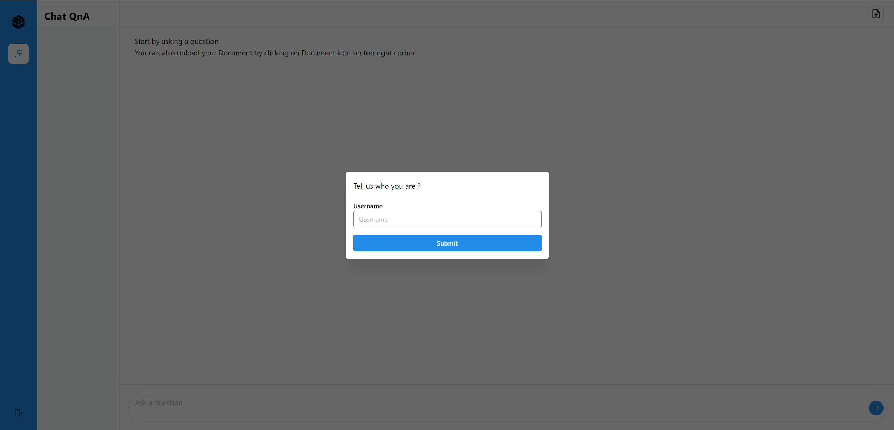
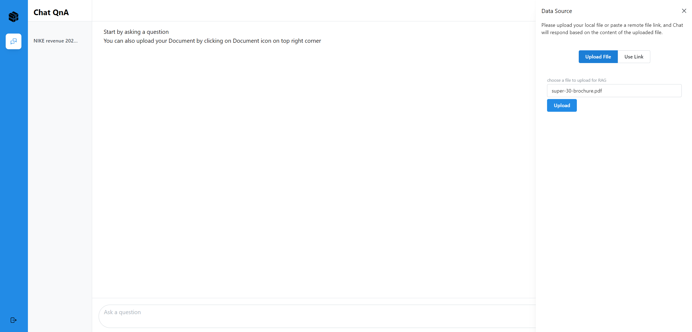

# ChatQnA Conversational UI

## 📸 Project Screenshots





## 🧐 Features

Here're some of the project's features:

- Start a Text Chat：Initiate a text chat with the ability to input written conversations, where the dialogue content can also be customized based on uploaded files.
- Context Awareness: The AI assistant maintains the context of the conversation, understanding references to previous statements or questions. This allows for more natural and coherent exchanges.
- Upload File: The choice between uploading locally or copying a remote link. Chat according to uploaded knowledge base.
- Clear: Clear the record of the current dialog box without retaining the contents of the dialog box.
- Chat history: Historical chat records can still be retained after refreshing, making it easier for users to view the context.
- Conversational Chat : The application maintains a history of the conversation, allowing users to review previous messages and the AI to refer back to earlier points in the dialogue when necessary.

## 🛠️ Get it Running

1. Clone the repo.

2. cd command to the current folder.

3. Modify the required .env variables.
   ```
   DOC_BASE_URL = ''
   ```
4. Execute `npm install` to install the corresponding dependencies.

5. Execute `npm run dev` in both environments
