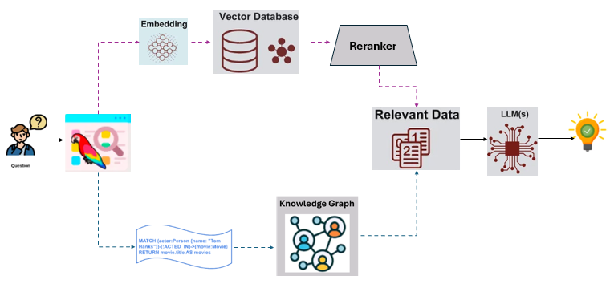

# HybridRAG Application

Enterprise AI systems require solutions that handle both structured data (databases, transactions, CSVs, JSON) and unstructured data (documents, images, audio). While traditional VectorRAG excels at semantic search across documents, it struggles with complex queries requiring global context or relationship-aware reasoning. HybridRAG application addresses these gaps by combining GraphRAG (knowledge graph-based retrieval) and VectorRAG (vector database retrieval) for enhanced accuracy and contextual relevance.

## Table of contents

1. [Architecture](#architecture)
2. [Deployment](#deployment)

## Architecture

The HybridRAG application is a customizable end-to-end workflow that leverages the capabilities of LLMs and RAG efficiently. HybridRAG architecture is shown below:

This application is modular as it leverages each component as a microservice(as defined in [GenAIComps](https://github.com/opea-project/GenAIComps)) that can scale independently. It comprises data preparation, embedding, retrieval, reranker(optional) and LLM microservices. All these microservices are stitched together by the HybridRAG megaservice that orchestrates the data through these microservices. The flow chart below shows the information flow between different microservices for this example.

## Deployment

[HybridRAG deployment on Intel Gaudi](./docker_compose/intel/hpu/gaudi/README.md)

## Validated Configurations

| **Deploy Method** | **LLM Engine** | **LLM Model**                       | **Hardware** |
| ----------------- | -------------- | ----------------------------------- | ------------ |
| Docker Compose    | vLLM           | meta-llama/Meta-Llama-3-8B-Instruct | Intel Gaudi  |
