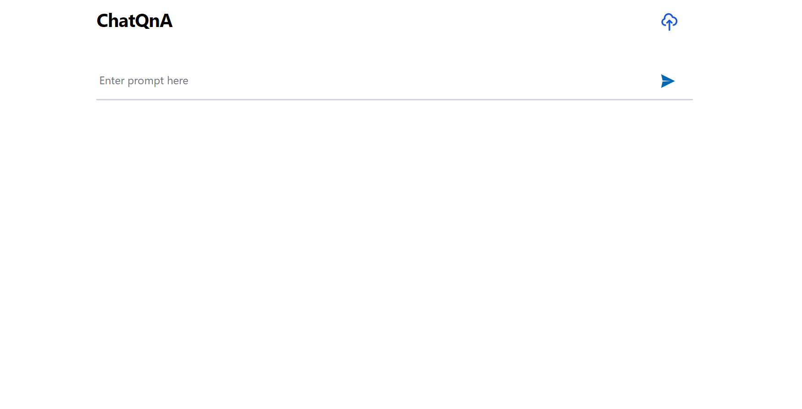
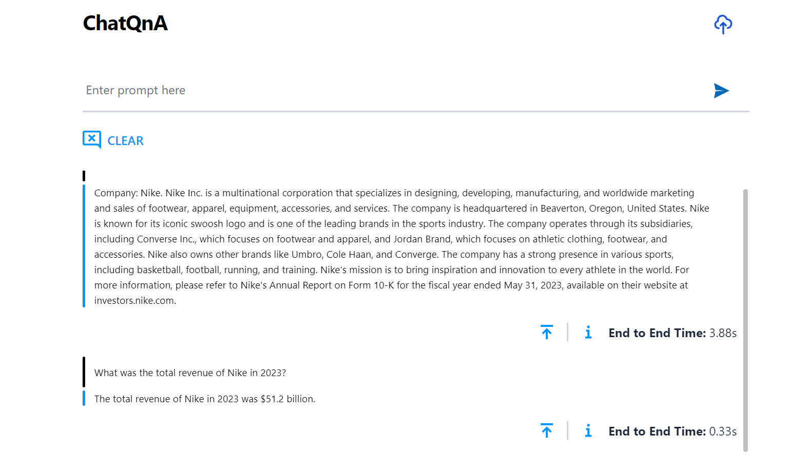
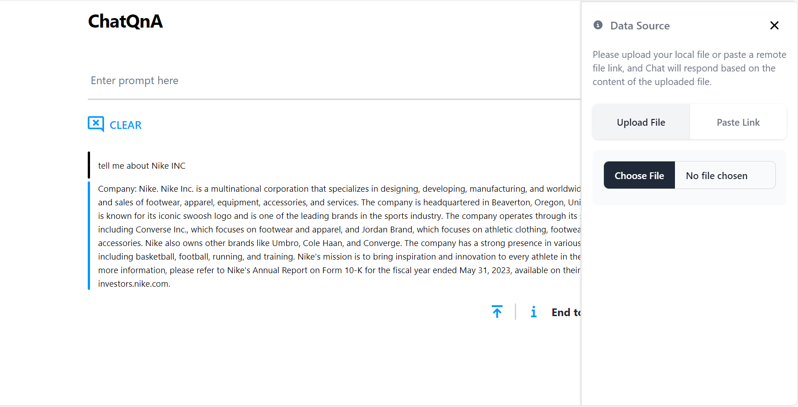

# ChatQnA Customized UI

## 📸 Project Screenshots





## 🧐 Features

Here're some of the project's features:

- Start a Text Chat：Initiate a text chat with the ability to input written conversations, where the dialogue content can also be customized based on uploaded files.
- Clear: Clear the record of the current dialog box without retaining the contents of the dialog box.
- Chat history: Historical chat records can still be retained after refreshing, making it easier for users to view the context.
- Scroll to Bottom / Top: The chat automatically slides to the bottom. Users can also click the top icon to slide to the top of the chat record.
- End to End Time: Shows the time spent on the current conversation.
- Upload File: The choice between uploading locally or copying a remote link. Chat according to uploaded knowledge base.
- Delete File: Delete a certain uploaded file.

## 🛠️ Get it Running

1. Clone the repo.

2. cd command to the current folder.

3. Modify the required .env variables.

   ```
   CHAT_BASE_URL = ''

   UPLOAD_FILE_BASE_URL = ''

   GET_FILE = ''

   DELETE_FILE = ''

   ```

4. Execute `npm install` to install the corresponding dependencies.

5. Execute `npm run dev` in both environments
