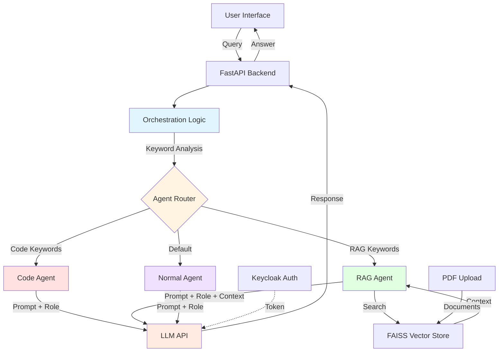
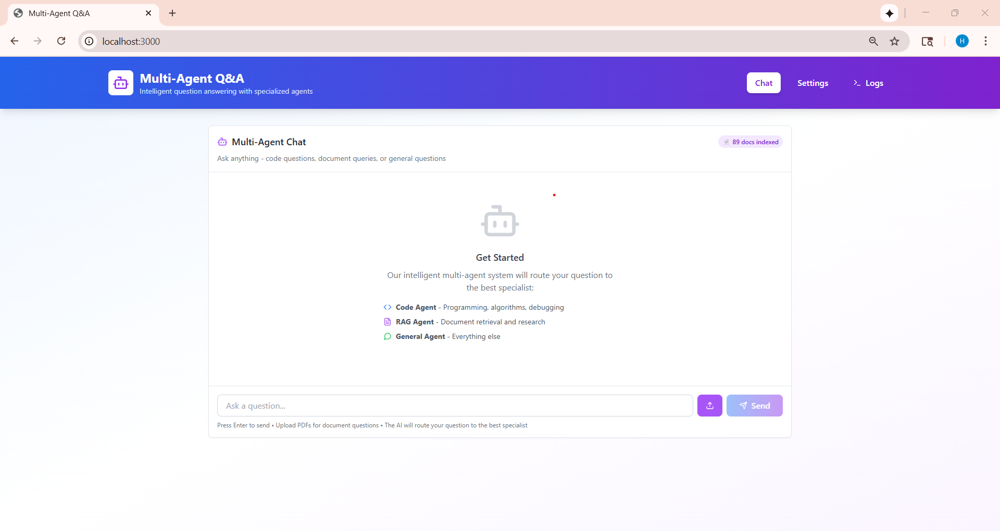

## Multi-Agent Q&A Application

A sophisticated multi-agent Q&A application featuring intelligent task delegation to specialized agents with enterprise inference integration.

## Table of Contents

- [Project Overview](#project-overview)
- [Features](#features)
- [Architecture](#architecture)
- [Prerequisites](#prerequisites)
- [Quick Start Deployment](#quick-start-deployment)
- [User Interface](#user-interface)
- [Troubleshooting](#troubleshooting)

---
## Project Overview

The multiagent-qna project is a sophisticated Question & Answer application built on a multi-agent architecture. Its core function is to receive a user's query, intelligently determine the nature of the question, and delegate it to the most suitable specialized agent for generating a high-quality response. The system is designed for enterprise environments, integrating with enterprise-grade inference APIs for its language model interactions.

---

## Features

- **Multi-Agent Architecture**: Orchestration agent that intelligently routes queries to specialized agents
- **Specialized Agents**:
  - **Code Agent**: Handles code-related questions and programming queries
  - **RAG Agent**: Retrieves and answers questions from documents
  - **Normal Agent**: Handles general questions and conversations
- **Modern UI**: ChatGPT-like interface with settings management
- **Enterprise Integration**: Uses enterprise-inference API for LLM interactions
- **Configurable**: Easily configure agent roles, goals, and behavior via UI

---

## Architecture

Below is the multi-agent system architecture showing how user queries are intelligently routed to specialized agents. The orchestration layer analyzes incoming queries using keyword detection and delegates them to the appropriate agent (Code, RAG, or Normal) for processing, ensuring each query is handled by the most qualified specialist.



The application consists of:
1. **Orchestration Agent**: Analyzes user queries and delegates to appropriate specialized agents
2. **Specialized Agents**: Each handles a specific domain (code, RAG, general)
3. **API Layer**: FastAPI backend with enterprise-inference integration
4. **UI**: React-based chat interface with settings management

**Service Components:**

1. **React Web UI (Port 3000)** -  Provides ChatGPT-like interface with settings management for configuring agent roles, goals, and behavior

2. **FastAPI Backend (Port 5001)** - Orchestrates multi-agent system, analyzes queries using keyword detection, delegates to specialized agents (Code, RAG, Normal), and manages FAISS vector store for document retrieval

**Typical Flow:**

1. User submits a query through the chat interface.
2. The FastAPI backend receives the query and passes it to the orchestration logic.
3. The orchestration logic analyzes the query using keyword detection to determine intent.
4. The agent router delegates the query to the appropriate specialized agent:
   - **Code-related queries** (keywords: code, function, debug, etc.) → Code Agent
   - **Document-based queries** (keywords: document, PDF, search, etc.) → RAG Agent
   - **General queries** → Normal Agent
5. If RAG Agent is selected:
   - Searches the FAISS vector store for relevant document context
   - Retrieves matching chunks to augment the prompt
6. The selected agent constructs a specialized prompt with its role, goal, and context.
7. The system authenticates with Keycloak and obtains an access token.
8. The agent calls the enterprise LLM API with the token and specialized prompt.
9. The LLM (Llama-3.1-8B-Instruct) generates a response tailored to the agent's expertise.
10. The response is returned to the user via the UI with agent attribution showing which specialist handled the query.

---

## Prerequisites

### System Requirements

Before you begin, ensure you have the following installed:

- **Docker and Docker Compose**
- **Enterprise inference endpoint access** (Keycloak authentication)

### Verify Docker Installation

```bash
# Check Docker version
docker --version

# Check Docker Compose version
docker compose version

# Verify Docker is running
docker ps
```
---

## Quick Start Deployment

### Clone the Repository

```bash
git clone https://github.com/cld2labs/GenAISamples.git
cd GenAISamples/multiagent-qna
```

### Set up the Environment

This application requires an `.env` file in the `api` directory for proper configuration. Create it with the commands below:

```bash
# Create the .env file in the api directory
mkdir -p api
cat > api/.env << EOF
BASE_URL=https://your-enterprise-inference-url.com
KEYCLOAK_CLIENT_ID=your_client_id
KEYCLOAK_CLIENT_SECRET=your_client_secret
EMBEDDING_MODEL_ENDPOINT=bge-base-en-v1.5
INFERENCE_MODEL_ENDPOINT=Llama-3.1-8B-Instruct
EMBEDDING_MODEL_NAME=bge-base-en-v1.5
INFERENCE_MODEL_NAME=meta-llama/Llama-3.1-8B-Instruct
EOF
```

Or manually create `api/.env` with:

```bash
BASE_URL=https://your-enterprise-inference-url.com
KEYCLOAK_CLIENT_ID=your_client_id
KEYCLOAK_CLIENT_SECRET=your_client_secret
EMBEDDING_MODEL_ENDPOINT=bge-base-en-v1.5
INFERENCE_MODEL_ENDPOINT=Llama-3.1-8B-Instruct
EMBEDDING_MODEL_NAME=bge-base-en-v1.5
INFERENCE_MODEL_NAME=meta-llama/Llama-3.1-8B-Instruct
```

**Note**: The docker-compose.yml file automatically loads environment variables from `./api/.env` for the backend service.

### Running the Application

Start both API and UI services together with Docker Compose:

```bash
# From the rag-chatbot directory
docker compose up --build

# Or run in detached mode (background)
docker compose up -d --build
```

The API will be available at: `http://localhost:5001`  
The UI will be available at: `http://localhost:3000`

**View logs**:

```bash
# All services
docker compose logs -f

# Backend only
docker compose logs -f backend

# Frontend only
docker compose logs -f frontend
```

**Verify the services are running**:

```bash
# Check API health
curl http://localhost:5001/health

# Check if containers are running
docker compose ps
```
---

## User Interface

**Using the Application**

Make sure you are at the localhost:3000 url

You will be directed to the main page which has each feature



### Chat Interface

1. Navigate to the chat interface
2. Type your question in the input box
3. The orchestration agent will analyze your query and route it to the appropriate specialized agent
4. View the response with agent attribution

### Settings Page

Configure agents:
- **Orchestration Agent**: Role, goal, and backstory
- **Code Agent**: Code-specific configuration
- **RAG Agent**: Document retrieval settings
- **Normal Agent**: General conversation settings

**UI Configuration**

When running with Docker Compose, the UI automatically connects to the backend API. The frontend is available at `http://localhost:3000` and the API at `http://localhost:5001`.

For production deployments, you may want to configure a reverse proxy or update the API URL in the frontend configuration.

### Stopping the Application


```bash
docker compose down
```

---

## Troubleshooting

For comprehensive troubleshooting guidance, common issues, and solutions, refer to:

[TROUBLESHOOTING.md](TROUBLESHOOTING.md)


