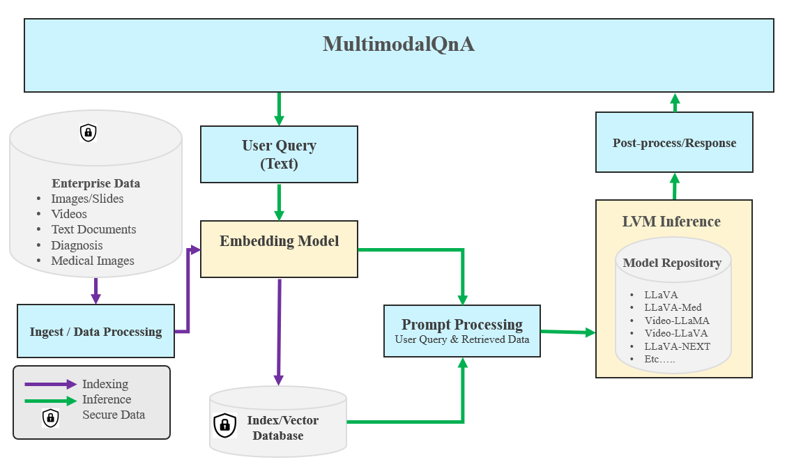
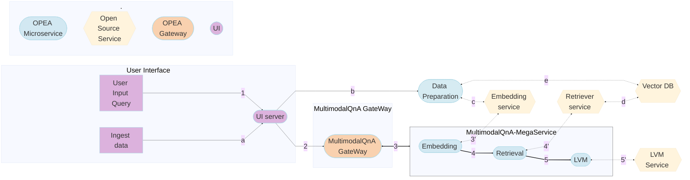
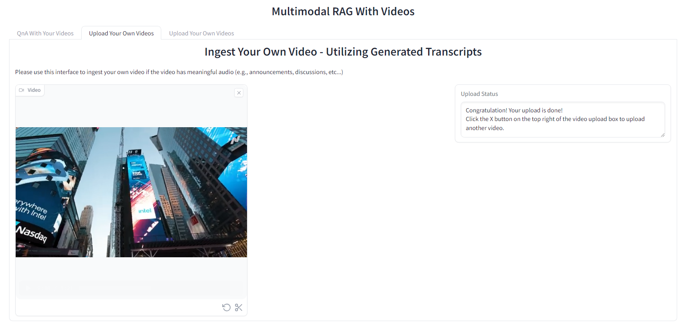
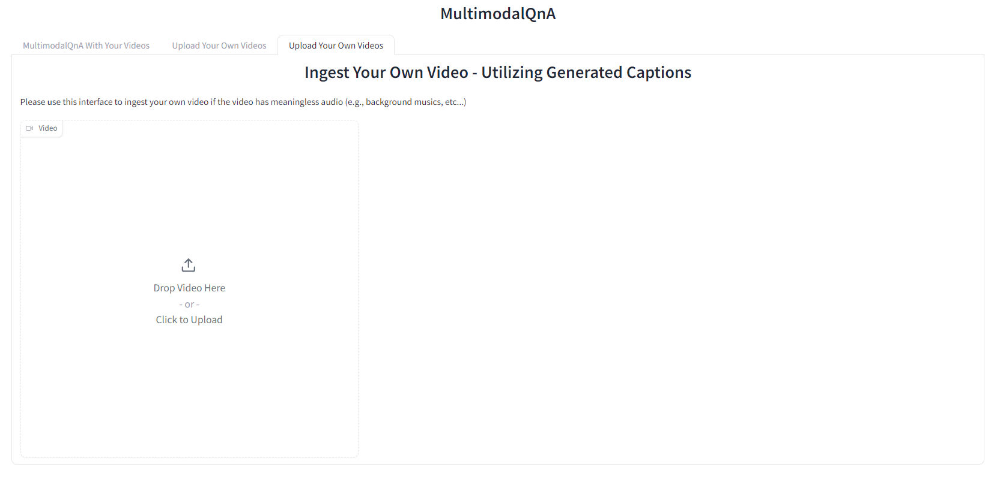
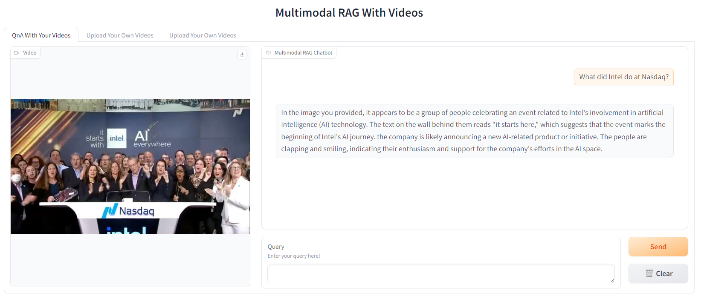

# MultimodalQnA Application

Suppose you possess a set of videos and wish to perform question-answering to extract insights from these videos. To respond to your questions, it typically necessitates comprehension of visual cues within the videos, knowledge derived from the audio content, or often a mix of both these visual elements and auditory facts. The MultimodalQnA framework offers an optimal solution for this purpose.

`MultimodalQnA` addresses your questions by dynamically fetching the most pertinent multimodal information (frames, transcripts, and/or captions) from your collection of videos. For this purpose, MultimodalQnA utilizes [BridgeTower model](https://huggingface.co/BridgeTower/bridgetower-large-itm-mlm-gaudi), a multimodal encoding transformer model which merges visual and textual data into a unified semantic space. During the video ingestion phase, the BridgeTower model embeds both visual cues and auditory facts as texts, and those embeddings are then stored in a vector database. When it comes to answering a question, the MultimodalQnA will fetch its most relevant multimodal content from the vector store and feed it into a downstream Large Vision-Language Model (LVM) as input context to generate a response for the user.

The MultimodalQnA architecture shows below:



MultimodalQnA is implemented on top of [GenAIComps](https://github.com/opea-project/GenAIComps), the MultimodalQnA Flow Chart shows below:



This MultimodalQnA use case performs Multimodal-RAG using LangChain, Redis VectorDB and Text Generation Inference on [Intel Gaudi2](https://www.intel.com/content/www/us/en/products/details/processors/ai-accelerators/gaudi-overview.html) and [Intel Xeon Scalable Processors](https://www.intel.com/content/www/us/en/products/details/processors/xeon.html), and we invite contributions from other hardware vendors to expand the example.

The Intel Gaudi2 accelerator supports both training and inference for deep learning models in particular for LLMs. Visit [Habana AI products](https://habana.ai/products) for more details.

In the below, we provide a table that describes for each microservice component in the MultimodalQnA architecture, the default configuration of the open source project, hardware, port, and endpoint.

<details>
<summary><b>Gaudi default compose.yaml</b></summary>

| MicroService | Open Source Project   | HW    | Port | Endpoint                                        |
| ------------ | --------------------- | ----- | ---- | ----------------------------------------------- |
| Embedding    | Langchain             | Xeon  | 6000 | /v1/embeddings                                  |
| Retriever    | Langchain, Redis      | Xeon  | 7000 | /v1/multimodal_retrieval                        |
| LVM          | Langchain, TGI        | Gaudi | 9399 | /v1/lvm                                         |
| Dataprep     | Redis, Langchain, TGI | Gaudi | 6007 | /v1/generate_transcripts, /v1/generate_captions |

</details>

## Required Models

By default, the embedding and LVM models are set to a default value as listed below:

| Service              | Model                                       |
| -------------------- | ------------------------------------------- |
| embedding-multimodal | BridgeTower/bridgetower-large-itm-mlm-gaudi |
| LVM                  | llava-hf/llava-v1.6-vicuna-13b-hf           |

You can choose other LVM models, such as `llava-hf/llava-1.5-7b-hf ` and `llava-hf/llava-1.5-13b-hf`, as needed.

## Deploy MultimodalQnA Service

The MultimodalQnA service can be effortlessly deployed on either Intel Gaudi2 or Intel XEON Scalable Processors.

Currently we support deploying MultimodalQnA services with docker compose.

### Setup Environment Variable

To set up environment variables for deploying MultimodalQnA services, follow these steps:

1. Set the required environment variables:

   ```bash
   # Example: export host_ip=$(hostname -I | awk '{print $1}')
   export host_ip="External_Public_IP"
   # Example: no_proxy="localhost, 127.0.0.1, 192.168.1.1"
   export no_proxy="Your_No_Proxy"
   ```

2. If you are in a proxy environment, also set the proxy-related environment variables:

   ```bash
   export http_proxy="Your_HTTP_Proxy"
   export https_proxy="Your_HTTPs_Proxy"
   ```

3. Set up other environment variables:

   > Notice that you can only choose **one** command below to set up envs according to your hardware. Other that the port numbers may be set incorrectly.

   ```bash
   # on Gaudi
   source ./docker_compose/intel/hpu/gaudi/set_env.sh
   # on Xeon
   source ./docker_compose/intel/cpu/xeon/set_env.sh
   ```

### Deploy MultimodalQnA on Gaudi

Refer to the [Gaudi Guide](./docker_compose/intel/hpu/gaudi/README.md) to build docker images from source.

Find the corresponding [compose.yaml](./docker_compose/intel/hpu/gaudi/compose.yaml).

```bash
cd GenAIExamples/MultimodalQnA/docker_compose/intel/hpu/gaudi/
docker compose -f compose.yaml up -d
```

> Notice: Currently only the **Habana Driver 1.17.x** is supported for Gaudi.

### Deploy MultimodalQnA on Xeon

Refer to the [Xeon Guide](./docker_compose/intel/cpu/xeon/README.md) for more instructions on building docker images from source.

Find the corresponding [compose.yaml](./docker_compose/intel/cpu/xeon/compose.yaml).

```bash
cd GenAIExamples/MultimodalQnA/docker_compose/intel/cpu/xeon/
docker compose -f compose.yaml up -d
```

## MultimodalQnA Demo on Gaudi2






