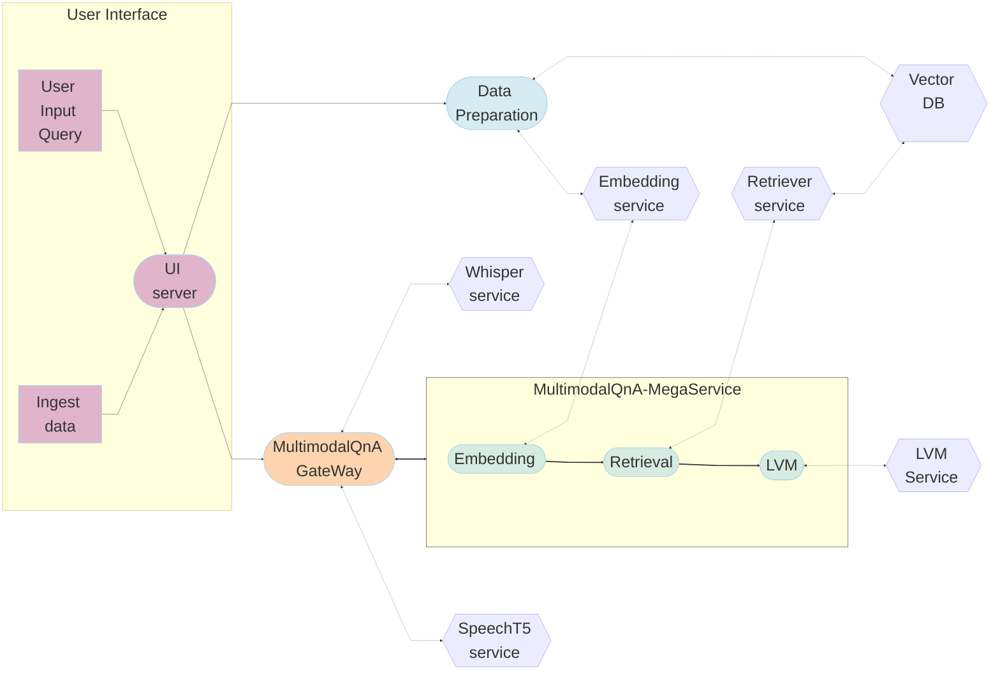
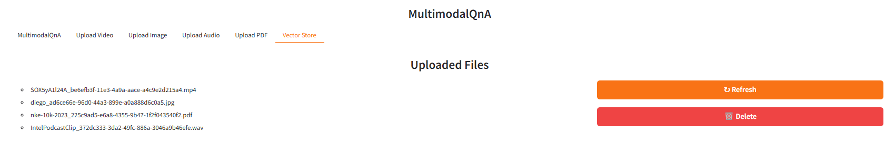

# MultimodalQnA Application

Multimodal question answering is the process of extracting insights from documents that contain a mix of text, images, videos, audio, and PDFs. It involves reasoning over both textual and non-textual content to answer user queries.

The MultimodalQnA framework enables this by leveraging the BridgeTower model, which encodes visual and textual data into a shared semantic space. During ingestion, it processes content and stores embeddings in a vector database. At query time, relevant multimodal segments are retrieved and passed to a vision-language model to generate responses in text or audio form.

## Table of Contents

1. [Architecture](#architecture)
2. [Deployment Options](#deployment-options)
3. [Monitoring and Tracing](./README_miscellaneous.md)

## Architecture

The MultimodalQnA application is an end-to-end workflow designed for multimodal question answering across video, image, audio, and PDF inputs. The architecture is illustrated below:

The MultimodalQnA example is implemented using the component-level microservices defined in [GenAIComps](https://github.com/opea-project/GenAIComps), the MultimodalQnA Flow Chart shows below:

This MultimodalQnA use case performs Multimodal-RAG using LangChain, Redis VectorDB and Text Generation Inference on [Intel Gaudi2](https://www.intel.com/content/www/us/en/products/details/processors/ai-accelerators/gaudi.html), [Intel Xeon Scalable Processors](https://www.intel.com/content/www/us/en/products/details/processors/xeon.html) and [AMD EPYC™ Processors](https://www.amd.com/en/products/processors/server/epyc.html), and we invite contributions from other hardware vendors to expand the example.

## Deployment Options

The table below lists currently available deployment options. They outline in detail the implementation of this example on selected hardware.

## Validated Configurations

| **Deploy Method** | **LLM Engine** | **LLM Model**                     | **Database**  | **Hardware** |
| ----------------- | -------------- | --------------------------------- | ------------- | ------------ |
| Docker Compose    | LLAVA          | llava-hf/llava-1.5-7b-hf          | Milvus, Redis | Intel Xeon   |
| Docker Compose    | LLAVA          | llava-hf/llava-v1.6-vicuna-13b-hf | Redis         | Intel Gaudi  |
| Docker Compose    | LLAVA          | llava-hf/llava-1.5-7b-hf          | Milvus, Redis | AMD EPYC     |
| Docker Compose    | TGI, vLLM      | Xkev/Llama-3.2V-11B-cot           | Redis         | AMD ROCm     |

## Validated Configurations

| **Deploy Method** | **LLM Engine** | **LLM Model**                     | **Database**  | **Hardware** |
| ----------------- | -------------- | --------------------------------- | ------------- | ------------ |
| Docker Compose    | LLAVA          | llava-hf/llava-1.5-7b-hf          | Milvus, Redis | Intel Xeon   |
| Docker Compose    | LLAVA          | llava-hf/llava-v1.6-vicuna-13b-hf | Redis         | Intel Gaudi  |
| Docker Compose    | LLAVA          | llava-hf/llava-1.5-7b-hf          | Milvus, Redis | AMD EPYC     |
| Docker Compose    | TGI, vLLM      | Xkev/Llama-3.2V-11B-cot           | Redis         | AMD ROCm     |
