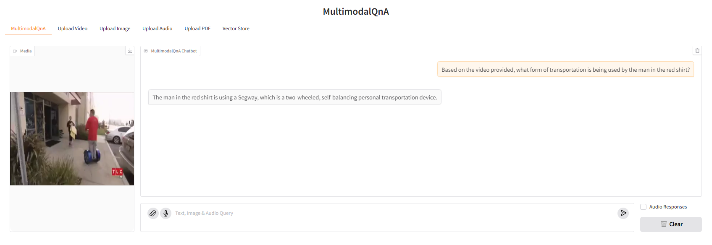
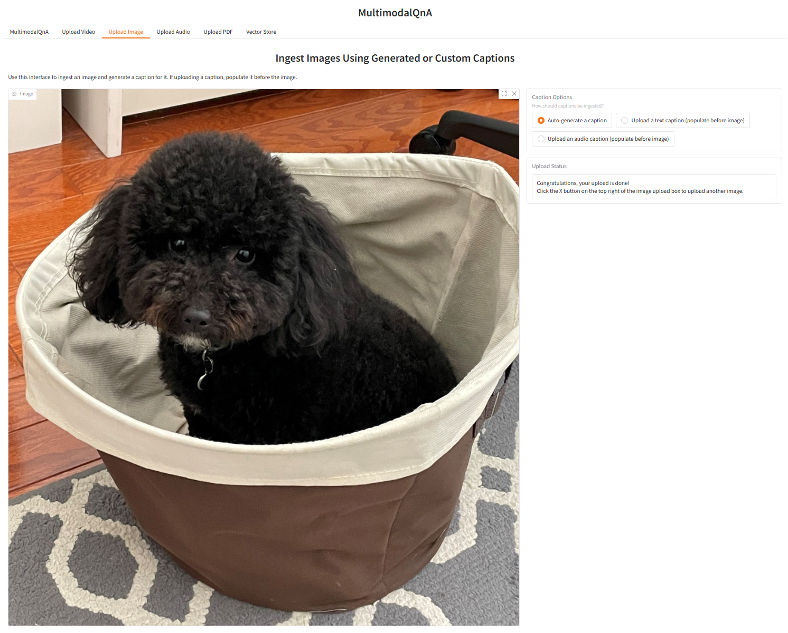

# MultimodalQnA Application

Suppose you possess a set of videos, images, audio files, PDFs, or some combination thereof and wish to perform question-answering to extract insights from these documents. To respond to your questions, the system needs to comprehend a mix of textual, visual, and audio facts drawn from the document contents. The MultimodalQnA framework offers an optimal solution for this purpose.

`MultimodalQnA` addresses your questions by dynamically fetching the most pertinent multimodal information (e.g. images, transcripts, and captions) from your collection of video, image, audio, and PDF files. For this purpose, MultimodalQnA utilizes [BridgeTower model](https://huggingface.co/BridgeTower/bridgetower-large-itm-mlm-gaudi), a multimodal encoding transformer model which merges visual and textual data into a unified semantic space. During the ingestion phase, the BridgeTower model embeds both visual cues and auditory facts as texts, and those embeddings are then stored in a vector database. When it comes to answering a question, the MultimodalQnA will fetch its most relevant multimodal content from the vector store and feed it into a downstream Large Vision-Language Model (LVM) as input context to generate a response for the user.

The MultimodalQnA architecture shows below:


MultimodalQnA is implemented on top of [GenAIComps](https://github.com/opea-project/GenAIComps), the MultimodalQnA Flow Chart shows below:


This MultimodalQnA use case performs Multimodal-RAG using LangChain, Redis VectorDB and Text Generation Inference on [Intel Gaudi2](https://www.intel.com/content/www/us/en/products/details/processors/ai-accelerators/gaudi-overview.html) and [Intel Xeon Scalable Processors](https://www.intel.com/content/www/us/en/products/details/processors/xeon.html), and we invite contributions from other hardware vendors to expand the example.

The [Whisper Service](https://github.com/opea-project/GenAIComps/blob/main/comps/asr/src/README.md)
is used by MultimodalQnA for converting audio queries to text. If a spoken response is requested, the
[SpeechT5 Service](https://github.com/opea-project/GenAIComps/blob/main/comps/tts/src/README.md) translates the text
response from the LVM to a speech audio file.

The Intel Gaudi2 accelerator supports both training and inference for deep learning models in particular for LLMs. Visit [Habana AI products](https://habana.ai/products) for more details.

In the below, we provide a table that describes for each microservice component in the MultimodalQnA architecture, the default configuration of the open source project, hardware, port, and endpoint.

<details>
<summary><b>Gaudi and Xeon default compose.yaml settings</b></summary>

| MicroService | Open Source Project   | HW    | Port | Endpoint                                                    |
| ------------ | --------------------- | ----- | ---- | ----------------------------------------------------------- |
| Dataprep     | Redis, Langchain, TGI | Xeon  | 6007 | /v1/generate_transcripts, /v1/generate_captions, /v1/ingest |
| Embedding    | Langchain             | Xeon  | 6000 | /v1/embeddings                                              |
| LVM          | Langchain, Transformers | Xeon | 9399 | /v1/lvm                                                    |
| Retriever    | Langchain, Redis      | Xeon  | 7000 | /v1/retrieval                                               |
| SpeechT5     | Transformers          | Xeon  | 7055 | /v1/tts                                                     |
| Whisper      | Transformers          | Xeon  | 7066 | /v1/asr                                                     |
| Dataprep     | Redis, Langchain, TGI | Gaudi | 6007 | /v1/generate_transcripts, /v1/generate_captions, /v1/ingest |
| Embedding    | Langchain             | Gaudi | 6000 | /v1/embeddings                                              |
| LVM          | Langchain, TGI        | Gaudi | 9399 | /v1/lvm                                                     |
| Retriever    | Langchain, Redis      | Gaudi | 7000 | /v1/retrieval                                               |
| SpeechT5     | Transformers          | Gaudi | 7055 | /v1/tts                                                     |
| Whisper      | Transformers          | Gaudi | 7066 | /v1/asr                                                     |

</details>

## Required Models

By default, the embedding and LVM models are set to a default value as listed below:

| Service   | HW    | Model                                     |
| --------- | ----- | ----------------------------------------- |
| embedding | Xeon  | BridgeTower/bridgetower-large-itm-mlm-itc |
| LVM       | Xeon  | llava-hf/llava-1.5-7b-hf                  |
| SpeechT5  | Xeon  | microsoft/speecht5_tts                    |
| Whisper   | Xeon  | openai/whisper-small                      |
| embedding | Gaudi | BridgeTower/bridgetower-large-itm-mlm-itc |
| LVM       | Gaudi | llava-hf/llava-v1.6-vicuna-13b-hf         |
| SpeechT5  | Gaudi | microsoft/speecht5_tts                    |
| Whisper   | Gaudi  | openai/whisper-small                     |

You can choose other LVM models, such as `llava-hf/llava-1.5-7b-hf ` and `llava-hf/llava-1.5-13b-hf`, as needed.

## Deploy MultimodalQnA Service

The MultimodalQnA service can be effortlessly deployed on either Intel Gaudi2 or Intel XEON Scalable Processors.

Currently we support deploying MultimodalQnA services with docker compose. The [`docker_compose`](docker_compose)
directory has folders which include `compose.yaml` files for different hardware types:

```
📂 docker_compose
├── 📂 amd
│   └── 📂 gpu
│       └── 📂 rocm
│           ├── 📄 compose.yaml
│           └── ...
└── 📂 intel
    ├── 📂 cpu
    │   └── 📂 xeon
    │       ├── 📄 compose.yaml
    │       └── ...
    └── 📂 hpu
        └── 📂 gaudi
            ├── 📄 compose.yaml
            └── ...
```

### Setup Environment Variables

To set up environment variables for deploying MultimodalQnA services, follow these steps:

1. Set the required environment variables:

   ```bash
   # Example: export host_ip=$(hostname -I | awk '{print $1}')
   export host_ip="External_Public_IP"

   # Append the host_ip to the no_proxy list to allow container communication
   # Example: no_proxy="localhost, 127.0.0.1, 192.168.1.1"
   export no_proxy="${no_proxy},${host_ip}"
   ```

2. If you are in a proxy environment, also set the proxy-related environment variables:

   ```bash
   export http_proxy="Your_HTTP_Proxy"
   export https_proxy="Your_HTTPs_Proxy"
   ```

3. Set up other environment variables:

   > Choose **one** command below to set env vars according to your hardware. Otherwise, the port numbers may be set incorrectly.

   ```bash
   # on Gaudi
   cd docker_compose/intel/hpu/gaudi
   source ./set_env.sh

   # on Xeon
   cd docker_compose/intel/cpu/xeon
   source ./set_env.sh
   ```

### Deploy MultimodalQnA on Gaudi

Refer to the [Gaudi Guide](./docker_compose/intel/hpu/gaudi/README.md) if you would like to build docker images from
source, otherwise images will be pulled from Docker Hub.

Find the corresponding [compose.yaml](./docker_compose/intel/hpu/gaudi/compose.yaml).

```bash
# While still in the docker_compose/intel/hpu/gaudi directory, use docker compose to bring up the services
docker compose -f compose.yaml up -d
```

> Notice: Currently only the **Habana Driver 1.18.x** is supported for Gaudi.

### Deploy MultimodalQnA on Xeon

Refer to the [Xeon Guide](./docker_compose/intel/cpu/xeon/README.md) if you would like to build docker images from
source, otherwise images will be pulled from Docker Hub.

Find the corresponding [compose.yaml](./docker_compose/intel/cpu/xeon/compose.yaml).

```bash
# While still in the docker_compose/intel/cpu/xeon directory, use docker compose to bring up the services
docker compose -f compose.yaml up -d
```

## MultimodalQnA Demo on Gaudi2

### Multimodal QnA UI


### Video Ingestion


### Text Query following the ingestion of a Video



### Image Ingestion



### Text Query following the ingestion of an image


### Audio Ingestion


### Text Query following the ingestion of an Audio Podcast


### PDF Ingestion


### Text query following the ingestion of a PDF


