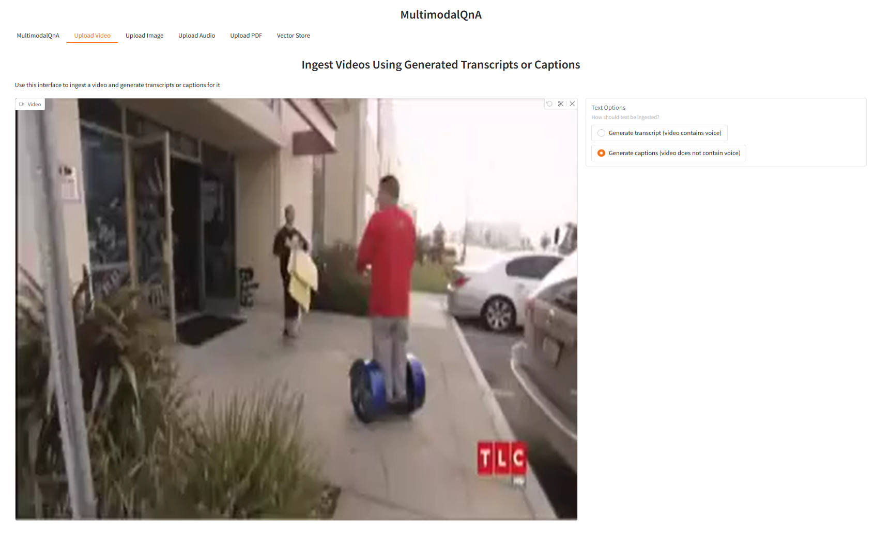
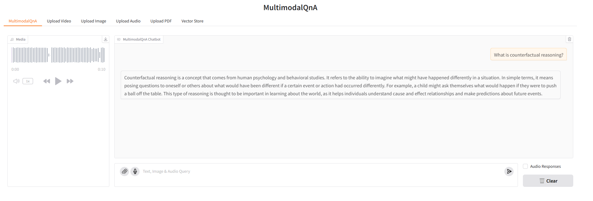
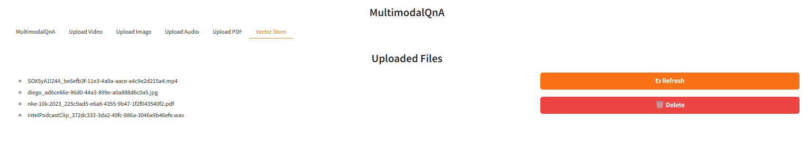

# MultimodalQnA Docker Image Build

## Table of Contents

1. [Build MegaService Docker Image](#build-megaservice-docker-image)
2. [Build UI Docker Image](#build-ui-docker-image)
3. [Generate a HuggingFace Access Token](#generate-a-huggingface-access-token)
4. [Troubleshooting](#troubleshooting)
5. [Monitoring OPEA Services with Prometheus and Grafana Dashboard](#monitoring-opea-services-with-prometheus-and-grafana-dashboard)
6. [Tracing with OpenTelemetry and Jaeger](#tracing-with-opentelemetry-and-jaeger)
7. [Demo Screenshots](#demo-screenshots)

## Build MegaService Docker Image

To construct the Megaservice of MultimodalQnA, the [GenAIExamples](https://github.com/opea-project/GenAIExamples.git) repository is utilized. Build Megaservice Docker image via command below:

```bash
git clone https://github.com/opea-project/GenAIExamples.git
cd GenAIExamples/MultimodalQnA
docker build --no-cache -t opea/multimodalqna:latest --build-arg https_proxy=$https_proxy --build-arg http_proxy=$http_proxy -f Dockerfile .
```

## Build UI Docker Image

Build frontend Docker image via below command:

```bash
cd GenAIExamples/MultimodalQnA/ui
docker build -t opea/multimodalqna-ui:latest --build-arg https_proxy=$https_proxy --build-arg http_proxy=$http_proxy -f ./docker/Dockerfile .
```

## Generate a HuggingFace Access Token

Some HuggingFace resources, such as some models, are only accessible if the developer have an access token. In the absence of a HuggingFace access token, the developer can create one by first creating an account by following the steps provided at [HuggingFace](https://huggingface.co/) and then generating a [user access token](https://huggingface.co/docs/transformers.js/en/guides/private#step-1-generating-a-user-access-token).

## Troubleshooting

1. If you get errors like "Access Denied", [validate micro service](https://github.com/opea-project/GenAIExamples/blob/main/MultimodalQnA/docker_compose/intel/cpu/xeon/README.md#validate-microservices) first. A simple example:

   ```bash
   http_proxy=""
   curl http://${host_ip}:8399/generate \
    -X POST \
    -H 'Content-Type: application/json' \
    -d '{
      "prompt": "Describe the image please.",
      "img_b64_str": [
        "iVBORw0KGgoAAAANSUhEUgAAAAoAAAAKCAYAAACNMs+9AAAAFUlEQVR42mP8/5+hnoEIwDiqkL4KAcT9GO0U4BxoAAAAAElFTkSuQmCC",
        "iVBORw0KGgoAAAANSUhEUgAAAAoAAAAKCAYAAACNMs+9AAAAFUlEQVR42mNkYPhfz0AEYBxVSF+FAP5FDvcfRYWgAAAAAElFTkSuQmCC"
      ]
    }'
   ```

2. (Docker only) If all microservices work well, check the port ${host_ip}:8888, the port may be allocated by other users, you can modify the `compose.yaml`.
3. (Docker only) If you get errors like "The container name is in use", change container name in `compose.yaml`.

## Monitoring OPEA Services with Prometheus and Grafana Dashboard

OPEA microservice deployment can easily be monitored through Grafana dashboards using data collected via Prometheus. Follow the [README](https://github.com/opea-project/GenAIEval/blob/main/evals/benchmark/grafana/README.md) to set up Prometheus and Grafana servers and import dashboards to monitor the OPEA services.


## Tracing with OpenTelemetry and Jaeger

> NOTE: This feature is disabled by default. Please use the compose.telemetry.yaml file to enable this feature.

OPEA microservice and [TGI](https://huggingface.co/docs/text-generation-inference/en/index)/[TEI](https://huggingface.co/docs/text-embeddings-inference/en/index) serving can easily be traced through [Jaeger](https://www.jaegertracing.io/) dashboards in conjunction with [OpenTelemetry](https://opentelemetry.io/) Tracing feature. Follow the [README](https://github.com/opea-project/GenAIComps/tree/main/comps/cores/telemetry#tracing) to trace additional functions if needed.

Tracing data is exported to http://{EXTERNAL_IP}:4318/v1/traces via Jaeger.
Users could also get the external IP via below command.

```bash
ip route get 8.8.8.8 | grep -oP 'src \K[^ ]+'
```

Access the Jaeger dashboard UI at http://{EXTERNAL_IP}:16686

For TGI serving on Gaudi, users could see different services like opea, TEI and TGI.


Here is a screenshot for one tracing of TGI serving request.


There are also OPEA related tracings. Users could understand the time breakdown of each service request by looking into each opea:schedule operation.


There could be asynchronous function such as `llm/MicroService_asyn_generate` and user needs to check the trace of the asynchronous function in another operation like
opea:llm_generate_stream.


## Demo Screenshots

### Multimodal QnA UI


### Video Ingestion



### Text Query following the ingestion of a Video


### Image Ingestion


### Text Query following the ingestion of an image


### Text Query following the ingestion of an image using text-to-speech


### Audio Ingestion


### Text Query following the ingestion of an Audio Podcast



### PDF Ingestion


### Text query following the ingestion of a PDF


### View, Refresh, and Delete ingested media in the Vector Store


