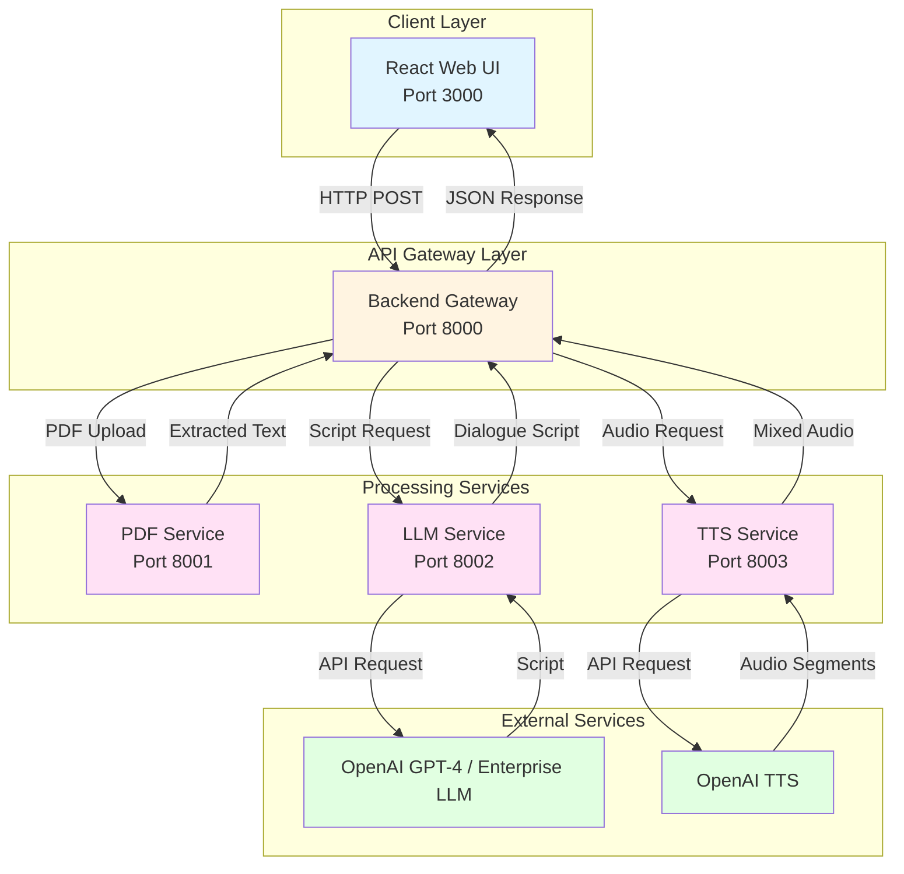
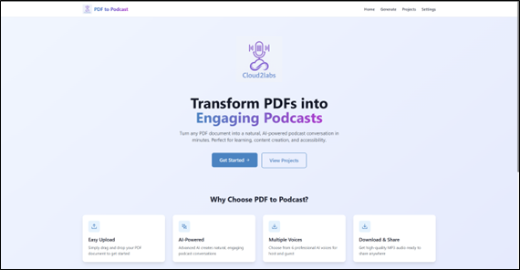
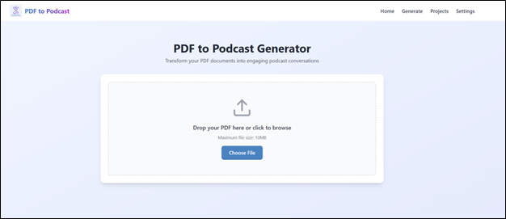
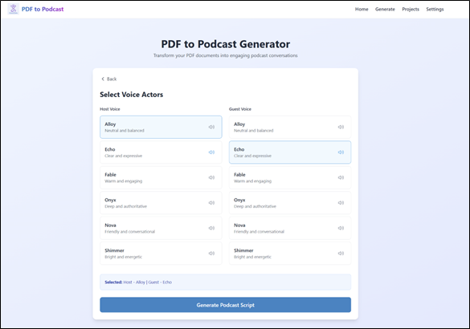
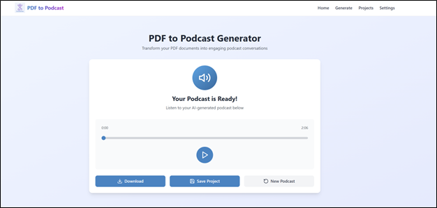

## PDF to Podcast Generator

AI-powered application that transforms PDF documents into engaging podcast-style audio conversations. This application can be deployed using either OpenAI APIs or enterprise inference endpoints.

## Table of Contents

- [Project Overview](#project-overview)
- [Features](#features)
- [Architecture](#architecture)
- [Prerequisites](#prerequisites)
- [Quick Start Deployment](#quick-start-deployment)
- [User Interface](#user-interface)
- [Troubleshooting](#troubleshooting)

---

## Project Overview

PDF to Podcast Generator is a microservices-based application that converts PDF documents into natural podcast-style audio conversations. The system extracts text from PDFs, generates engaging dialogue using Large Language Models, and synthesizes high-quality audio using Text-to-Speech technology.

---

## Features

- Digital PDF text extraction with support for text-based PDFs up to 10 MB
- AI-powered script generation with natural host and guest conversation format
- Supports multiple LLM backends: OpenAI GPT-4 or custom enterprise inference endpoints
- High-quality audio generation using OpenAI TTS with 6 different voice options
- Modern React web interface with real-time progress tracking
- Integrated audio player with waveform visualization
- Project management and organization with download functionality
- RESTful API for integration with JSON-based communication

---

## Architecture

This application uses a microservices architecture where each service handles a specific part of the podcast generation process. The React frontend communicates with a backend gateway that orchestrates requests across three specialized services: PDF processing, script generation, and audio synthesis. The LLM service can be configured to use either OpenAI GPT models or custom enterprise inference endpoints with Keycloak authentication, while the TTS service uses OpenAI for audio generation. This separation allows for flexible deployment options and easy scaling of individual components.



This application is built using FastAPI microservices architecture with Docker containerization.

**Service Components:**

1. **React Web UI (Port 3000)** - Handles file uploads, displays generation progress, and provides audio playback interface

2. **Backend Gateway (Port 8000)** - Routes requests to microservices and manages job lifecycle and state

3. **PDF Service (Port 8001)** - Extracts text from PDF files using PyPDF2 and pdfplumber libraries (no external API dependencies)

4. **LLM Service (Port 8002)** - Generates podcast dialogue scripts using OpenAI GPT-4 or custom enterprise inference endpoints with Keycloak authentication

5. **TTS Service (Port 8003)** - Synthesizes audio using OpenAI TTS API with multiple voice support and audio mixing

---

## Prerequisites

### System Requirements

Before you begin, ensure you have the following installed:

- **Docker and Docker Compose**
- **Enterprise inference endpoint access** (Keycloak authentication)
- **OpenAPI KEY** (Need OpenAPI Key as enterprise inference doesn't have supported models for Audio and Video )

### Verify Docker Installation

```bash
# Check Docker version
docker --version

# Check Docker Compose version
docker compose version

# Verify Docker is running
docker ps
```

## Quick Start Deployment

### Clone the Repository

```bash
git clone https://github.com/cld2labs/GenAISamples.git
cd GenAISamples/pdf-podcast
```

### Set up the Environment

Each service needs its own `.env` file. Copy the example files and edit with your credentials.

**1. PDF Service Configuration:**

```bash
cp api/pdf-service/.env.example api/pdf-service/.env
```

No changes needed. Uses default values.

**2. TTS Service Configuration:**

```bash
cp api/tts-service/.env.example api/tts-service/.env
```

Open `api/tts-service/.env` and replace `your-openai-api-key-here` with your actual OpenAI API key.

Available TTS voices: alloy, echo, fable, onyx, nova, shimmer. Default voices are alloy (host) and nova (guest).

**3. LLM Service Configuration:**

```bash
cp api/llm-service/.env.example api/llm-service/.env
```

- Replace these placeholder values:
  - `BASE_URL` with your enterprise API endpoint
  - `KEYCLOAK_CLIENT_SECRET` with your actual client secret
  - `INFERENCE_MODEL_ENDPOINT` if different from default
  - `INFERENCE_MODEL_NAME` if different from default

**4. Backend Service Configuration:**

```bash
cp .env.example .env
```
No changes needed. Uses default values.

### Running the Application

Start both API and UI services together with Docker Compose:

```bash
# From the rag-chatbot directory
docker compose up --build

# Or run in detached mode (background)
docker compose up -d --build
```
The Backend will be available at: http://localhost:8000

The UI will be available at: http://localhost:3000

The LLM-service will be available at: http://localhost:8002

The PDF-service will be available at: http://localhost:8001

The TTS-service will be available at: http://localhost:8003

**View logs**:

```bash
# All services
docker compose logs -f

# Backend only
docker compose logs -f backend

# Frontend only
docker compose logs -f frontend
```

**Verify the services are running**:

```bash
# Check API health
curl http://localhost:8002/health

# Check if containers are running
docker compose ps
```

## User Interface

**Using the Application**

Make sure you are at the localhost:3000 url

**Test the Application**

1. Upload a PDF file (max 10MB)
2. Wait for text extraction
3. Select host and guest voices
4. Click "Generate Script" and wait 15-30 seconds
5. Review generated script
6. Click "Generate Audio" and wait 30-60 seconds
7. Listen to your podcast










### Stopping the Application


```bash
docker compose down
```

## Troubleshooting

For detailed troubleshooting guidance and solutions to common issues, refer to:

[TROUBLESHOOTING_and_ADDITIONAL_INFO.md](./TROUBLESHOOTING_and_ADDITIONAL_INFO.md)
