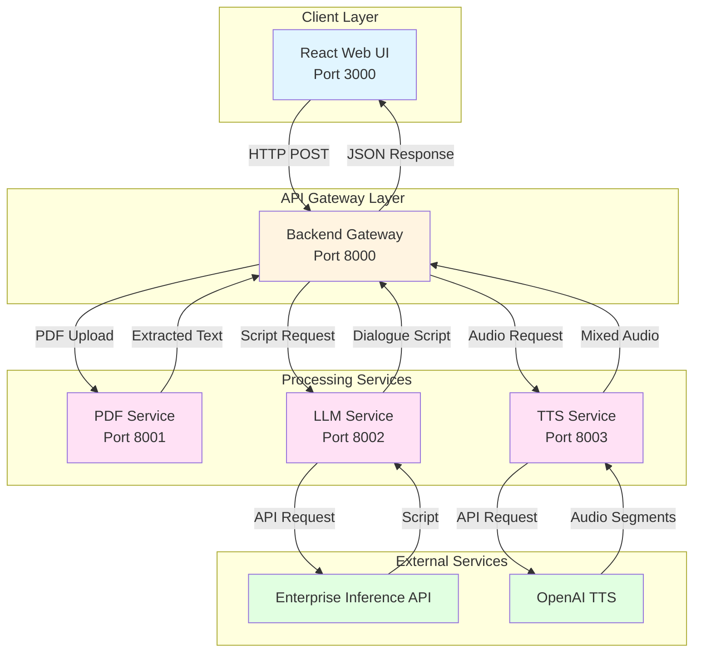
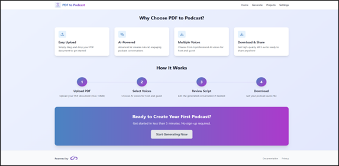

## PDF to Podcast Generator

AI-powered application that transforms PDF documents into engaging podcast-style audio conversations using enterprise inference endpoints for script generation and OpenAI TTS for audio synthesis.

## Table of Contents

- [Project Overview](#project-overview)
- [Features](#features)
- [Architecture](#architecture)
- [Prerequisites](#prerequisites)
- [Quick Start Deployment](#quick-start-deployment)
- [User Interface](#user-interface)
- [Troubleshooting](#troubleshooting)

---

## Project Overview

PDF to Podcast Generator is a microservices-based application that converts PDF documents into natural podcast-style audio conversations. The system extracts text from PDFs, generates engaging dialogue using Large Language Models, and synthesizes high-quality audio using Text-to-Speech technology.

---

## Features

- Digital PDF text extraction with support for text-based PDFs up to 10 MB
- AI-powered script generation with natural host and guest conversation format
- Enterprise inference endpoints for LLM-based script generation
- High-quality audio generation using OpenAI TTS with 6 different voice options
- Modern React web interface with real-time progress tracking
- Integrated audio player with waveform visualization
- Project management and organization with download functionality
- RESTful API for integration with JSON-based communication

---

## Architecture

This application uses a microservices architecture where each service handles a specific part of the podcast generation process. The React frontend communicates with a backend gateway that orchestrates requests across three specialized services: PDF processing, script generation, and audio synthesis. The LLM service uses enterprise inference endpoints with token-based authentication for script generation, while the TTS service uses OpenAI TTS API for audio generation. This separation allows for flexible deployment options and easy scaling of individual components.



This application is built using FastAPI microservices architecture with Docker containerization.

**Service Components:**

1. **React Web UI (Port 3000)** - Handles file uploads, displays generation progress, and provides audio playback interface

2. **Backend Gateway (Port 8000)** - Routes requests to microservices and manages job lifecycle and state

3. **PDF Service (Port 8001)** - Extracts text from PDF files using PyPDF2 and pdfplumber libraries (no external API dependencies)

4. **LLM Service (Port 8002)** - Generates podcast dialogue scripts using enterprise inference endpoints with token-based authentication

5. **TTS Service (Port 8003)** - Synthesizes audio using OpenAI TTS API with multiple voice support and audio mixing

---

## Prerequisites

### System Requirements

Before you begin, ensure you have the following installed:

- **Docker and Docker Compose**
- **Enterprise inference endpoint access** (token-based authentication)

### Verify Docker Installation

```bash
# Check Docker version
docker --version

# Check Docker Compose version
docker compose version

# Verify Docker is running
docker ps
```

### Required API Keys

**For LLM Service (Script Generation):**
- INFERENCE_API_ENDPOINT: URL of the deployed model inference service
- INFERENCE_API_TOKEN: API key / bearer token used to authenticate requests

**For TTS Service (Audio Generation):**
- OpenAI API Key for text-to-speech
  - Sign up at https://platform.openai.com/
  - Create API key at https://platform.openai.com/api-keys
  - Key format starts with `sk-proj-`
  - Requires access to TTS APIs

---

## Quick Start Deployment

### Clone the Repository

```bash
git clone https://github.com/opea-project/GenAIExamples.git
cd GenAIExamples/PdfToPodcast
```

### Set up the Environment

Each service needs its own `.env` file. Copy the example files and edit with your credentials.

**1. PDF Service Configuration:**

```bash
cp api/pdf-service/.env.example api/pdf-service/.env
```

No changes needed. Uses default values.

**2. TTS Service Configuration:**

```bash
cp api/tts-service/.env.example api/tts-service/.env
```

Open `api/tts-service/.env` and replace `your-openai-api-key-here` with your actual OpenAI API key.

Available TTS voices: alloy, echo, fable, onyx, nova, shimmer. Default voices are alloy (host) and nova (guest).

**3. LLM Service Configuration:**

```bash
cp api/llm-service/.env.example api/llm-service/.env
```

Open `api/llm-service/.env` and configure your inference endpoint:

- Replace `INFERENCE_API_ENDPOINT` with your inference service URL (without /v1)
- Replace `INFERENCE_API_TOKEN` with your pre-generated bearer token
- Update `INFERENCE_MODEL_NAME` if different from default (deepseek-ai/DeepSeek-R1-Distill-Qwen-32B)

**4. Backend Service Configuration:**

```bash
cp .env.example .env
```
No changes needed. Uses default values.


### Running the Application
Start all services together with Docker Compose:

```bash
# From the pdf-podcast directory
docker compose up --build

# Or run in detached mode (background)
docker compose up -d --build
```

This will:
- Pull required Docker images
- Build all 5 microservices
- Create containers and internal networking
- Start services in detached mode

First time deployment takes 5-10 minutes.

**Check all containers are running:**

```bash
docker compose ps
```

Expected output shows 5 containers with status "Up":

```
NAME            PORTS                    STATUS
frontend        0.0.0.0:3000->3000/tcp   Up
backend         0.0.0.0:8000->8000/tcp   Up
pdf-service     0.0.0.0:8001->8001/tcp   Up
llm-service     0.0.0.0:8002->8002/tcp   Up
tts-service     0.0.0.0:8003->8003/tcp   Up
```

**View logs**:

```bash
# All services
docker compose logs -f

# Backend only
docker compose logs -f backend

# Frontend only
docker compose logs -f frontend

# llm-service
docker compose logs -f llm-service

```

**Verify the services are running**:

```bash
# Check API health
curl http://localhost:8002/health
```
---

## User Interface

**Using the Application**

Make sure you are at the localhost:3000 url

### Test the Application

1. Upload a PDF file (max 10MB)
2. Wait for text extraction
3. Select host and guest voices
4. Click "Generate Script" and wait 15-30 seconds
5. Review generated script
6. Click "Generate Audio" and wait 30-60 seconds
7. Listen to your podcast
### Home Page




The home page introduces the application with a clean design showing key features and a simple process guide.

### Generate Page


**Workflow:**

1. **Upload PDF** - Drag and drop or browse to upload PDF (max 10MB)
2. **Generate Script** - Select voices and generate AI dialogue (15-30 seconds)
3. **Generate Audio** - Convert script to audio (30-60 seconds)
4. **Listen and Download** - Play audio with integrated player and download MP3
### Cleanup

Stop all services:

```bash
docker compose down
```

Remove all containers and volumes:

```bash
docker compose down -v
```


## Troubleshooting

For detailed troubleshooting guidance and solutions to common issues, refer to:

[TROUBLESHOOTING_and_ADDITIONAL_INFO.md](./TROUBLESHOOTING_and_ADDITIONAL_INFO.md)
