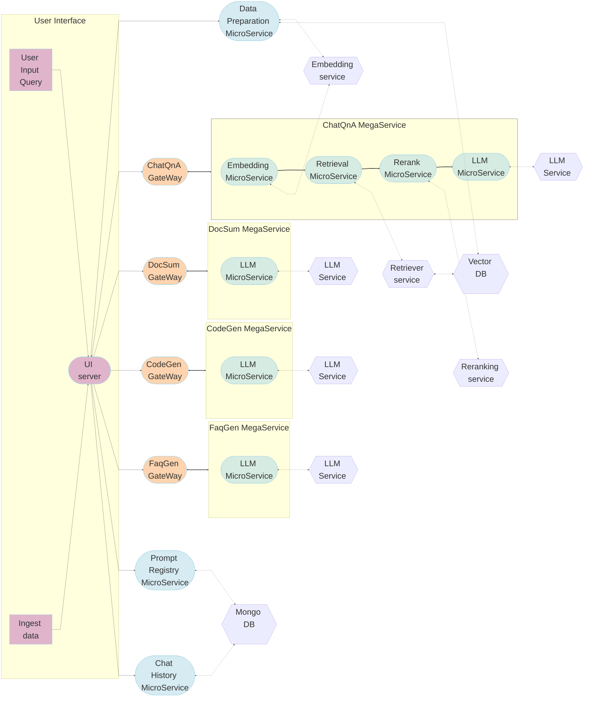

# Productivity Suite Application

Productivity Suite, a tool designed to streamline your workflow and boost productivity! Our application leverages the power of OPEA microservices to deliver a comprehensive suite of features tailored to meet the diverse needs of modern enterprises.

The ProductivitySuite example is implemented using both megaservices and the component-level microservices defined in [GenAIComps](https://github.com/opea-project/GenAIComps). The flow chart below shows the information flow between different megaservices and microservices for this example. Prompt Registry and Chat History microservices save prompt and chat history from the ChatQnA MegaService only into the database.

---

## 🛠️ Key Features

### 💬 Chat with Documents

Engage in intelligent conversations with your documents using our advanced **Retrieval-Augmented Generation (RAG)** capabilities. Ask questions, receive relevant information, and gain insights from your documents in real-time!

### 📄 Content Summarization

Summarize lengthy documents or articles, enabling you to grasp key takeaways quickly. Save time and effort with our intelligent summarization feature!

### ❓ FAQ Generation

Effortlessly create comprehensive FAQs based on your documents. Ensure your users have access to the information they need with minimal effort!

### 💻 Code Generation

Boost your coding productivity by providing a description of the functionality you require. Our application generates corresponding code snippets, saving you valuable time and effort!

### 🎛️ User Context Management

Maintain a seamless workflow by managing your user's context within the application. Our context management system keeps track of documents and chat history for a personalized experience.

### 🔐 Identity and Access Management

Utilizes the open-source platform **Keycloak** for single sign-on identity and access management. This ensures secure and convenient access to your productivity tools.

---

## 📚 Setup Guide

- **[Keycloak Configuration Guide](./docker_compose/intel/cpu/xeon/keycloak_setup_guide.md)**: Instructions to set up Keycloak for identity and access management.
- **[Xeon Guide](./docker_compose/intel/cpu/xeon/README.md)**: Instructions to build Docker images from source and run the application via Docker Compose.
