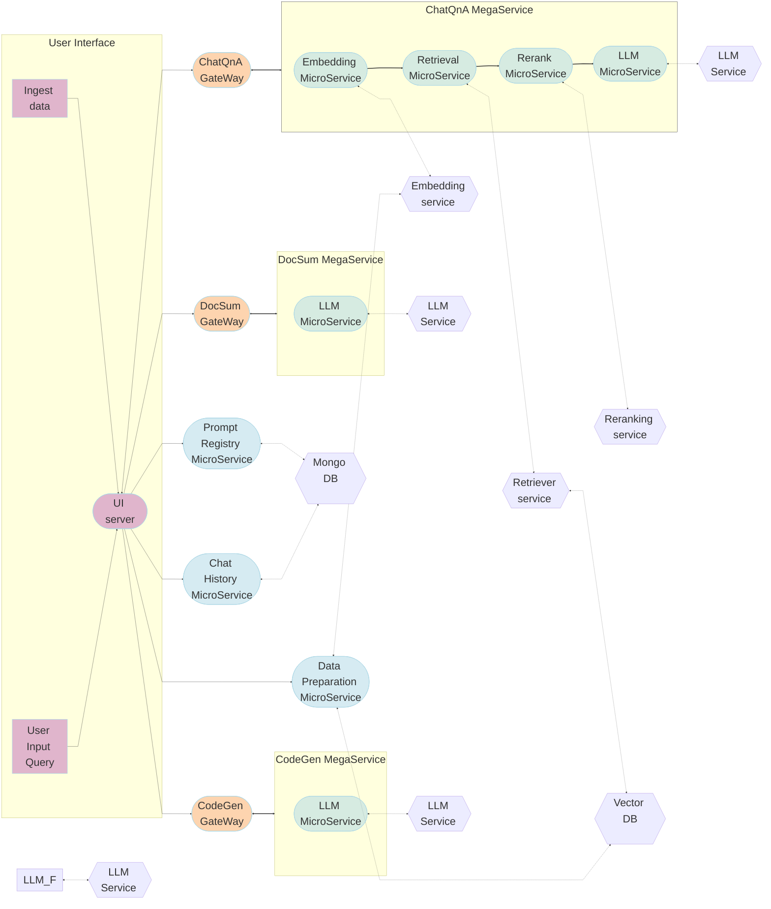

# Productivity Suite Application

Productivity Suite, a tool designed to streamline your workflow and boost productivity! Our application leverages the power of OPEA microservices to deliver a comprehensive suite of features tailored to meet the diverse needs of modern enterprises.

## Table of contents

1. [Architecture](#architecture)
2. [Deployment Options](#deployment-options)

## Architecture

The ProductivitySuite example is implemented using both megaservices and the component-level microservices defined in [GenAIComps](https://github.com/opea-project/GenAIComps). The flow chart below shows the information flow between different megaservices and microservices for this example. Prompt Registry and Chat History microservices save prompt and chat history from the ChatQnA MegaService only into the database.

---

## Deployment Options

The table below lists the available deployment options and their implementation details for different hardware platforms.

| Platform   | Deployment Method | Link                                                            |
| ---------- | ----------------- | --------------------------------------------------------------- |
| Intel Xeon | Docker compose    | [Deployment on Xeon](./docker_compose/intel/cpu/xeon/README.md) |
| AMD EPYC   | Docker compose    | [Deployment on EPYC](./docker_compose/amd/cpu/epyc/README.md)   |

## Validated Configurations

| **Deploy Method** | **LLM Engine** | **LLM Model**             | **Hardware** |
| ----------------- | -------------- | ------------------------- | ------------ |
| Docker Compose    | vLLM           | Intel/neural-chat-7b-v3-3 | Intel Xeon   |
| Docker Compose    | vLLM           | Intel/neural-chat-7b-v3-3 | AMD EPYC     |
