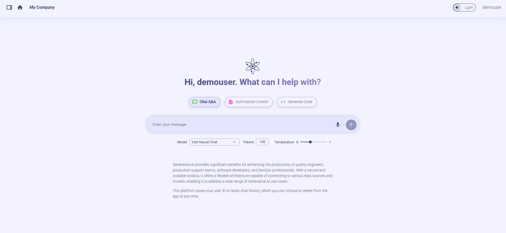

<h1 align="center" id="title"> Productivity Suite React UI</h1>

### 📸 Project Screenshots




<h2>🧐 Features</h2>

Here're some of the project's features:

#### CHAT QNA

- Start a Text Chat：Initiate a text chat with the ability to input written conversations, where the dialogue content can also be customized based on uploaded files.
- Context Awareness: The AI assistant maintains the context of the conversation, understanding references to previous statements or questions. This allows for more natural and coherent exchanges.

  ##### DATA SOURCE

  - The choice between uploading locally or copying a remote link. Chat according to uploaded knowledge base.
  - Uploaded File would get listed and user would be able add or remove file/links

  ###### Screen Shot

  

- Clear: Clear the record of the current dialog box without retaining the contents of the dialog box.
- Chat history: Historical chat records can still be retained after refreshing, making it easier for users to view the context.
- Conversational Chat : The application maintains a history of the conversation, allowing users to review previous messages and the AI to refer back to earlier points in the dialogue when necessary.
  ###### Screen Shots
  
  

#### CODEGEN

- Generate code: generate the corresponding code based on the current user's input.
  ###### Screen Shot
  

#### DOC SUMMARY

- Summarizing Uploaded Files: Upload files from their local device, then click 'Generate Summary' to summarize the content of the uploaded file. The summary will be displayed on the 'Summary' box.
- Summarizing Text via Pasting: Paste the text to be summarized into the text box, then click 'Generate Summary' to produce a condensed summary of the content, which will be displayed in the 'Summary' box on the right.
- Scroll to Bottom: The summarized content will automatically scroll to the bottom.
  ###### Screen Shot
  
  

#### FAQ Generator

- Generate FAQs from Text via Pasting: Paste the text to into the text box, then click 'Generate FAQ' to produce a condensed FAQ of the content, which will be displayed in the 'FAQ' box below.

- Generate FAQs from Text via txt file Upload: Upload the file in the Upload bar, then click 'Generate FAQ' to produce a condensed FAQ of the content, which will be displayed in the 'FAQ' box below.
  ###### Screen Shot
  

<h2>🛠️ Get it Running:</h2>

1. Clone the repo.

2. cd command to the current folder.

3. create a .env file and add the following variables and values.
   ```env
   VITE_BACKEND_SERVICE_ENDPOINT_CHATQNA=''
   VITE_BACKEND_SERVICE_ENDPOINT_CODEGEN=''
   VITE_BACKEND_SERVICE_ENDPOINT_DOCSUM=''
   VITE_BACKEND_SERVICE_ENDPOINT_FAQGEN=''
   VITE_KEYCLOAK_SERVICE_ENDPOINT=''
   VITE_DATAPREP_SERVICE_ENDPOINT=''
   VITE_DATAPREP_GET_FILE_ENDPOINT=''
   VITE_DATAPREP_DELETE_FILE_ENDPOINT=''
   VITE_CHAT_HISTORY_CREATE_ENDPOINT=''
   VITE_CHAT_HISTORY_GET_ENDPOINT=''
   VITE_CHAT_HISTORY_DELETE_ENDPOINT=''
   VITE_PROMPT_SERVICE_GET_ENDPOINT=''
   VITE_PROMPT_SERVICE_CREATE_ENDPOINT=''
   ```
4. Execute `npm install` to install the corresponding dependencies.

5. Execute `npm run dev`

6. open http://localhost:5174 in browser to the see the UI
