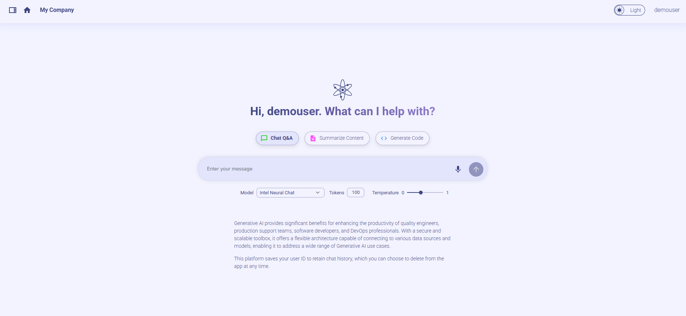
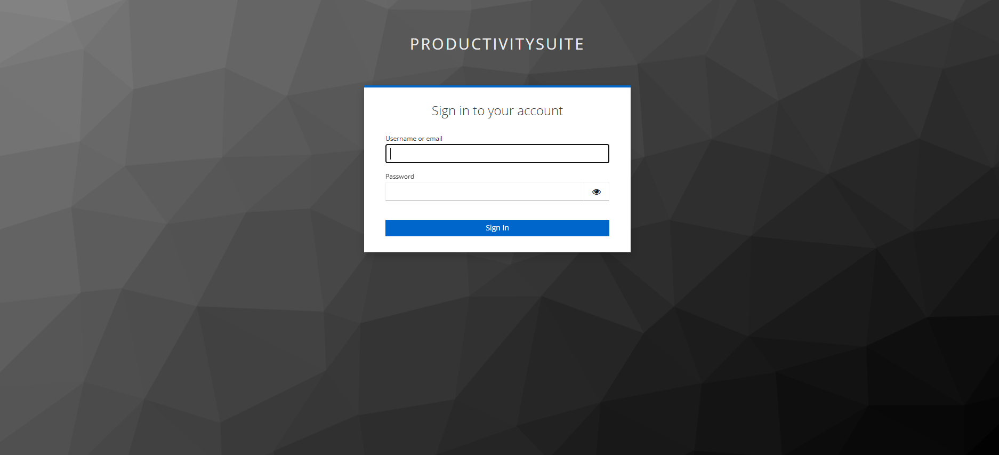
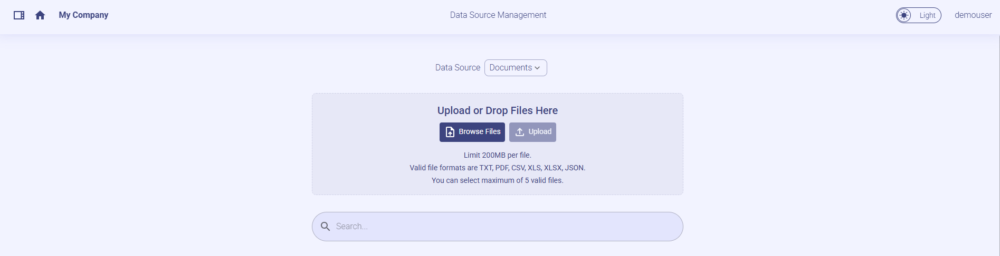
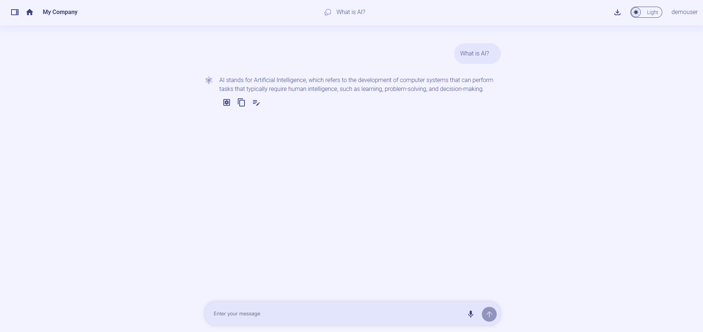
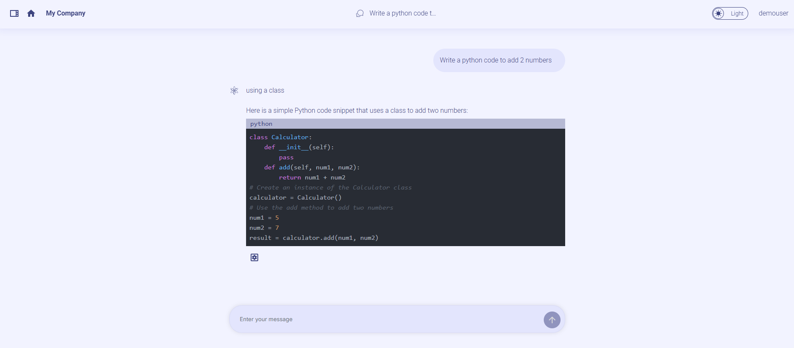
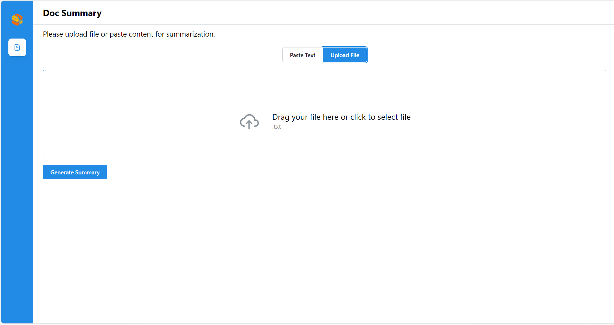
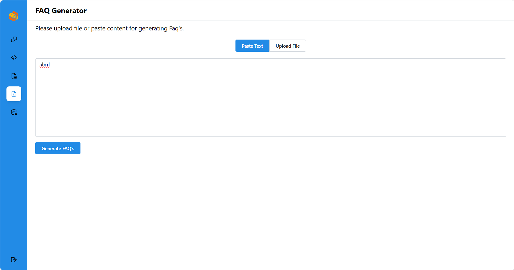

# Build Mega Service of Productivity Suite on Xeon

This document outlines the deployment process for OPEA Productivity Suite utilizing the [GenAIComps](https://github.com/opea-project/GenAIComps.git) microservice pipeline on Intel Xeon server and [GenAIExamples](https://github.com/opea-project/GenAIExamppes.git) solutions. The steps include Docker image creation, container deployment via Docker Compose, and service execution to integrate microservices such as `embedding`, `retriever`, `rerank`, and `llm`. We will publish the Docker images to Docker Hub soon, it will simplify the deployment process for this service.

## 🚀 Build Docker Images

First of all, you need to build Docker Images locally and install the python package of it.

```bash
git clone https://github.com/opea-project/GenAIComps.git
cd GenAIComps
```

### 1. Build Embedding Image

```bash
docker build --no-cache -t opea/embedding-tei:latest --build-arg https_proxy=$https_proxy --build-arg http_proxy=$http_proxy -f comps/embeddings/langchain/docker/Dockerfile .
```

### 2. Build Retriever Image

```bash
docker build --no-cache -t opea/retriever-redis:latest --build-arg https_proxy=$https_proxy --build-arg http_proxy=$http_proxy -f comps/retrievers/langchain/redis/docker/Dockerfile .
```

### 3. Build Rerank Image

```bash
docker build --no-cache -t opea/reranking-tei:latest --build-arg https_proxy=$https_proxy --build-arg http_proxy=$http_proxy -f comps/reranks/tei/docker/Dockerfile .
```

### 4. Build LLM Image

#### Use TGI as backend

```bash
docker build --no-cache -t opea/llm-tgi:latest --build-arg https_proxy=$https_proxy --build-arg http_proxy=$http_proxy -f comps/llms/text-generation/tgi/Dockerfile .
```

### 5. Build Dataprep Image

```bash
docker build --no-cache -t opea/dataprep-redis:latest --build-arg https_proxy=$https_proxy --build-arg http_proxy=$http_proxy -f comps/dataprep/redis/langchain/docker/Dockerfile .

```

### 6. Build Prompt Registry Image

```bash
docker build -t opea/promptregistry-mongo-server:latest --build-arg https_proxy=$https_proxy --build-arg http_proxy=$http_proxy -f comps/prompt_registry/mongo/docker/Dockerfile .


```

### 7. Build Chat History Image

```bash
docker build -t opea/chathistory-mongo-server:latest --build-arg https_proxy=$https_proxy --build-arg http_proxy=$http_proxy -f comps/chathistory/mongo/docker/Dockerfile .
cd ..
```

### 8. Build MegaService Docker Images

The Productivity Suite is composed of multiple GenAIExample reference solutions composed together.

#### 8.1 Build ChatQnA MegaService Docker Images

```bash
git clone https://github.com/opea-project/GenAIExamples.git
cd GenAIExamples/ChatQnA/docker
docker build --no-cache -t opea/chatqna:latest --build-arg https_proxy=$https_proxy --build-arg http_proxy=$http_proxy -f Dockerfile .
cd ../../..
```

#### 8.2 Build DocSum Megaservice Docker Images

```bash
cd GenAIExamples/DocSum/docker
docker build --no-cache -t opea/docsum:latest --build-arg https_proxy=$https_proxy --build-arg http_proxy=$http_proxy -f Dockerfile .
cd ../../..
```

#### 8.3 Build CodeGen Megaservice Docker Images

```bash
cd GenAIExamples/CodeGen/docker
docker build --no-cache -t opea/codegen:latest --build-arg https_proxy=$https_proxy --build-arg http_proxy=$http_proxy -f Dockerfile .
cd ../../..
```

#### 8.4 Build FAQGen Megaservice Docker Images

```bash
cd GenAIExamples/FaqGen/docker
docker build --no-cache -t opea/faqgen:latest --build-arg https_proxy=$https_proxy --build-arg http_proxy=$http_proxy -f Dockerfile .
cd ../../..
```

### 9. Build UI Docker Image

Build frontend Docker image that enables via below command:

**Export the value of the public IP address of your Xeon server to the `host_ip` environment variable**

```bash
cd GenAIExamples/ProductivitySuite/docker/ui/
docker build --no-cache -t ProductivitySuite/docker/xeon/compose.yaml ./docker/Dockerfile.react .
cd ../../../..
```

## 🚀 Start Microservices

### Setup Environment Variables

Since the `compose.yaml` will consume some environment variables, you need to setup them in advance as below.

**Export the value of the public IP address of your Xeon server to the `host_ip` environment variable**

> Change the External_Public_IP below with the actual IPV4 value

```
export host_ip="External_Public_IP"
```

**Export the value of your Huggingface API token to the `your_hf_api_token` environment variable**

> Change the Your_Huggingface_API_Token below with tyour actual Huggingface API Token value

```
export your_hf_api_token="Your_Huggingface_API_Token"
```

**Append the value of the public IP address to the no_proxy list**

```
export your_no_proxy=${your_no_proxy},"External_Public_IP"
```

```bash
export MONGO_HOST=${host_ip}
export MONGO_PORT=27017
export DB_NAME="test"
export COLLECTION_NAME="Conversations"
export EMBEDDING_MODEL_ID="BAAI/bge-base-en-v1.5"
export RERANK_MODEL_ID="BAAI/bge-reranker-base"
export LLM_MODEL_ID="Intel/neural-chat-7b-v3-3"
export LLM_MODEL_ID_CODEGEN="meta-llama/CodeLlama-7b-hf"
export TEI_EMBEDDING_ENDPOINT="http://${host_ip}:6006"
export TEI_RERANKING_ENDPOINT="http://${host_ip}:8808"
export TGI_LLM_ENDPOINT="http://${host_ip}:9009"
export REDIS_URL="redis://${host_ip}:6379"
export INDEX_NAME="rag-redis"
export HUGGINGFACEHUB_API_TOKEN=${your_hf_api_token}
export MEGA_SERVICE_HOST_IP=${host_ip}
export EMBEDDING_SERVICE_HOST_IP=${host_ip}
export RETRIEVER_SERVICE_HOST_IP=${host_ip}
export RERANK_SERVICE_HOST_IP=${host_ip}
export LLM_SERVICE_HOST_IP=${host_ip}
export LLM_SERVICE_HOST_IP_DOCSUM=${host_ip}
export LLM_SERVICE_HOST_IP_FAQGEN=${host_ip}
export LLM_SERVICE_HOST_IP_CODEGEN=${host_ip}
export LLM_SERVICE_HOST_IP_CHATQNA=${host_ip}
export TGI_LLM_ENDPOINT_CHATQNA="http://${host_ip}:9009"
export TGI_LLM_ENDPOINT_CODEGEN="http://${host_ip}:8028"
export TGI_LLM_ENDPOINT_FAQGEN="http://${host_ip}:9009"
export TGI_LLM_ENDPOINT_DOCSUM="http://${host_ip}:9009"
export BACKEND_SERVICE_ENDPOINT_CHATQNA="http://${host_ip}:8888/v1/chatqna"
export DATAPREP_DELETE_FILE_ENDPOINT="http://${host_ip}:6009/v1/dataprep/delete_file"
export BACKEND_SERVICE_ENDPOINT_FAQGEN="http://${host_ip}:8889/v1/faqgen"
export BACKEND_SERVICE_ENDPOINT_CODEGEN="http://${host_ip}:7778/v1/codegen"
export BACKEND_SERVICE_ENDPOINT_DOCSUM="http://${host_ip}:8890/v1/docsum"
export DATAPREP_SERVICE_ENDPOINT="http://${host_ip}:6007/v1/dataprep"
export DATAPREP_GET_FILE_ENDPOINT="http://${host_ip}:6007/v1/dataprep/get_file"
export CHAT_HISTORY_CREATE_ENDPOINT="http://${host_ip}:6012/v1/chathistory/create"
export CHAT_HISTORY_CREATE_ENDPOINT="http://${host_ip}:6012/v1/chathistory/create"
export CHAT_HISTORY_DELETE_ENDPOINT="http://${host_ip}:6012/v1/chathistory/delete"
export CHAT_HISTORY_GET_ENDPOINT="http://${host_ip}:6012/v1/chathistory/get"
export PROMPT_SERVICE_GET_ENDPOINT="http://${host_ip}:6015/v1/prompt/get"
export PROMPT_SERVICE_CREATE_ENDPOINT="http://${host_ip}:6015/v1/prompt/create"
export KEYCLOAK_SERVICE_ENDPOINT="http://${host_ip}:8080"
export LLM_SERVICE_HOST_PORT_FAQGEN=9002
export LLM_SERVICE_HOST_PORT_CODEGEN=9001
export LLM_SERVICE_HOST_PORT_DOCSUM=9003
export PROMPT_COLLECTION_NAME="prompt"
```

Note: Please replace with `host_ip` with you external IP address, do not use localhost.

### Start all the services Docker Containers

> Before running the docker compose command, you need to be in the folder that has the docker compose yaml file

```bash
cd GenAIExamples/ProductivitySuite/docker/xeon/
```

```bash
docker compose -f compose.yaml up -d
```

### Setup Keycloak

Please refer to [keycloak_setup_guide](keycloak_setup_guide.md) for more detail related to Keycloak configuration setup.

### Validate Microservices

1. TEI Embedding Service

   ```bash
   curl ${host_ip}:6006/embed \
       -X POST \
       -d '{"inputs":"What is Deep Learning?"}' \
       -H 'Content-Type: application/json'
   ```

2. Embedding Microservice

   ```bash
   curl http://${host_ip}:6000/v1/embeddings\
     -X POST \
     -d '{"text":"hello"}' \
     -H 'Content-Type: application/json'
   ```

3. Retriever Microservice

   To consume the retriever microservice, you need to generate a mock embedding vector by Python script. The length of embedding vector
   is determined by the embedding model.
   Here we use the model `EMBEDDING_MODEL_ID="BAAI/bge-base-en-v1.5"`, which vector size is 768.

   Check the vector dimension of your embedding model, set `your_embedding` dimension equals to it.

   ```bash
   export your_embedding=$(python3 -c "import random; embedding = [random.uniform(-1, 1) for _ in range(768)]; print(embedding)")
   curl http://${host_ip}:7000/v1/retrieval \
     -X POST \
     -d "{\"text\":\"test\",\"embedding\":${your_embedding}}" \
     -H 'Content-Type: application/json'
   ```

4. TEI Reranking Service

   ```bash
   curl http://${host_ip}:8808/rerank \
       -X POST \
       -d '{"query":"What is Deep Learning?", "texts": ["Deep Learning is not...", "Deep learning is..."]}' \
       -H 'Content-Type: application/json'
   ```

5. Reranking Microservice

   ```bash
   curl http://${host_ip}:8000/v1/reranking\
     -X POST \
     -d '{"initial_query":"What is Deep Learning?", "retrieved_docs": [{"text":"Deep Learning is not..."}, {"text":"Deep learning is..."}]}' \
     -H 'Content-Type: application/json'
   ```

6. LLM backend Service (ChatQnA, DocSum, FAQGen)

   ```bash
   curl http://${host_ip}:9009/generate \
     -X POST \
     -d '{"inputs":"What is Deep Learning?","parameters":{"max_new_tokens":17, "do_sample": true}}' \
     -H 'Content-Type: application/json'
   ```

7. LLM backend Service (CodeGen)

   ```bash
   curl http://${host_ip}:8028/generate \
     -X POST \
     -d '{"inputs":"def print_hello_world():","parameters":{"max_new_tokens":256, "do_sample": true}}' \
     -H 'Content-Type: application/json'
   ```

8. ChatQnA LLM Microservice

   ```bash
   curl http://${host_ip}:9000/v1/chat/completions\
     -X POST \
     -d '{"query":"What is Deep Learning?","max_new_tokens":17,"top_k":10,"top_p":0.95,"typical_p":0.95,"temperature":0.01,"repetition_penalty":1.03,"streaming":true}' \
     -H 'Content-Type: application/json'
   ```

9. CodeGen LLM Microservice

   ```bash
   curl http://${host_ip}:9001/v1/chat/completions\
     -X POST \
     -d '{"query":"def print_hello_world():"}' \
     -H 'Content-Type: application/json'
   ```

10. DocSum LLM Microservice

    ```bash
    curl http://${host_ip}:9002/v1/chat/docsum\
      -X POST \
      -d '{"query":"Text Embeddings Inference (TEI) is a toolkit for deploying and serving open source text embeddings and sequence classification models. TEI enables high-performance extraction for the most popular models, including FlagEmbedding, Ember, GTE and E5"}' \
      -H 'Content-Type: application/json'
    ```

11. FAQGen LLM Microservice

    ```bash
    curl http://${host_ip}:9003/v1/faqgen\
      -X POST \
      -d '{"query":"Text Embeddings Inference (TEI) is a toolkit for deploying and serving open source text embeddings and sequence classification models. TEI enables high-performance extraction for the most popular models, including FlagEmbedding, Ember, GTE and E5"}' \
      -H 'Content-Type: application/json'
    ```

12. ChatQnA MegaService

    ```bash
    curl http://${host_ip}:8888/v1/chatqna -H "Content-Type: application/json" -d '{
         "messages": "What is the revenue of Nike in 2023?"
         }'
    ```

13. FAQGen MegaService

    ```bash
    curl http://${host_ip}:8889/v1/faqgen -H "Content-Type: application/json" -d '{
         "messages": "Text Embeddings Inference (TEI) is a toolkit for deploying and serving open source text embeddings and sequence classification models. TEI enables high-performance extraction for the most popular models, including FlagEmbedding, Ember, GTE and E5."
         }'
    ```

14. DocSum MegaService

    ```bash
    curl http://${host_ip}:8890/v1/docsum -H "Content-Type: application/json" -d '{
         "messages": "Text Embeddings Inference (TEI) is a toolkit for deploying and serving open source text embeddings and sequence classification models. TEI enables high-performance extraction for the most popular models, including FlagEmbedding, Ember, GTE and E5."
         }'
    ```

15. CodeGen MegaService

    ```bash
    curl http://${host_ip}:7778/v1/codegen -H "Content-Type: application/json" -d '{
         "messages": "def print_hello_world():"
         }'
    ```

16. Dataprep Microservice

    If you want to update the default knowledge base, you can use the following commands:

    Update Knowledge Base via Local File Upload:

    ```bash
    curl -X POST "http://${host_ip}:6007/v1/dataprep" \
         -H "Content-Type: multipart/form-data" \
         -F "files=@./nke-10k-2023.pdf"
    ```

    This command updates a knowledge base by uploading a local file for processing. Update the file path according to your environment.

    Add Knowledge Base via HTTP Links:

    ```bash
    curl -X POST "http://${host_ip}:6007/v1/dataprep" \
         -H "Content-Type: multipart/form-data" \
         -F 'link_list=["https://opea.dev"]'
    ```

    This command updates a knowledge base by submitting a list of HTTP links for processing.

    Also, you are able to get the file list that you uploaded:

    ```bash
    curl -X POST "http://${host_ip}:6007/v1/dataprep/get_file" \
         -H "Content-Type: application/json"
    ```

    To delete the file/link you uploaded:

    ```bash
    # delete link
    curl -X POST "http://${host_ip}:6007/v1/dataprep/delete_file" \
         -d '{"file_path": "https://opea.dev.txt"}' \
         -H "Content-Type: application/json"

    # delete file
    curl -X POST "http://${host_ip}:6007/v1/dataprep/delete_file" \
         -d '{"file_path": "nke-10k-2023.pdf"}' \
         -H "Content-Type: application/json"

    # delete all uploaded files and links
    curl -X POST "http://${host_ip}:6007/v1/dataprep/delete_file" \
         -d '{"file_path": "all"}' \
         -H "Content-Type: application/json"
    ```

17. Prompt Registry Microservice

    If you want to update the default Prompts in the application for your user, you can use the following commands:

    ```bash
    curl -X 'POST' \
      http://{host_ip}:6015/v1/prompt/create \
      -H 'accept: application/json' \
      -H 'Content-Type: application/json' \
      -d '{
        "prompt_text": "test prompt", "user": "test"
    }'
    ```

    Retrieve prompt from database based on user or prompt_id

    ```bash
    curl -X 'POST' \
      http://{host_ip}:6015/v1/prompt/get \
      -H 'accept: application/json' \
      -H 'Content-Type: application/json' \
      -d '{
      "user": "test"}'

    curl -X 'POST' \
      http://{host_ip}:6015/v1/prompt/get \
      -H 'accept: application/json' \
      -H 'Content-Type: application/json' \
      -d '{
      "user": "test", "prompt_id":"{prompt_id returned from save prompt route above}"}'
    ```

    Delete prompt from database based on prompt_id provided

    ```bash
    curl -X 'POST' \
      http://{host_ip}:6015/v1/prompt/delete \
      -H 'accept: application/json' \
      -H 'Content-Type: application/json' \
      -d '{
      "user": "test", "prompt_id":"{prompt_id to be deleted}"}'
    ```

18. Chat History Microservice

    To validate the chatHistory Microservice, you can use the following commands.

    Create a sample conversation and get the message ID.

    ```bash
    curl -X 'POST' \
      http://${host_ip}:6012/v1/chathistory/create \
      -H 'accept: application/json' \
      -H 'Content-Type: application/json' \
      -d '{
      "data": {
        "messages": "test Messages", "user": "test"
      }
    }'
    ```

    Retrieve the conversation based on user or conversation id

    ```bash
    curl -X 'POST' \
      http://${host_ip}:6012/v1/chathistory/get \
      -H 'accept: application/json' \
      -H 'Content-Type: application/json' \
      -d '{
      "user": "test"}'

    curl -X 'POST' \
      http://${host_ip}:6012/v1/chathistory/get \
      -H 'accept: application/json' \
      -H 'Content-Type: application/json' \
      -d '{
      "user": "test", "id":"{Conversation id to retrieve }"}'
    ```

    Delete Conversation from database based on conversation id provided.

    ```bash
    curl -X 'POST' \
      http://${host_ip}:6012/v1/chathistory/delete \
      -H 'accept: application/json' \
      -H 'Content-Type: application/json' \
      -d '{
      "user": "test", "id":"{Conversation id to Delete}"}'
    ```

## 🚀 Launch the UI

To access the frontend, open the following URL in your browser: http://{host_ip}:5174. By default, the UI runs on port 80 internally. If you prefer to use a different host port to access the frontend, you can modify the port mapping in the `compose.yaml` file as shown below:

```yaml
  productivity-suite-xeon-react-ui-server:
    image: opea/productivity-suite-react-ui-server:latest
    ...
    ports:
      - "5715:80" # Map port 5715 on the host to port 80 in the container.
```

Here is an example of running Productivity Suite



## 🧐 Features

Here're some of the project's features:

### CHAT QNA

- Start a Text Chat：Initiate a text chat with the ability to input written conversations, where the dialogue content can also be customized based on uploaded files.
- Context Awareness: The AI assistant maintains the context of the conversation, understanding references to previous statements or questions. This allows for more natural and coherent exchanges.

### DATA SOURCE

- The choice between uploading locally or copying a remote link. Chat according to uploaded knowledge base.
- Uploaded File would get listed and user would be able add or remove file/links

#### Screen Shot



- Clear: Clear the record of the current dialog box without retaining the contents of the dialog box.
- Chat history: Historical chat records can still be retained after refreshing, making it easier for users to view the context.
- Conversational Chat : The application maintains a history of the conversation, allowing users to review previous messages and the AI to refer back to earlier points in the dialogue when necessary.

#### Screen Shots




### CODEGEN

- Generate code: generate the corresponding code based on the current user's input.

  Screen Shot
  

### DOC SUMMARY

- Summarizing Uploaded Files: Upload files from their local device, then click 'Generate Summary' to summarize the content of the uploaded file. The summary will be displayed on the 'Summary' box.
- Summarizing Text via Pasting: Paste the text to be summarized into the text box, then click 'Generate Summary' to produce a condensed summary of the content, which will be displayed in the 'Summary' box on the right.
- Scroll to Bottom: The summarized content will automatically scroll to the bottom.

#### Screen Shot




### FAQ Generator

- Generate FAQs from Text via Pasting: Paste the text to into the text box, then click 'Generate FAQ' to produce a condensed FAQ of the content, which will be displayed in the 'FAQ' box below.

- Generate FAQs from Text via txt file Upload: Upload the file in the Upload bar, then click 'Generate FAQ' to produce a condensed FAQ of the content, which will be displayed in the 'FAQ' box below.

#### Screen Shot


