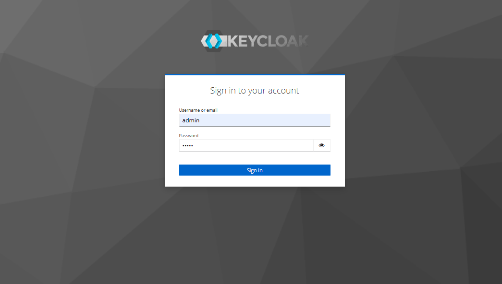
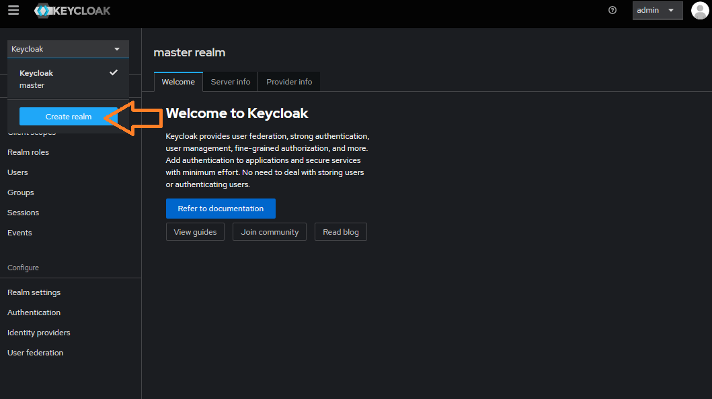
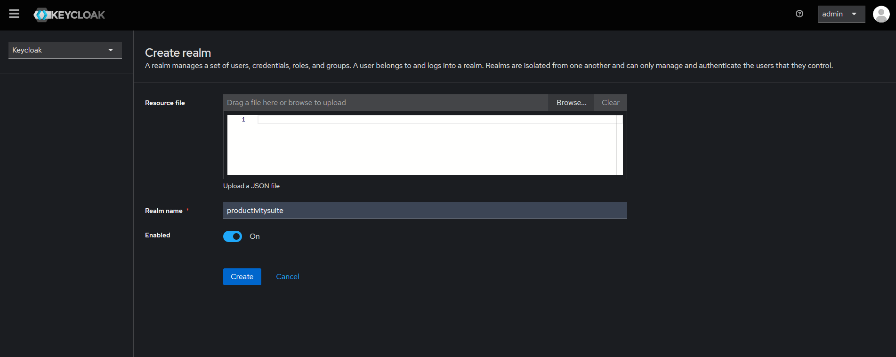
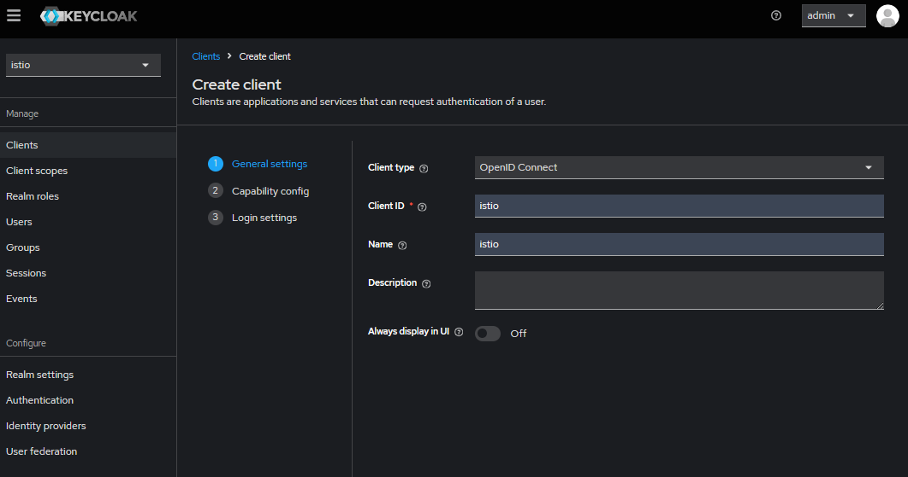
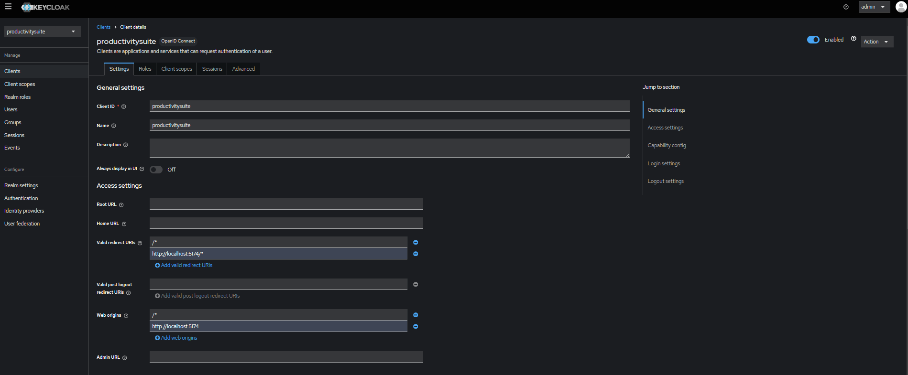
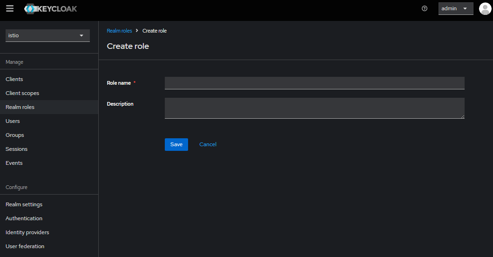
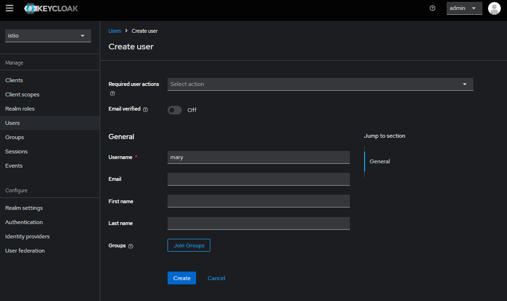
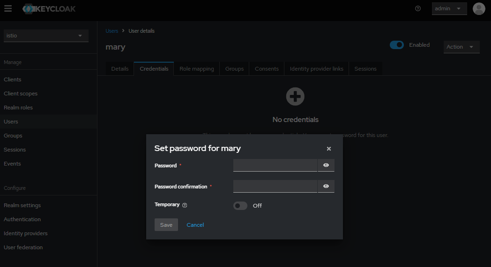
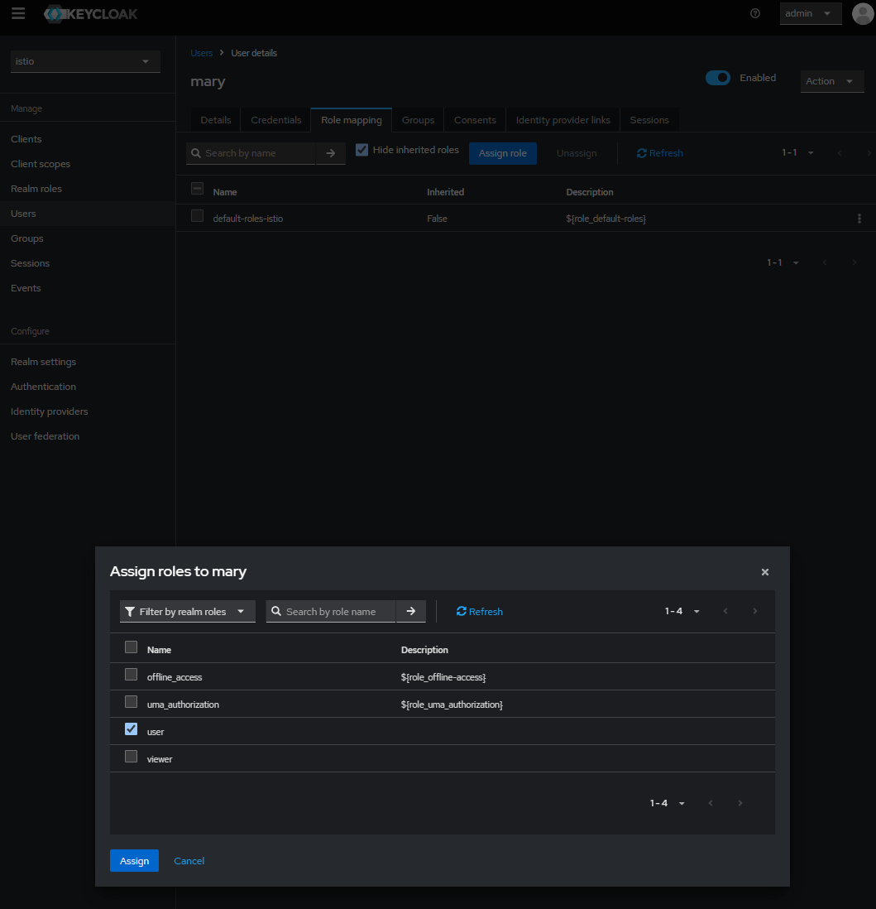

# Keycloak Configuration Setup

This document show you step-by-step how to configure Keycloak settings.

The user management is done via Keycloak and the configuration steps look like this:

1. Access the Keycloak admin console via url http:${host_ip}:8080 or endpoint that exposed from your kubernetes cluster to configure user. Use default username(admin) and password(admin) to login.
   
2. Create a new realm named **productivitysuite** within Keycloak.
   
   
3. Create a new client called **productivitysuite** with default configurations.
   
4. Select the **productivitysuite** client that created just now. Insert your ProductivitySuite UI url endpoint into "Valid redirect URIs" and "Web origins" field. Example as screenshot below:
   
5. From the left pane select the Realm roles and create a new role name as user and another new role as viewer.
   
6. Create a new user name as for example mary and another user as bob. Set passwords for both users (set 'Temporary' to 'Off'). Select Role mapping on the top, assign the user role to mary and assign the viewer role to bob.
   
   
   
