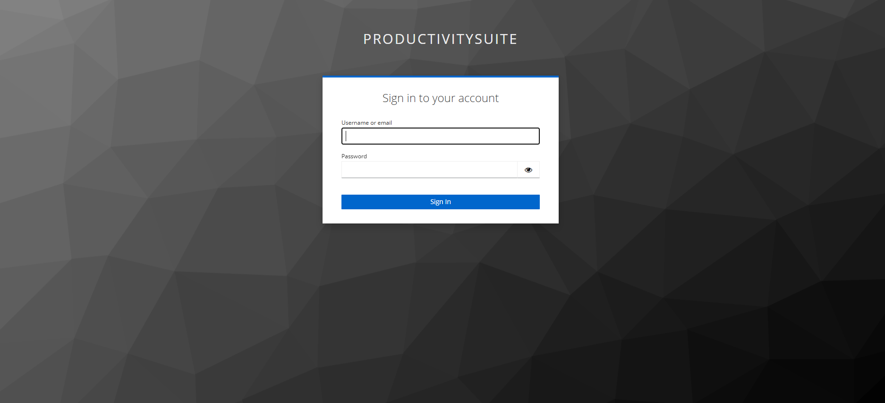
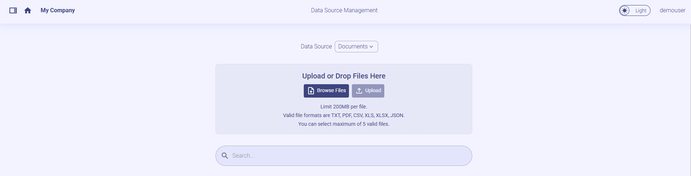
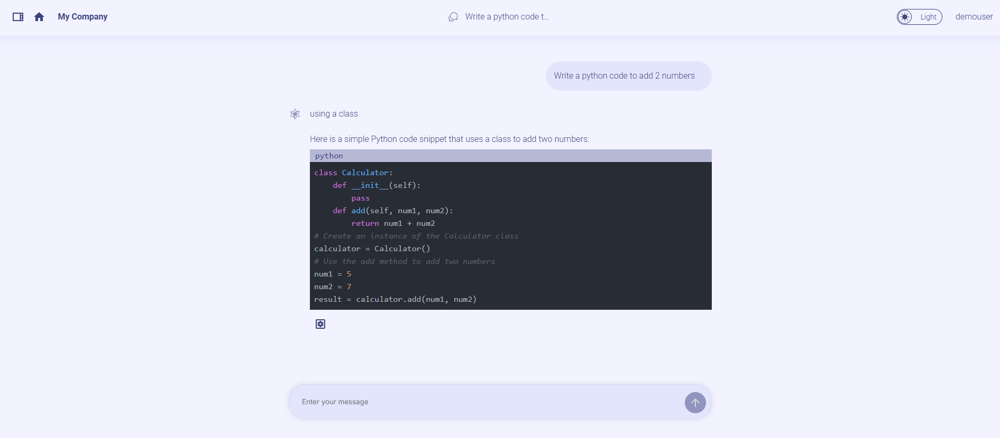

# Productivity Suite React UI

## 📸 Project Screenshots




## 🧐 Features

Here're some of the project's features:

### CHAT QNA

- Start a Text Chat：Initiate a text chat with the ability to input written conversations, where the dialogue content can also be customized based on uploaded files.
- Context Awareness: The AI assistant maintains the context of the conversation, understanding references to previous statements or questions. This allows for more natural and coherent exchanges.

#### DATA SOURCE

- The choice between uploading locally or copying a remote link. Chat according to uploaded knowledge base.
- Uploaded File would get listed and user would be able add or remove file/links

##### Screen Shot



- Clear: Clear the record of the current dialog box without retaining the contents of the dialog box.
- Chat history: Historical chat records can still be retained after refreshing, making it easier for users to view the context.
- Conversational Chat : The application maintains a history of the conversation, allowing users to review previous messages and the AI to refer back to earlier points in the dialogue when necessary.

##### Screen Shots


### CODEGEN

- Generate code: generate the corresponding code based on the current user's input.

  Screen Shot
  

### DOC SUMMARY

- Summarizing Uploaded Files: Upload files from their local device, then click up arrow button to summarize the content of the uploaded file.
- Summarizing Text via Pasting: Paste the text to be summarized into the text box, then click up arrow button to produce a condensed summary of the content, which will be displayed in the new page
- Scroll to Bottom: The summarized content will automatically scroll to the bottom.

#### Screen Shot


## 🛠️ Get it Running

1. Clone the repo.

2. cd command to the current folder.

3. create a .env file and add the following variables and values.
   ```
    VITE_BACKEND_SERVICE_ENDPOINT_CHATQNA=""
    VITE_DATAPREP_DELETE_FILE_ENDPOINT=""
    VITE_BACKEND_SERVICE_ENDPOINT_CODEGEN=""
    VITE_BACKEND_SERVICE_ENDPOINT_DOCSUM=""
    VITE_DATAPREP_SERVICE_ENDPOINT=""
    VITE_DATAPREP_GET_FILE_ENDPOINT=""
    VITE_CHAT_HISTORY_CREATE_ENDPOINT=""
    VITE_CHAT_HISTORY_DELETE_ENDPOINT=""
    VITE_CHAT_HISTORY_GET_ENDPOINT=""
    VITE_PROMPT_SERVICE_GET_ENDPOINT=""
    VITE_PROMPT_SERVICE_CREATE_ENDPOINT=""
    VITE_PROMPT_SERVICE_DELETE_ENDPOINT=""
    VITE_KEYCLOAK_SERVICE_ENDPOINT=""
    VITE_PROMPT_COLLECTION_NAME="prompt"
   ```
4. There is models_config.json file under public folder. It is in the below format. The types key in the below json array shows that the model is used for following types.

   ```
     [

         {
             "model_name": "Intel/neural-chat-7b-v3-3",
             "displayName": "Intel Neural Chat",
             "minToken": 100,
             "maxToken": 2000,
             "types": [
                 "chat",
                 "summary",
                 "code"
             ]
         }

     ]
   ```

5. Execute `npm install` to install the corresponding dependencies.

6. Execute `npm run dev`

7. open http://localhost:5174 in browser to the see the UI
