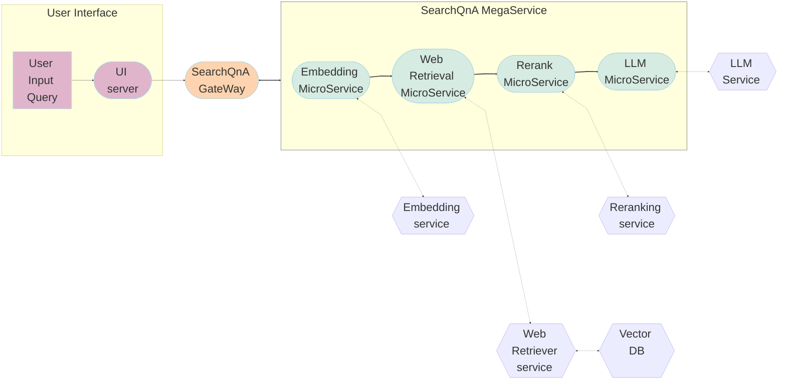

# SearchQnA Application

Search Question and Answering (SearchQnA) harnesses the synergy between search engines, like Google Search, and large language models (LLMs) to enhance QA quality. While LLMs excel at general knowledge, they face limitations in accessing real-time or specific details due to their reliance on prior training data. By integrating a search engine, SearchQnA bridges this gap.

Operating within the LangChain framework, the Google Search QnA chatbot mimics human behavior by iteratively searching, selecting, and synthesizing information. Here's how it works:

- Diverse Search Queries: The system employs an LLM to generate multiple search queries from a single prompt, ensuring a wide range of query terms essential for comprehensive results.

- Parallel Search Execution: Queries are executed simultaneously, accelerating data collection. This concurrent approach enables the bot to 'read' multiple pages concurrently, a unique advantage of AI.

- Top Link Prioritization: Algorithms identify top K links for each query, and the bot scrapes full page content in parallel. This prioritization ensures the extraction of the most relevant information.

- Efficient Data Indexing: Extracted data is meticulously indexed into a dedicated vector store (Chroma DB), optimizing retrieval and comparison in subsequent steps.

- Contextual Result Matching: The bot matches original search queries with relevant documents stored in the vector store, presenting users with accurate and contextually appropriate results.

By integrating search capabilities with LLMs within the LangChain framework, this Google Search QnA chatbot delivers comprehensive and precise answers, akin to human search behavior.

## Table of contents

1. [Architecture](#architecture)
2. [Deployment Options](#deployment-options)

## Architecture

The architecture of the SearchQnA Application is illustrated below:

The SearchQnA example is implemented using the component-level microservices defined in [GenAIComps](https://github.com/opea-project/GenAIComps). The flow chart below shows the information flow between different microservices for this example.

This SearchQnA use case performs Search-augmented Question Answering across multiple platforms. Currently, we provide the example for Intel® Gaudi® 2 and Intel® Xeon® Scalable Processors, and we invite contributions from other hardware vendors to expand OPEA ecosystem.

## Deployment Options

The table below lists the available deployment options and their implementation details for different hardware platforms.

| Category               | Deployment Option      | Description                                                    |
| ---------------------- | ---------------------- | -------------------------------------------------------------- |
| On-premise Deployments | Docker Compose (Xeon)  | [DocSum deployment on Xeon](./docker_compose/intel/cpu/xeon)   |
|                        | Docker Compose (Gaudi) | [DocSum deployment on Gaudi](./docker_compose/intel/hpu/gaudi) |
|                        | Docker Compose (ROCm)  | [DocSum deployment on AMD ROCm](./docker_compose/amd/gpu/rocm) |
