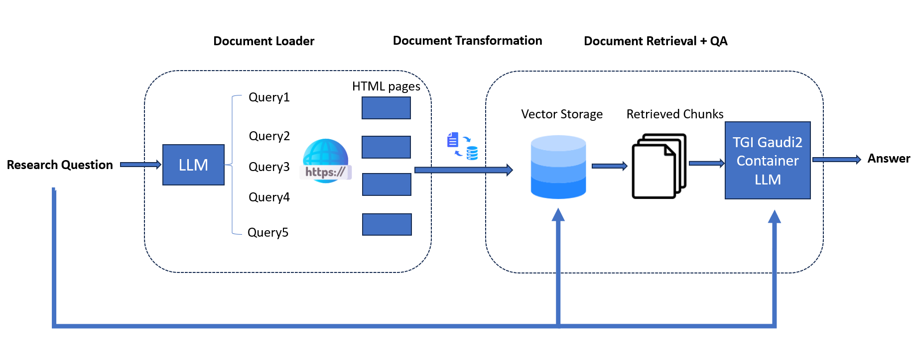

# Search Question and Answering

Search Question and Answering (SearchQnA) harnesses the synergy between search engines, like Google Search, and large language models (LLMs) to enhance QA quality. While LLMs excel at general knowledge, they face limitations in accessing real-time or specific details due to their reliance on prior training data. By integrating a search engine, SearchQnA bridges this gap.

Operating within the LangChain framework, the Google Search QnA chatbot mimics human behavior by iteratively searching, selecting, and synthesizing information. Here's how it works:

- Diverse Search Queries: The system employs an LLM to generate multiple search queries from a single prompt, ensuring a wide range of query terms essential for comprehensive results.

- Parallel Search Execution: Queries are executed simultaneously, accelerating data collection. This concurrent approach enables the bot to 'read' multiple pages concurrently, a unique advantage of AI.

- Top Link Prioritization: Algorithms identify top K links for each query, and the bot scrapes full page content in parallel. This prioritization ensures the extraction of the most relevant information.

- Efficient Data Indexing: Extracted data is meticulously indexed into a dedicated vector store (Chroma DB), optimizing retrieval and comparison in subsequent steps.

- Contextual Result Matching: The bot matches original search queries with relevant documents stored in the vector store, presenting users with accurate and contextually appropriate results.

By integrating search capabilities with LLMs within the LangChain framework, this Google Search QnA chatbot delivers comprehensive and precise answers, akin to human search behavior.

The workflow falls into the following architecture:



# Start Backend Service

1. Start the TGI service to deploy your LLM

```sh
cd serving/tgi_gaudi
bash build_docker.sh
bash launch_tgi_service.sh
```

`launch_tgi_service.sh` by default uses `8080` as the TGI service's port. Please replace it if there are any port conflicts.

2. Start the SearchQnA application using Google Search

```sh
cd langchain/docker
docker build . --build-arg http_proxy=${http_proxy} --build-arg https_proxy=${http_proxy}  -t intel/gen-ai-examples:searchqna-gaudi --no-cache
docker run -e TGI_ENDPOINT=<TGI ENDPOINT> -e GOOGLE_CSE_ID=<GOOGLE CSE ID> -e GOOGLE_API_KEY=<GOOGLE API KEY> -e HUGGINGFACEHUB_API_TOKEN=<HUGGINGFACE API TOKEN> -p 8085:8000 -e http_proxy=$http_proxy -e https_proxy=$https_proxy --runtime=habana -e HABANA_VISIBE_DEVILCES=all -e OMPI_MCA_btl_vader_single_copy_mechanism=none --cap-add=sys_nice --ipc=host intel/gen-ai-examples:searchqna-gaudi
```

Here is the explanation of some of the above parameters:

- `TGI_ENDPOINT`: the endpoint of your TGI service, usually equal to `<ip of your machine>:<port of your TGI service>`
- `GOOGLE_CSE_ID`: your CSE ID for Google Search Engine, usually generated [here](https://programmablesearchengine.google.com/controlpanel/all)
- `GOOGLE_API_KEY`: your API key for Google Search Engine, usually generated [here](https://console.cloud.google.com/apis/credentials)
- `HUGGINGFACEHUB_API_TOKEN`: your HuggingFace hub API token, usually generated [here](https://huggingface.co/settings/tokens)
- `-p 8085:8000`: This will map the 8000 port of the SearchQnA service inside the container to the 8085 port on the host

3. Quick test

```sh
curl http://localhost:8085/v1/rag/web_search_chat_stream -X POST -d '{"query":"Give me some latest news?"}' -H 'Content-Type: application/json'
```

# Start Frontend GUI

Navigate to the "ui" folder and execute the following commands to start the frontend GUI:

```bash
cd ui
sudo apt-get install npm && \
    npm install -g n && \
    n stable && \
    hash -r && \
    npm install -g npm@latest
```

For CentOS, please use the following commands instead:

```bash
curl -sL https://rpm.nodesource.com/setup_20.x | sudo bash -
sudo yum install -y nodejs
```

Update the `BACKEND_BASE_URL` environment variable in the `.env` file by replacing the IP address '127.0.0.1' with the actual IP address.

Run the following command to install the required dependencies:

```bash
npm install
```

Start the development server by executing the following command:

```bash
nohup npm run dev &
```

This will initiate the frontend service and launch the application.
