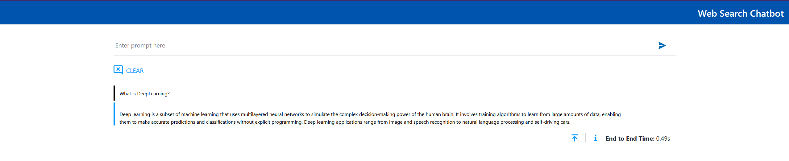

# Example SearchQnA deployments on AMD GPU (ROCm)

This document outlines the deployment process for a SearchQnA application utilizing the [GenAIComps](https://github.com/opea-project/GenAIComps.git) microservice pipeline on AMD GPU (ROCm).

This example includes the following sections:

- [SearchQnA Quick Start Deployment](#searchqna-quick-start-deployment): Demonstrates how to quickly deploy a SearchQnA application/pipeline on AMD GPU platform.
- [SearchQnA Docker Compose Files](#searchqna-docker-compose-files): Describes some example deployments and their docker compose files.
- [Launch the UI](#launch-the-ui): Guideline for UI usage

## SearchQnA Quick Start Deployment

This section describes how to quickly deploy and test the SearchQnA service manually on AMD GPU (ROCm). The basic steps are:

1. [Access the Code](#access-the-code)
2. [Generate a HuggingFace Access Token](#generate-a-huggingface-access-token)
3. [Configure the Deployment Environment](#configure-the-deployment-environment)
4. [Deploy the Services Using Docker Compose](#deploy-the-services-using-docker-compose)
5. [Check the Deployment Status](#check-the-deployment-status)
6. [Test the Pipeline](#test-the-pipeline)
7. [Cleanup the Deployment](#cleanup-the-deployment)

### Access the Code

Clone the GenAIExample repository and access the SearchQnA AMD GPU (ROCm) Docker Compose files and supporting scripts:

```bash
git clone https://github.com/opea-project/GenAIExamples.git
cd GenAIExamples/SearchQnA/docker_compose/amd/gpu/rocm
```

Checkout a released version, such as v1.2:

```bash
git checkout v1.2
```

### Generate a HuggingFace Access Token

Some HuggingFace resources require an access token. Developers can create one by first signing up on [HuggingFace](https://huggingface.co/) and then generating a [user access token](https://huggingface.co/docs/transformers.js/en/guides/private#step-1-generating-a-user-access-token).

### Configure the Deployment Environment

To set up environment variables for deploying SearchQnA services, source the _setup_env.sh_ script in this directory:

```
//with TGI:
source ./set_env.sh
```

```
//with VLLM:
source ./set_env_vllm.sh
```

The _setup_env.sh_ script will prompt for required and optional environment variables used to configure the SearchQnA services based on TGI. The _setup_env_vllm.sh_ script will prompt for required and optional environment variables used to configure the SearchQnA services based on VLLM. If a value is not entered, the script will use a default value for the same. It will also generate a _.env_ file defining the desired configuration. Consult the section on [SearchQnA Service configuration](#SearchQnA-service-configuration) for information on how service specific configuration parameters affect deployments.

### Deploy the Services Using Docker Compose

To deploy the SearchQnA services, execute the `docker compose up` command with the appropriate arguments. For a default deployment, execute:

```bash
//with TGI:
docker compose -f compose.yaml up -d
```

```bash
//with VLLM:
docker compose -f compose_vllm.yaml up -d
```

**Note**: developers should build docker image from source when:

- Developing off the git main branch (as the container's ports in the repo may be different from the published docker image).
- Unable to download the docker image.
- Use a specific version of Docker image.

Please refer to the table below to build different microservices from source:

| Microservice  | Deployment Guide                                                                                                                    |
| ------------- | ----------------------------------------------------------------------------------------------------------------------------------- |
| Reranking     | [whisper build guide](https://github.com/opea-project/GenAIComps/tree/main/comps/rerankings/src)                                    |
| vLLM          | [vLLM build guide](https://github.com/opea-project/GenAIComps/tree/main/comps/third_parties/vllm#build-docker)                      |
| LLM-TextGen   | [LLM-TextGen build guide](https://github.com/opea-project/GenAIComps/tree/main/comps/llms/src/text-generation#1-build-docker-image) |
| Web-Retriever | [Web-Retriever build guide](https://github.com/opea-project/GenAIComps/tree/main/comps/web_retrievers/src)                          |
| Embedding     | [Embedding build guide](https://github.com/opea-project/GenAIComps/tree/main/comps/embeddings/src)                                  |
| MegaService   | [MegaService build guide](../../../../README_miscellaneous.md#build-megaservice-docker-image)                                       |
| UI            | [Basic UI build guide](../../../../README_miscellaneous.md#build-ui-docker-image)                                                   |

### Check the Deployment Status

After running Docker Compose, the list of images can be checked using the following command:

```
docker ps -a
```

For the default deployment, the following containers should have started

### Test the Pipeline

Once the SearchQnA services are running, test the pipeline using the following command:

```bash
    DATA='{"messages": "What is the latest news from the AI world? '\
    'Give me a summary.","stream": "True"}'

    curl http://${host_ip}:3008/v1/searchqna \
    -H "Content-Type: application/json" \
    -d "$DATA"
```

**Note** The value of _host_ip_ was set using the _set_env.sh_ script and can be found in the _.env_ file.

Checking the response from the service. The response should be similar to JSON:

```textmate
data: {"id":"cmpl-f095893d094a4e9989423c2364f00bc1","choices":[{"finish_reason":null,"index":0,"logprobs":null,"text":",","stop_reason":null}],"created":1742960360,"model":"Intel/neural-chat-7b-v3-3","object":"text_completion","system_fingerprint":null,"usage":null}
data: {"id":"cmpl-f095893d094a4e9989423c2364f00bc1","choices":[{"finish_reason":null,"index":0,"logprobs":null,"text":" with","stop_reason":null}],"created":1742960360,"model":"Intel/neural-chat-7b-v3-3","object":"text_completion","system_fingerprint":null,"usage":null}
data: {"id":"cmpl-f095893d094a4e9989423c2364f00bc1","choices":[{"finish_reason":null,"index":0,"logprobs":null,"text":" calls","stop_reason":null}],"created":1742960360,"model":"Intel/neural-chat-7b-v3-3","object":"text_completion","system_fingerprint":null,"usage":null}
data: {"id":"cmpl-f095893d094a4e9989423c2364f00bc1","choices":[{"finish_reason":null,"index":0,"logprobs":null,"text":" for","stop_reason":null}],"created":1742960360,"model":"Intel/neural-chat-7b-v3-3","object":"text_completion","system_fingerprint":null,"usage":null}
data: {"id":"cmpl-f095893d094a4e9989423c2364f00bc1","choices":[{"finish_reason":null,"index":0,"logprobs":null,"text":" more","stop_reason":null}],"created":1742960360,"model":"Intel/neural-chat-7b-v3-3","object":"text_completion","system_fingerprint":null,"usage":null}
data: {"id":"cmpl-f095893d094a4e9989423c2364f00bc1","choices":[{"finish_reason":null,"index":0,"logprobs":null,"text":" regulation","stop_reason":null}],"created":1742960360,"model":"Intel/neural-chat-7b-v3-3","object":"text_completion","system_fingerprint":null,"usage":null}
data: {"id":"cmpl-f095893d094a4e9989423c2364f00bc1","choices":[{"finish_reason":null,"index":0,"logprobs":null,"text":" and","stop_reason":null}],"created":1742960360,"model":"Intel/neural-chat-7b-v3-3","object":"text_completion","system_fingerprint":null,"usage":null}
data: {"id":"cmpl-f095893d094a4e9989423c2364f00bc1","choices":[{"finish_reason":null,"index":0,"logprobs":null,"text":" trans","stop_reason":null}],"created":1742960360,"model":"Intel/neural-chat-7b-v3-3","object":"text_completion","system_fingerprint":null,"usage":null}
data: {"id":"cmpl-f095893d094a4e9989423c2364f00bc1","choices":[{"finish_reason":null,"index":0,"logprobs":null,"text":"parency","stop_reason":null}],"created":1742960360,"model":"Intel/neural-chat-7b-v3-3","object":"text_completion","system_fingerprint":null,"usage":null}
data: {"id":"cmpl-f095893d094a4e9989423c2364f00bc1","choices":[{"finish_reason":null,"index":0,"logprobs":null,"text":".","stop_reason":null}],"created":1742960360,"model":"Intel/neural-chat-7b-v3-3","object":"text_completion","system_fingerprint":null,"usage":null}
data: {"id":"cmpl-f095893d094a4e9989423c2364f00bc1","choices":[{"finish_reason":"stop","index":0,"logprobs":null,"text":"","stop_reason":null}],"created":1742960360,"model":"Intel/neural-chat-7b-v3-3","object":"text_completion","system_fingerprint":null,"usage":null}
data: [DONE]
```

A response text similar to the one above indicates that the service verification was successful.

### Cleanup the Deployment

To stop the containers associated with the deployment, execute the following command:

```bash
//with TGI:
docker compose -f compose.yaml down
```

```bash
//with VLLM:
docker compose -f compose_vllm.yaml down
```

All the SearchQnA containers will be stopped and then removed on completion of the "down" command.

## SearchQnA Docker Compose Files

When deploying the SearchQnA pipeline on AMD GPUs (ROCm), different large language model serving frameworks can be selected. The table below outlines the available configurations included in the application.

| File                                     | Description                                                                                |
| ---------------------------------------- | ------------------------------------------------------------------------------------------ |
| [compose.yaml](./compose.yaml)           | Default compose file using tgi as serving framework                                        |
| [compose_vllm.yaml](./compose_vllm.yaml) | The LLM serving framework is vLLM. All other configurations remain the same as the default |

## Launch the UI

Access the UI at http://${EXTERNAL_HOST_IP}:${SEARCH_FRONTEND_SERVICE_PORT}. A page should open when navigating to this address.


The appearance of such a page indicates that the service is operational and responsive, allowing functional UI testing to proceed.

Let's enter the task for the service in the "Enter prompt here" field. For example, "What is DeepLearning?" and press Enter. After that, a page with the result of the task should open:


A correct result displayed on the page indicates that the UI service has been successfully verified.
