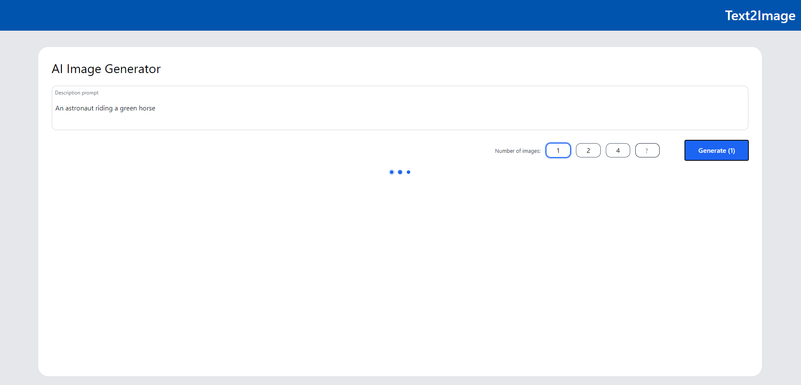
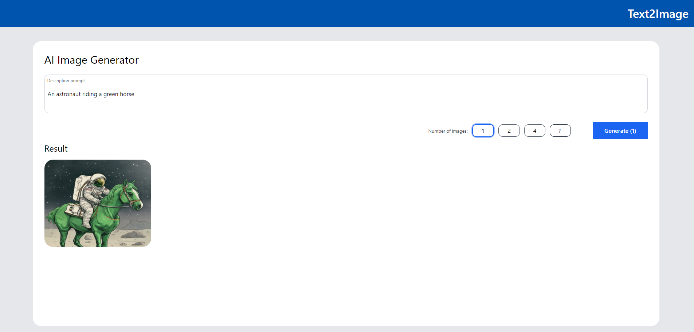

# Text2Image Customized UI

## 📸 Project Screenshots




## 🧐 Features

Here're some of the project's features:

- Generate Images from Text: Enter the image description and the desired number of images, then wait for them to be generated.

## 🛠️ Get it Running

1. Clone the repo.

2. cd command to the current folder.

3. Modify the required .env variables.

   ```
   BACKEND_BASE_URL = ''

   ```

4. Execute `npm install` to install the corresponding dependencies.

5. Execute `npm run dev` in both environments
