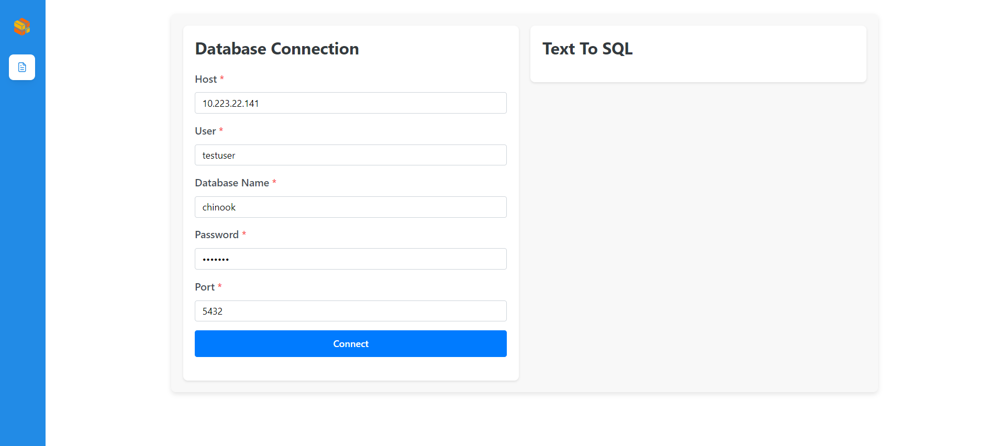

# DBQnA React Application

## 📸 Project Screenshots

Initial Page


Enter DB credentials and connect to DB


DB connection failed


DB connection successful


Enter user question


SQL query generation failed


SQL query generation successful


## 🧐 Features

Here're some of the project's features:

- Database Connection Validation: The app allows users to input database credentials (host, user, database, password, and port). Upon clicking the "Connect" button, it verifies the connection status through an API, providing feedback if the database connection is successful or not.

- Natural Language to SQL Query: Once the database connection is established, the user can input an English-language question, which is then sent to an API for conversion into an SQL query. The generated SQL is displayed in the UI for user review.

- Scroll to Bottom: The output generated will automatically scroll to the bottom.

## 🛠️ Get it Running

1. Clone the repo.

2. cd command to the current folder.

3. Modify the required .env variables.
   ```
   VITE_TEXT_TO_SQL_URL = ''
   ```
4. Execute `npm install` to install the corresponding dependencies.

5. Execute `npm run dev` in both environments
