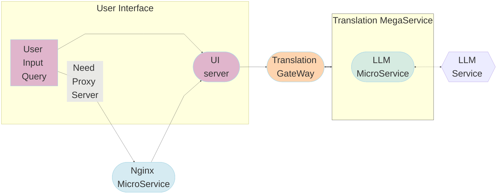

# Translation Application

Language Translation is the communication of the meaning of a source-language text by means of an equivalent target-language text.

Translation architecture shows below:

The Translation example is implemented using the component-level microservices defined in [GenAIComps](https://github.com/opea-project/GenAIComps). The flow chart below shows the information flow between different microservices for this example.

This Translation use case performs Language Translation Inference across multiple platforms. Currently, we provide the example for [Intel Gaudi2](https://www.intel.com/content/www/us/en/products/details/processors/ai-accelerators/gaudi-overview.html) and [Intel Xeon Scalable Processors](https://www.intel.com/content/www/us/en/products/details/processors/xeon.html), and we invite contributions from other hardware vendors to expand OPEA ecosystem.

## Deploy Translation Service

The Translation service can be effortlessly deployed on either Intel Gaudi2 or Intel Xeon Scalable Processors.

### Deploy Translation on Gaudi

Refer to the [Gaudi Guide](./docker_compose/intel/hpu/gaudi/README.md) for instructions on deploying Translation on Gaudi.

### Deploy Translation on Xeon

Refer to the [Xeon Guide](./docker_compose/intel/cpu/xeon/README.md) for instructions on deploying Translation on Xeon.
