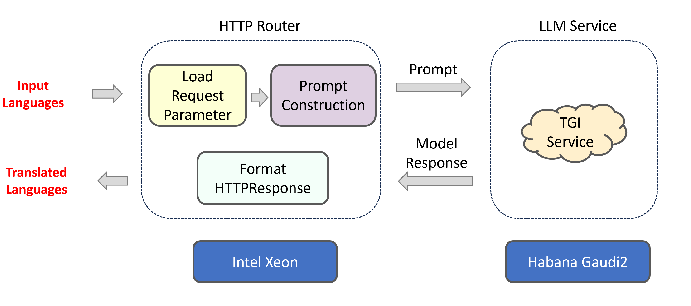

# Language Translation

Language Translation is the communication of the meaning of a source-language text by means of an equivalent target-language text.

The workflow falls into the following architecture:



# Start Backend Service

1. Start the TGI Service to deploy your LLM

```sh
cd serving/tgi_gaudi
bash build_docker.sh
bash launch_tgi_service.sh
```

`launch_tgi_service.sh` the script uses `8080` as the TGI service's port by default. Please replace it if any port conflicts detected.

2. Start the Language Translation Service

```sh
cd langchain/docker
bash build_docker.sh
docker run -it --name translation_server --net=host --ipc=host -e TGI_ENDPOINT=${TGI_ENDPOINT} -e HUGGINGFACEHUB_API_TOKEN=${HUGGINGFACEHUB_API_TOKEN} -e SERVER_PORT=8000 -e http_proxy=${http_proxy} -e https_proxy=${https_proxy} translation:latest bash
```

**Note**: Set the following parameters before running the above command

- `TGI_ENDPOINT`: The endpoint of your TGI service, usually equal to `<ip of your machine>:<port of your TGI service>`.
- `HUGGINGFACEHUB_API_TOKEN`: Your HuggingFace hub API token, usually generated [here](https://huggingface.co/settings/tokens).
- `SERVER_PORT`: The port of the Translation service on the host.

3. Quick Test

```sh
curl http://localhost:8000/v1/translation \
    -X POST \
    -d '{"language_from": "Chinese","language_to": "English","source_language": "我爱机器翻译。"}' \
    -H 'Content-Type: application/json'
```

The shortcodes of languages are also supported:

```sh
curl http://localhost:8000/v1/translation \
    -X POST \
    -d '{"language_from": "de","language_to": "en","source_language": "Maschinelles Lernen"}' \
    -H 'Content-Type: application/json'
```
