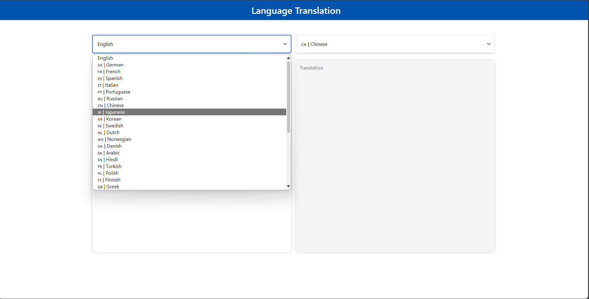

# Build MegaService of Translation on Gaudi

This document outlines the deployment process for a Translation application utilizing the [GenAIComps](https://github.com/opea-project/GenAIComps.git) microservice pipeline on Intel Gaudi server. The steps include Docker image creation, container deployment via Docker Compose, and service execution to integrate microservices such as We will publish the Docker images to Docker Hub, it will simplify the deployment process for this service.

## 🚀 Build Docker Images

First of all, you need to build Docker Images locally. This step can be ignored after the Docker images published to Docker hub.

```bash
git clone https://github.com/opea-project/GenAIComps.git
cd GenAIComps
```

### 1. Build LLM Image

```bash
docker build -t opea/llm-tgi:latest --build-arg https_proxy=$https_proxy --build-arg http_proxy=$http_proxy -f comps/llms/text-generation/tgi/Dockerfile .
```

### 2. Build MegaService Docker Image

To construct the Mega Service, we utilize the [GenAIComps](https://github.com/opea-project/GenAIComps.git) microservice pipeline within the `translation.py` Python script. Build the MegaService Docker image using the command below:

```bash
git clone https://github.com/opea-project/GenAIExamples
cd GenAIExamples/Translation/docker
docker build -t opea/translation:latest --build-arg https_proxy=$https_proxy --build-arg http_proxy=$http_proxy -f Dockerfile .
```

### 3. Build UI Docker Image

Construct the frontend Docker image using the command below:

```bash
cd GenAIExamples/Translation/docker/ui/
docker build -t opea/translation-ui:latest --build-arg https_proxy=$https_proxy --build-arg http_proxy=$http_proxy -f ./docker/Dockerfile .
```

Then run the command `docker images`, you will have the following four Docker Images:

1. `opea/llm-tgi:latest`
2. `opea/translation:latest`
3. `opea/translation-ui:latest`

## 🚀 Start Microservices

### Setup Environment Variables

Since the `compose.yaml` will consume some environment variables, you need to setup them in advance as below.

```bash
export http_proxy=${your_http_proxy}
export https_proxy=${your_http_proxy}
export LLM_MODEL_ID="haoranxu/ALMA-13B"
export TGI_LLM_ENDPOINT="http://${host_ip}:8008"
export HUGGINGFACEHUB_API_TOKEN=${your_hf_api_token}
export MEGA_SERVICE_HOST_IP=${host_ip}
export LLM_SERVICE_HOST_IP=${host_ip}
export BACKEND_SERVICE_ENDPOINT="http://${host_ip}:8888/v1/translation"
```

Note: Please replace with `host_ip` with you external IP address, do not use localhost.

### Start Microservice Docker Containers

```bash
docker compose up -d
```

### Validate Microservices

1. TGI Service

```bash
curl http://${host_ip}:8008/generate \
  -X POST \
  -d '{"inputs":"What is Deep Learning?","parameters":{"max_new_tokens":64, "do_sample": true}}' \
  -H 'Content-Type: application/json'
```

2. LLM Microservice

```bash
curl http://${host_ip}:9000/v1/chat/completions \
  -X POST \
  -d '{"query":"Translate this from Chinese to English:\nChinese: 我爱机器翻译。\nEnglish:"}' \
  -H 'Content-Type: application/json'
```

3. MegaService

```bash
curl http://${host_ip}:8888/v1/translation -H "Content-Type: application/json" -d '{
     "language_from": "Chinese","language_to": "English","source_language": "我爱机器翻译。"}'
```

Following the validation of all aforementioned microservices, we are now prepared to construct a mega-service.

## 🚀 Launch the UI

Open this URL `http://{host_ip}:5173` in your browser to access the frontend.


