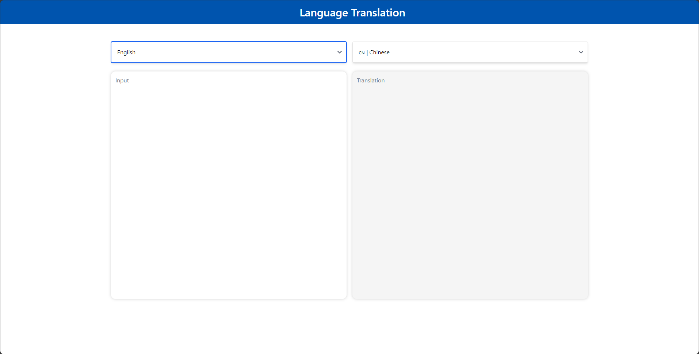
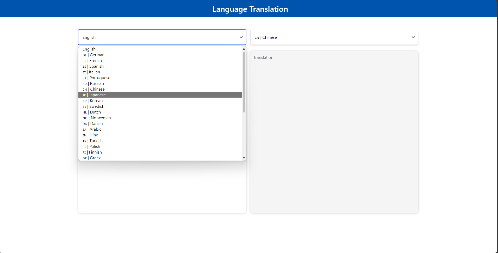

# Build Mega Service of Translation on Xeon

This document outlines the deployment process for a Translation application utilizing the [GenAIComps](https://github.com/opea-project/GenAIComps.git) microservice pipeline on Intel Xeon server. The steps include Docker image creation, container deployment via Docker Compose, and service execution to integrate microservices such as `llm`. We will publish the Docker images to Docker Hub soon, it will simplify the deployment process for this service.

## 🚀 Apply Xeon Server on AWS

To apply a Xeon server on AWS, start by creating an AWS account if you don't have one already. Then, head to the [EC2 Console](https://console.aws.amazon.com/ec2/v2/home) to begin the process. Within the EC2 service, select the Amazon EC2 M7i or M7i-flex instance type to leverage the power of 4th Generation Intel Xeon Scalable processors. These instances are optimized for high-performance computing and demanding workloads.

For detailed information about these instance types, you can refer to this [link](https://aws.amazon.com/ec2/instance-types/m7i/). Once you've chosen the appropriate instance type, proceed with configuring your instance settings, including network configurations, security groups, and storage options.

After launching your instance, you can connect to it using SSH (for Linux instances) or Remote Desktop Protocol (RDP) (for Windows instances). From there, you'll have full access to your Xeon server, allowing you to install, configure, and manage your applications as needed.

## 🚀 Build Docker Images

First of all, you need to build Docker Images locally and install the python package of it.

```bash
git clone https://github.com/opea-project/GenAIComps.git
cd GenAIComps
```

### 1. Build LLM Image

```bash
docker build -t opea/llm-tgi:latest --build-arg https_proxy=$https_proxy --build-arg http_proxy=$http_proxy -f comps/llms/text-generation/tgi/Dockerfile .
```

### 2. Build MegaService Docker Image

To construct the Mega Service, we utilize the [GenAIComps](https://github.com/opea-project/GenAIComps.git) microservice pipeline within the `translation.py` Python script. Build MegaService Docker image via below command:

```bash
git clone https://github.com/opea-project/GenAIExamples
cd GenAIExamples/Translation/docker
docker build -t opea/translation:latest --build-arg https_proxy=$https_proxy --build-arg http_proxy=$http_proxy -f Dockerfile .
```

### 3. Build UI Docker Image

Build frontend Docker image via below command:

```bash
cd GenAIExamples/Translation/docker/ui
docker build -t opea/translation-ui:latest --build-arg https_proxy=$https_proxy --build-arg http_proxy=$http_proxy -f ./docker/Dockerfile .
```

Then run the command `docker images`, you will have the following Docker Images:

1. `opea/gen-ai-comps:llm-tgi-server`
2. `opea/gen-ai-comps:translation-megaservice-server`
3. `opea/gen-ai-comps:translation-ui-server`

## 🚀 Start Microservices

### Setup Environment Variables

Since the `docker_compose.yaml` will consume some environment variables, you need to setup them in advance as below.

```bash
export http_proxy=${your_http_proxy}
export https_proxy=${your_http_proxy}
export LLM_MODEL_ID="haoranxu/ALMA-13B"
export TGI_LLM_ENDPOINT="http://${host_ip}:8008"
export HUGGINGFACEHUB_API_TOKEN=${your_hf_api_token}
export MEGA_SERVICE_HOST_IP=${host_ip}
export LLM_SERVICE_HOST_IP=${host_ip}
export BACKEND_SERVICE_ENDPOINT="http://${host_ip}:8888/v1/translation"
```

Note: Please replace with `host_ip` with you external IP address, do not use localhost.

### Start Microservice Docker Containers

```bash
docker compose -f docker_compose.yaml up -d
```

### Validate Microservices

1. TGI Service

```bash
curl http://${host_ip}:8008/generate \
  -X POST \
  -d '{"inputs":"What is Deep Learning?","parameters":{"max_new_tokens":17, "do_sample": true}}' \
  -H 'Content-Type: application/json'
```

2. LLM Microservice

```bash
curl http://${host_ip}:9000/v1/chat/completions \
  -X POST \
  -d '{"query":"Translate this from Chinese to English:\nChinese: 我爱机器翻译。\nEnglish:"}' \
  -H 'Content-Type: application/json'
```

3. MegaService

```bash
curl http://${host_ip}:8888/v1/translation -H "Content-Type: application/json" -d '{
     "language_from": "Chinese","language_to": "English","source_language": "我爱机器翻译。"}'
```

Following the validation of all aforementioned microservices, we are now prepared to construct a mega-service.

## 🚀 Launch the UI

Open this URL `http://{host_ip}:5173` in your browser to access the frontend.


