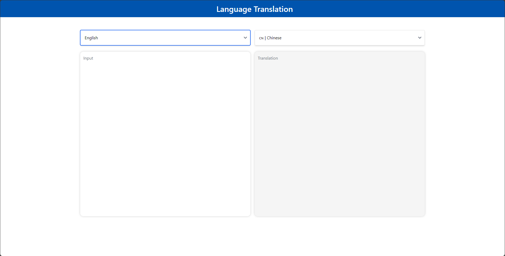

# Build MegaService of Translation on Gaudi

This document outlines the deployment process for a Translation application utilizing the [GenAIComps](https://github.com/opea-project/GenAIComps.git) microservice pipeline on Intel Gaudi server. The steps include Docker image creation, container deployment via Docker Compose, and service execution to integrate microservices such as We will publish the Docker images to Docker Hub, it will simplify the deployment process for this service.

## 🚀 Prepare Docker Images

For Docker Images, you have two options to prepare them.

1. Pull the docker images from docker hub.

   - More stable to use.
   - Will be automatically downloaded when using docker compose command.

2. Build the docker images from source.

   - Contain the latest new features.

   - Need to be manually build.

If you choose to pull docker images form docker hub, skip to [Start Microservices](#start-microservices) part directly.

Follow the instructions below to build the docker images from source.

### 1. Build LLM Image

```bash
git clone https://github.com/opea-project/GenAIComps.git
cd GenAIComps
docker build -t opea/llm-tgi:latest --build-arg https_proxy=$https_proxy --build-arg http_proxy=$http_proxy -f comps/llms/text-generation/tgi/Dockerfile .
```

### 2. Build MegaService Docker Image

To construct the Mega Service, we utilize the [GenAIComps](https://github.com/opea-project/GenAIComps.git) microservice pipeline within the `translation.py` Python script. Build the MegaService Docker image using the command below:

```bash
git clone https://github.com/opea-project/GenAIExamples
cd GenAIExamples/Translation/docker
docker build -t opea/translation:latest --build-arg https_proxy=$https_proxy --build-arg http_proxy=$http_proxy -f Dockerfile .
```

### 3. Build UI Docker Image

Construct the frontend Docker image using the command below:

```bash
cd GenAIExamples/Translation/ui/
docker build -t opea/translation-ui:latest --build-arg https_proxy=$https_proxy --build-arg http_proxy=$http_proxy -f ./docker/Dockerfile .
```

### 4. Build Nginx Docker Image

```bash
cd GenAIComps
docker build -t opea/nginx:latest --build-arg https_proxy=$https_proxy --build-arg http_proxy=$http_proxy -f comps/nginx/Dockerfile .
```

Then run the command `docker images`, you will have the following four Docker Images:

1. `opea/llm-tgi:latest`
2. `opea/translation:latest`
3. `opea/translation-ui:latest`
4. `opea/nginx:latest`

## 🚀 Start Microservices

### Required Models

By default, the LLM model is set to a default value as listed below:

| Service | Model             |
| ------- | ----------------- |
| LLM     | haoranxu/ALMA-13B |

Change the `LLM_MODEL_ID` below for your needs.

### Setup Environment Variables

1. Set the required environment variables:

   ```bash
   # Example: host_ip="192.168.1.1"
   export host_ip="External_Public_IP"
   # Example: no_proxy="localhost, 127.0.0.1, 192.168.1.1"
   export no_proxy="Your_No_Proxy"
   export HUGGINGFACEHUB_API_TOKEN="Your_Huggingface_API_Token"
   # Example: NGINX_PORT=80
   export NGINX_PORT=${your_nginx_port}
   ```

2. If you are in a proxy environment, also set the proxy-related environment variables:

   ```bash
   export http_proxy="Your_HTTP_Proxy"
   export https_proxy="Your_HTTPs_Proxy"
   ```

3. Set up other environment variables:

   ```bash
   cd ../../../
   source set_env.sh
   ```

### Start Microservice Docker Containers

```bash
docker compose up -d
```

> Note: The docker images will be automatically downloaded from `docker hub`:

```bash
docker pull opea/llm-tgi:latest
docker pull opea/translation:latest
docker pull opea/translation-ui:latest
docker pull opea/nginx:latest
```

### Validate Microservices

1. TGI Service

   ```bash
   curl http://${host_ip}:8008/generate \
     -X POST \
     -d '{"inputs":"What is Deep Learning?","parameters":{"max_new_tokens":64, "do_sample": true}}' \
     -H 'Content-Type: application/json'
   ```

2. LLM Microservice

   ```bash
   curl http://${host_ip}:9000/v1/chat/completions \
     -X POST \
     -d '{"query":"Translate this from Chinese to English:\nChinese: 我爱机器翻译。\nEnglish:"}' \
     -H 'Content-Type: application/json'
   ```

3. MegaService

   ```bash
   curl http://${host_ip}:8888/v1/translation -H "Content-Type: application/json" -d '{
        "language_from": "Chinese","language_to": "English","source_language": "我爱机器翻译。"}'
   ```

4. Nginx Service

   ```bash
   curl http://${host_ip}:${NGINX_PORT}/v1/translation \
       -H "Content-Type: application/json" \
       -d '{"language_from": "Chinese","language_to": "English","source_language": "我爱机器翻译。"}'
   ```

Following the validation of all aforementioned microservices, we are now prepared to construct a mega-service.

## 🚀 Launch the UI

Open this URL `http://{host_ip}:5173` in your browser to access the frontend.


