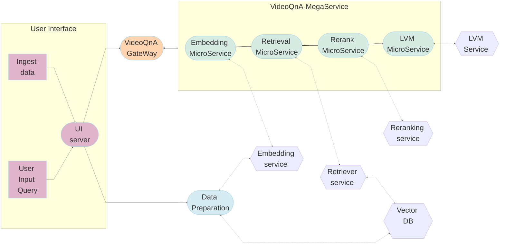

# VideoQnA Application

VideoQnA is a framework that retrieves video based on provided user prompt. It uses only the video embeddings to perform vector similarity search in Intel's VDMS vector database and performs all operations on Intel Xeon CPU. The pipeline supports long form videos and time-based search.

VideoQnA is implemented on top of [GenAIComps](https://github.com/opea-project/GenAIComps), with the architecture flow chart shows below:

- This project implements a Retrieval-Augmented Generation (RAG) workflow using LangChain, Intel VDMS VectorDB, and Text Generation Inference, optimized for Intel Xeon Scalable Processors.
- Video Processing: Videos are converted into feature vectors using mean aggregation and stored in the VDMS vector store.
- Query Handling: When a user submits a query, the system performs a similarity search in the vector store to retrieve the best-matching videos.
- Contextual Inference: The retrieved videos are then sent to the Large Vision Model (LVM) for inference, providing supplemental context for the query.

## Deploy VideoQnA Service

The VideoQnA service can be effortlessly deployed on Intel Xeon Scalable Processors.

### Required Models

By default, the embedding and LVM models are set to a default value as listed below:

| Service   | Model                        |
| --------- | ---------------------------- |
| Embedding | openai/clip-vit-base-patch32 |
| LVM       | DAMO-NLP-SG/Video-LLaMA      |

### Deploy VideoQnA on Xeon

For full instruction of deployment, please check [Guide](docker_compose/intel/cpu/xeon/README.md)

Currently we support deploying VideoQnA services with docker compose, using the docker images `built from source`. Find the corresponding [compose.yaml](docker_compose/intel/cpu/xeon/compose.yaml).
