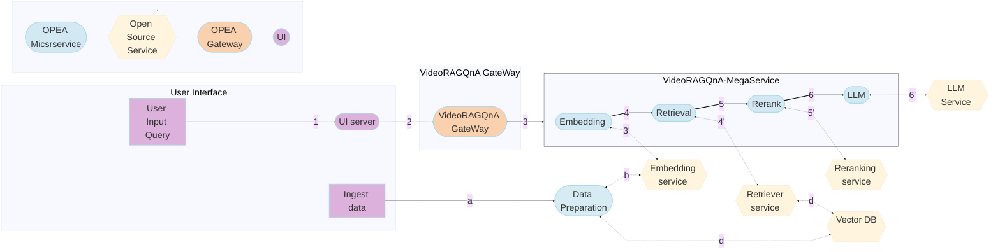

# VideoRAGQnA Application

Video RAG QnA is a framework that retrieves video based on provided user prompt. It uses only the video embeddings to perform vector similarity search in Intel's VDMS vector database and performs all operations on Intel Xeon CPU. The pipeline supports long form videos and time-based search.

VideoRAGQnA is implemented on top of [GenAIComps](https://github.com/opea-project/GenAIComps), with the architecture flow chart shows below:

This VideoRAGQnA use case performs RAG using LangChain, Intel VDMS VectorDB and Text Generation Inference on Intel XEON Scalable Processors.

## Deploy VideoRAGQnA Service

The VideoRAGQnA service can be effortlessly deployed on Intel XEON Scalable Processors.

### Required Models

By default, the embedding and LVM models are set to a default value as listed below:

| Service   | Model                        |
| --------- | ---------------------------- |
| Embedding | openai/clip-vit-base-patch32 |
| LVM       | DAMO-NLP-SG/Video-LLaMA      |

### Deploy VideoRAGQnA on Xeon

For full instruction of deployment, please check [Guide](docker/xeon/README.md)

Currently we support deploying VideoRAGQnA services with docker compose, using the docker images `built from source`. Find the corresponding [compose.yaml](./docker/xeon/compose.yaml).
