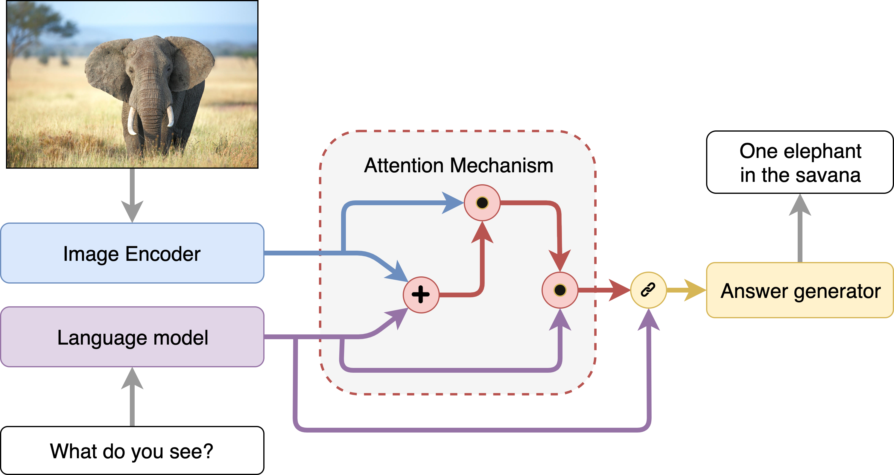
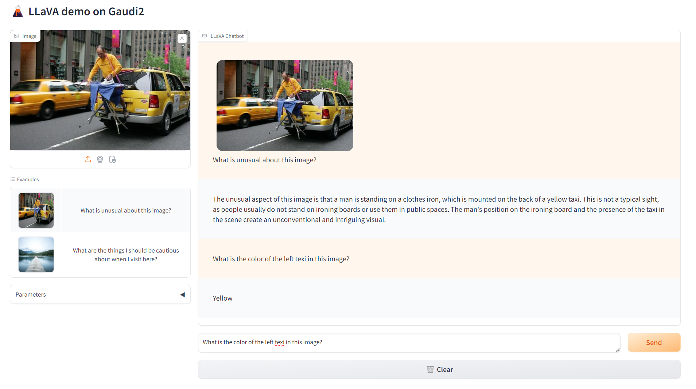
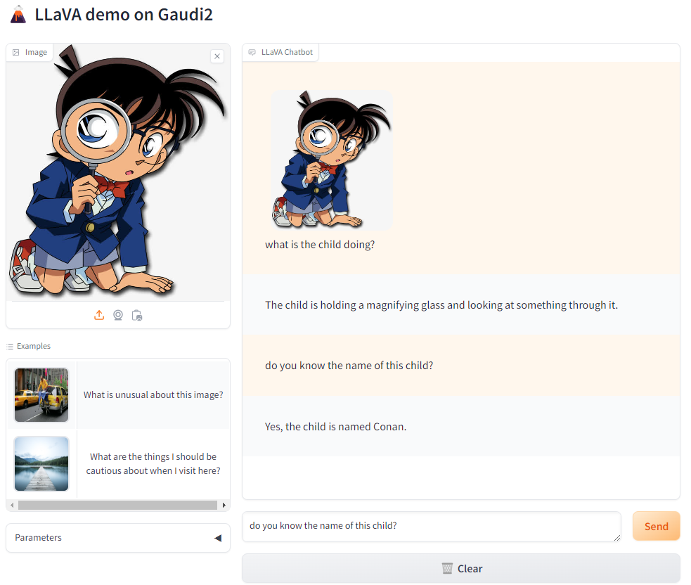

# Visual Question and Answering

Visual Question Answering (VQA) is the task of answering open-ended questions based on an image. The input to models supporting this task is typically a combination of an image and a question, and the output is an answer expressed in natural language.

Some noteworthy use case examples for VQA include:

- Accessibility applications for visually impaired individuals.
- Education: posing questions about visual materials presented in lectures or textbooks. VQA can also be utilized in interactive museum exhibits or historical sites.
- Customer service and e-commerce: VQA can enhance user experience by letting users ask questions about products.
- Image retrieval: VQA models can be used to retrieve images with specific characteristics. For example, the user can ask “Is there a dog?” to find all images with dogs from a set of images.

General architecture of VQA shows below:



This example guides you through how to deploy a [LLaVA-NeXT](https://github.com/LLaVA-VL/LLaVA-NeXT) (Open Large Multimodal Models) model on Intel Gaudi2 to do visual question and answering task. The Intel Gaudi2 accelerator supports both training and inference for deep learning models in particular for LLMs. Please visit [Habana AI products](https://habana.ai/products/) for more details.




## Required Models

By default, the model is set to `llava-hf/llava-v1.6-mistral-7b-hf`. To use a different model, update the `LVM_MODEL_ID` variable in the [`set_env.sh`](./docker/gaudi/set_env.sh) file.

```
export LVM_MODEL_ID="llava-hf/llava-v1.6-mistral-7b-hf"
```

You can choose other llava-next models, such as `llava-hf/llava-v1.6-vicuna-13b-hf`, as needed.

## Deploy VisualQnA Service

The VisualQnA service can be effortlessly deployed on either Intel Gaudi2 or Intel XEON Scalable Processors.

Currently we support deploying VisualQnA services with docker compose.

### Setup Environment Variable

To set up environment variables for deploying VisualQnA services, follow these steps:

1. Set the required environment variables:

   ```bash
   # Example: host_ip="192.168.1.1"
   export host_ip="External_Public_IP"
   # Example: no_proxy="localhost, 127.0.0.1, 192.168.1.1"
   export no_proxy="Your_No_Proxy"
   ```

2. If you are in a proxy environment, also set the proxy-related environment variables:

   ```bash
   export http_proxy="Your_HTTP_Proxy"
   export https_proxy="Your_HTTPs_Proxy"
   ```

3. Set up other environment variables:

   > Notice that you can only choose **one** command below to set up envs according to your hardware. Other that the port numbers may be set incorrectly.

   ```bash
   # on Gaudi
   source ./docker/gaudi/set_env.sh
   # on Xeon
   source ./docker/xeon/set_env.sh
   ```

### Deploy VisualQnA on Gaudi

Refer to the [Gaudi Guide](./docker/gaudi/README.md) to build docker images from source.

Find the corresponding [compose.yaml](./docker/gaudi/compose.yaml).

```bash
cd GenAIExamples/VisualQnA/docker/gaudi/
docker compose up -d
```

> Notice: Currently only the **Habana Driver 1.16.x** is supported for Gaudi.

### Deploy VisualQnA on Xeon

Refer to the [Xeon Guide](./docker/xeon/README.md) for more instructions on building docker images from source.

Find the corresponding [compose.yaml](./docker/xeon/compose.yaml).

```bash
cd GenAIExamples/VisualQnA/docker/xeon/
docker compose up -d
```
