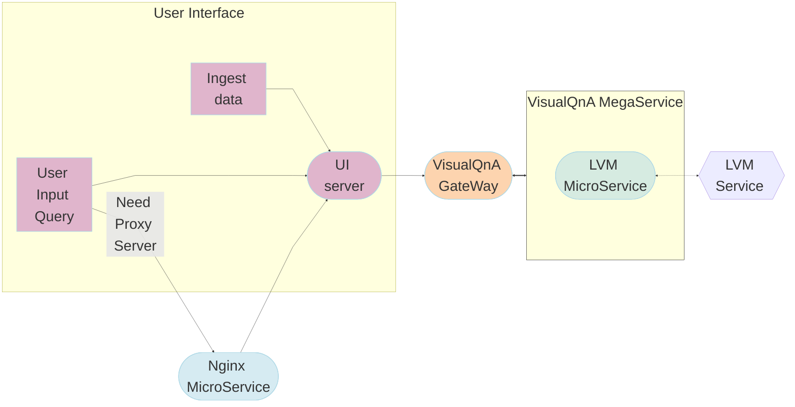

# Visual Question and Answering

Visual Question Answering (VQA) is the task of answering open-ended questions based on an image. The input to models supporting this task is typically a combination of an image and a question, and the output is an answer expressed in natural language.

Some noteworthy use case examples for VQA include:

- Accessibility applications for visually impaired individuals.
- Education: posing questions about visual materials presented in lectures or textbooks. VQA can also be utilized in interactive museum exhibits or historical sites.
- Customer service and e-commerce: VQA can enhance user experience by letting users ask questions about products.
- Image retrieval: VQA models can be used to retrieve images with specific characteristics. For example, the user can ask “Is there a dog?” to find all images with dogs from a set of images.

## Table of Contents

1. [Architecture](#architecture)
2. [Deployment Options](#deployment-options)
3. [Validated Configurations](#validated-configurations)

## Architecture

The VisualQnA example is implemented using the component-level microservices defined in [GenAIComps](https://github.com/opea-project/GenAIComps). The flow chart below shows the information flow between different microservices for this example.

This example guides you through how to deploy a [LLaVA-NeXT](https://github.com/LLaVA-VL/LLaVA-NeXT) (Open Large Multimodal Models) model on [Intel Gaudi2](https://www.intel.com/content/www/us/en/products/details/processors/ai-accelerators/gaudi.html), [Intel Xeon Scalable Processors](https://www.intel.com/content/www/us/en/products/details/processors/xeon.html) and [AMD EPYC™ Processors](https://www.amd.com/en/products/processors/server/epyc.html). We invite contributions from other hardware vendors to expand the OPEA ecosystem.

## Deployment Options

The VisualQnA service can be effortlessly deployed on Intel Gaudi2 or Intel Xeon Scalable Processors and AMD EPYC™ Processors.

The table below lists currently available deployment options. They outline in detail the implementation of this example on selected hardware.

| Category               | Deployment Option | Description                                                       |
| ---------------------- | ----------------- | ----------------------------------------------------------------- |
| On-premise Deployments | Docker compose    | [VisualQnA deployment on Xeon](./docker_compose/intel/cpu/xeon)   |
|                        |                   | [VisualQnA deployment on Gaudi](./docker_compose/intel/hpu/gaudi) |
|                        |                   | [VisualQnA deployment on AMD EPYC](./docker_compose/amd/cpu/epyc) |
|                        |                   | [VisualQnA deployment on AMD ROCm](./docker_compose/amd/gpu/rocm) |
|                        | Kubernetes        | [Helm Charts](./kubernetes/helm)                                  |
|                        |                   | [GMC](./kubernetes/gmc)                                           |

## Validated Configurations

| **Deploy Method** | **LLM Engine** | **LLM Model**                     | **Hardware** |
| ----------------- | -------------- | --------------------------------- | ------------ |
| Docker Compose    | TGI, vLLM      | llava-hf/llava-v1.6-mistral-7b-hf | Intel Xeon   |
| Docker Compose    | TGI, vLLM      | llava-hf/llava-1.5-7b-hf          | Intel Gaudi  |
| Docker Compose    | TGI, vLLM      | llava-hf/llava-v1.6-mistral-7b-hf | AMD EPYC     |
| Docker Compose    | TGI, vLLM      | Xkev/Llama-3.2V-11B-cot           | AMD ROCm     |
| Helm Charts       | TGI, vLLM      | llava-hf/llava-v1.6-mistral-7b-hf | Intel Gaudi  |
| Helm Charts       | TGI, vLLM      | llava-hf/llava-v1.6-mistral-7b-hf | Intel Xeon   |
