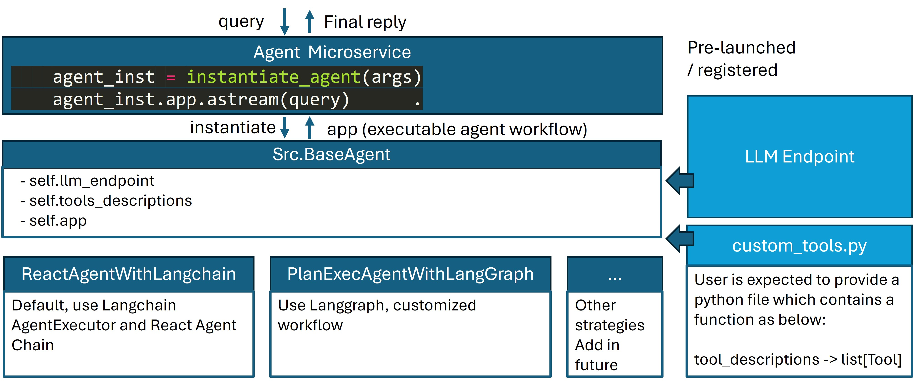

# Agent Microservice

## 1. Overview

This agent microservice is built on Langchain/Langgraph frameworks. Agents integrate the reasoning capabilities of large language models (LLMs) with the ability to take actionable steps, creating a more sophisticated system that can understand and process information, evaluate situations, take appropriate actions, communicate responses, and track ongoing situations.

### 1.1 Supported agent types

We currently support the following types of agents:

1. ReAct: use `react_langchain` or `react_langgraph` or `react_llama` as strategy. First introduced in this seminal [paper](https://arxiv.org/abs/2210.03629). The ReAct agent engages in "reason-act-observe" cycles to solve problems. Please refer to this [doc](https://python.langchain.com/v0.2/docs/how_to/migrate_agent/) to understand the differences between the langchain and langgraph versions of react agents. See table below to understand the validated LLMs for each react strategy.
2. RAG agent: use `rag_agent` or `rag_agent_llama` strategy. This agent is specifically designed for improving RAG performance. It has the capability to rephrase query, check relevancy of retrieved context, and iterate if context is not relevant. See table below to understand the validated LLMs for each rag agent strategy.
3. Plan and execute: `plan_execute` strategy. This type of agent first makes a step-by-step plan given a user request, and then execute the plan sequentially (or in parallel, to be implemented in future). If the execution results can solve the problem, then the agent will output an answer; otherwise, it will replan and execute again.

**Note**:

1. Due to the limitations in support for tool calling by TGI and vllm, we have developed subcategories of agent strategies (`rag_agent_llama` and `react_llama`) specifically designed for open-source LLMs served with TGI and vllm.
2. For advanced developers who want to implement their own agent strategies, please refer to [Section 5](#5-customize-agent-strategy) below.

### 1.2 LLM engine

Agents use LLM for reasoning and planning. We support 3 options of LLM engine:

1. Open-source LLMs served with TGI. Follow the instructions in [Section 2.2.1](#221-start-agent-microservices-with-tgi).
2. Open-source LLMs served with vllm. Follow the instructions in [Section 2.2.2](#222-start-agent-microservices-with-vllm).
3. OpenAI LLMs via API calls. To use OpenAI llms, specify `llm_engine=openai` and `export OPENAI_API_KEY=<your-openai-key>`

| Agent type       | `strategy` arg    | Validated LLMs (serving SW)                                                                                                                                                                                    | Notes                                                                                                                           |
| ---------------- | ----------------- | -------------------------------------------------------------------------------------------------------------------------------------------------------------------------------------------------------------- | ------------------------------------------------------------------------------------------------------------------------------- |
| ReAct            | `react_langchain` | [llama3.1-70B-Instruct](https://huggingface.co/meta-llama/Llama-3.1-70B-Instruct) (tgi-gaudi)                                                                                                                  | Only allows tools with one input variable                                                                                       |
| ReAct            | `react_langgraph` | GPT-4o-mini, [Mistral-7B-Instruct-v0.3](https://huggingface.co/mistralai/Mistral-7B-Instruct-v0.3) (vllm-gaudi),                                                                                               | if using vllm, need to specify `--enable-auto-tool-choice --tool-call-parser ${model_parser}`, refer to vllm docs for more info |
| ReAct            | `react_llama`     | [llama3.1-70B-Instruct](https://huggingface.co/meta-llama/Llama-3.1-70B-Instruct) (tgi-gaudi)                                                                                                                  | Recommended for open-source LLMs                                                                                                |
| RAG agent        | `rag_agent`       | GPT-4o-mini                                                                                                                                                                                                    |                                                                                                                                 |
| RAG agent        | `rag_agent_llama` | [llama3.1-70B-Instruct](https://huggingface.co/meta-llama/Llama-3.1-70B-Instruct) (tgi-gaudi)                                                                                                                  | Recommended for open-source LLMs, only allows 1 tool with input variable to be "query"                                          |
| Plan and execute | `plan_execute`    | GPT-4o-mini, [Mistral-7B-Instruct-v0.3](https://huggingface.co/mistralai/Mistral-7B-Instruct-v0.3) (vllm-gaudi), [Llama-3.1-8B-Instruct](https://huggingface.co/meta-llama/Llama-3.1-8B-Instruct) (vllm-gaudi) |                                                                                                                                 |

### 1.3 Tools

The tools are registered with a yaml file. We support the following types of tools:

1. Endpoint: user to provide url
2. User-defined python functions. This is usually used to wrap endpoints with request post or simple pre/post-processing.
3. Langchain tool modules.

Examples of how to register tools can be found in [Section 4](#-4-provide-your-own-tools) below.

### 1.4 Agent APIs

1. OpenAI compatible chat completions API
2. OpenAI compatible assistants APIs.

**Note**: not all keywords are supported yet.

## 🚀2. Start Agent Microservice

### 2.1 Build Microservices

```bash
cd GenAIComps/ # back to GenAIComps/ folder
docker build -t opea/agent-langchain:latest -f comps/agent/langchain/Dockerfile .
```

#### 2.2.1 Start Agent microservices with TGI

```bash
export ip_address=$(hostname -I | awk '{print $1}')
export model=mistralai/Mistral-7B-Instruct-v0.3
export HUGGINGFACEHUB_API_TOKEN=${HUGGINGFACEHUB_API_TOKEN}
export HF_TOKEN=${HUGGINGFACEHUB_API_TOKEN}

# TGI serving
docker run -d --runtime=habana --name "comps-tgi-gaudi-service" -p 8080:80 -v ./data:/data -e HF_TOKEN=$HF_TOKEN -e HABANA_VISIBLE_DEVICES=all -e OMPI_MCA_btl_vader_single_copy_mechanism=none --cap-add=sys_nice --ipc=host ghcr.io/huggingface/tgi-gaudi:latest --model-id $model --max-input-tokens 4096 --max-total-tokens 8092

# check status
docker logs comps-tgi-gaudi-service

# Agent
docker run -d --runtime=runc --name="comps-langchain-agent-endpoint" -v $WORKPATH/comps/agent/langchain/tools:/home/user/comps/agent/langchain/tools -p 9090:9090 --ipc=host -e HUGGINGFACEHUB_API_TOKEN=${HUGGINGFACEHUB_API_TOKEN} -e model=${model} -e ip_address=${ip_address} -e strategy=react_langchain -e llm_endpoint_url=http://${ip_address}:8080 -e llm_engine=tgi -e recursion_limit=5 -e require_human_feedback=false -e tools=/home/user/comps/agent/langchain/tools/custom_tools.yaml opea/agent-langchain:latest

# check status
docker logs comps-langchain-agent-endpoint
```

#### 2.2.2 Start Agent microservices with vllm

```bash
export ip_address=$(hostname -I | awk '{print $1}')
export model=mistralai/Mistral-7B-Instruct-v0.3
export HUGGINGFACEHUB_API_TOKEN=${HUGGINGFACEHUB_API_TOKEN}
export HF_TOKEN=${HUGGINGFACEHUB_API_TOKEN}
export vllm_volume=${YOUR_LOCAL_DIR_FOR_MODELS}

# build vLLM image
git clone https://github.com/HabanaAI/vllm-fork.git
cd ./vllm-fork
docker build -f Dockerfile.hpu -t opea/vllm-gaudi:latest --shm-size=128g . --build-arg https_proxy=$https_proxy --build-arg http_proxy=$http_proxy

# TGI serving
docker run -d --runtime=habana --rm --name "comps-vllm-gaudi-service" -p 8080:80 -v $vllm_volume:/data -e HF_TOKEN=$HF_TOKEN -e HF_HOME=/data -e OMPI_MCA_btl_vader_single_copy_mechanism=none -e PT_HPU_ENABLE_LAZY_COLLECTIVES=true -e http_proxy=$http_proxy -e https_proxy=$https_proxy -e VLLM_SKIP_WARMUP=true --cap-add=sys_nice --ipc=host opea/vllm-gaudi:latest --model ${model} --host 0.0.0.0 --port 80 --block-size 128 --max-num-seqs  4096 --max-seq_len-to-capture 8192 --enable-auto-tool-choice --tool-call-parser mistral

# check status
docker logs comps-vllm-gaudi-service

# Agent
docker run -d --runtime=runc --name="comps-langchain-agent-endpoint" -v $WORKPATH/comps/agent/langchain/tools:/home/user/comps/agent/langchain/tools -p 9090:9090 --ipc=host -e HUGGINGFACEHUB_API_TOKEN=${HUGGINGFACEHUB_API_TOKEN} -e model=${model} -e ip_address=${ip_address} -e strategy=react_langgraph -e llm_endpoint_url=http://${ip_address}:8080 -e llm_engine=vllm -e recursion_limit=5 -e require_human_feedback=false -e tools=/home/user/comps/agent/langchain/tools/custom_tools.yaml opea/agent-langchain:latest

# check status
docker logs comps-langchain-agent-endpoint
```

> debug mode
>
> ```bash
> docker run --rm --runtime=runc --name="comps-langchain-agent-endpoint" -v ./comps/agent/langchain/:/home/user/comps/agent/langchain/ -p 9090:9090 --ipc=host -e http_proxy=$http_proxy -e https_proxy=$https_proxy -e HUGGINGFACEHUB_API_TOKEN=${HUGGINGFACEHUB_API_TOKEN} -e model=${model} -e ip_address=${ip_address} -e strategy=react_langchain -e llm_endpoint_url=http://${ip_address}:8080 -e llm_engine=tgi -e recursion_limit=5 -e require_human_feedback=false -e tools=/home/user/comps/agent/langchain/tools/custom_tools.yaml opea/agent-langchain:latest
> ```

## 🚀 3. Validate Microservice

Once microservice starts, user can use below script to invoke.

```bash
curl http://${ip_address}:9090/v1/chat/completions -X POST -H "Content-Type: application/json" -d '{
     "query": "What is the weather today in Austin?"
    }'

# expected output

data: 'The temperature in Austin today is 78°F.</s>'

data: [DONE]

```

## 🚀 4. Provide your own tools

- Define tools

```bash
mkdir -p my_tools
vim my_tools/custom_tools.yaml

# [tool_name]
#   description: [description of this tool]
#   env: [env variables such as API_TOKEN]
#   pip_dependencies: [pip dependencies, separate by ,]
#   callable_api: [2 options provided - function_call, pre-defined-tools]
#   args_schema:
#     [arg_name]:
#       type: [str, int]
#       description: [description of this argument]
#   return_output: [return output variable name]
```

example - my_tools/custom_tools.yaml

```yaml
# Follow example below to add your tool
opea_index_retriever:
  description: Retrieve related information of Intel OPEA project based on input query.
  callable_api: tools.py:opea_rag_query
  args_schema:
    query:
      type: str
      description: Question query
  return_output: retrieved_data
```

example - my_tools/tools.py

```python
def opea_rag_query(query):
    ip_address = os.environ.get("ip_address")
    url = f"http://{ip_address}:8889/v1/retrievaltool"
    content = json.dumps({"text": query})
    print(url, content)
    try:
        resp = requests.post(url=url, data=content)
        ret = resp.text
        resp.raise_for_status()  # Raise an exception for unsuccessful HTTP status codes
    except requests.exceptions.RequestException as e:
        ret = f"An error occurred:{e}"
    return ret
```

- Launch Agent Microservice with your tools path

```bash
# Agent
docker run -d --runtime=runc --name="comps-langchain-agent-endpoint" -v my_tools:/home/user/comps/agent/langchain/tools -p 9090:9090 --ipc=host -e HUGGINGFACEHUB_API_TOKEN=${HUGGINGFACEHUB_API_TOKEN} -e model=${model} -e ip_address=${ip_address} -e strategy=react_langchain -e llm_endpoint_url=http://${ip_address}:8080 -e llm_engine=tgi -e recursive_limit=5 -e require_human_feedback=false -e tools=/home/user/comps/agent/langchain/tools/custom_tools.yaml opea/agent-langchain:latest
```

- validate with my_tools

```bash
$ curl http://${ip_address}:9090/v1/chat/completions -X POST -H "Content-Type: application/json" -d '{
     "query": "What is Intel OPEA project in a short answer?"
    }'
data: 'The Intel OPEA project is a initiative to incubate open source development of trusted, scalable open infrastructure for developer innovation and harness the potential value of generative AI. - - - - Thought:  I now know the final answer. - - - - - - Thought: - - - -'

data: [DONE]

$ curl http://${ip_address}:9090/v1/chat/completions -X POST -H "Content-Type: application/json" -d '{
     "query": "What is the weather today in Austin?"
    }'
data: 'The weather information in Austin is not available from the Open Platform for Enterprise AI (OPEA). You may want to try checking another source such as a weather app or website. I apologize for not being able to find the information you were looking for. <|eot_id|>'

data: [DONE]
```

## 5. Customize agent strategy

For advanced developers who want to implement their own agent strategies, you can add a separate folder in `src\strategy`, implement your agent by inherit the `BaseAgent` class, and add your strategy into the `src\agent.py`. The architecture of this agent microservice is shown in the diagram below as a reference.

